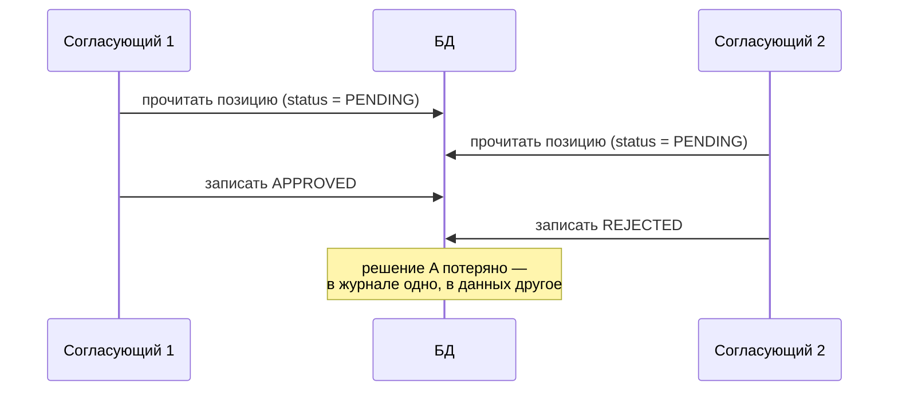

import { Steps } from '@astrojs/starlight/components';
import Brief from '../../../components/Brief.astro';
import CaseRef from '../../../components/CaseRef.astro';
import InterviewQuestions from '../../../components/InterviewQuestions.astro';
import Related from '../../../components/Related.astro';

<Brief>

**Транзакция** — группа операций, которая выполняется **целиком или никак**. Свойства **ACID**: атомарность, согласованность, изоляция, долговечность.
**Уровень изоляции** определяет, что одна транзакция видит из параллельных: от Read Uncommitted до Serializable; чем строже — тем меньше аномалий и больше конфликтов.
Транзакция работает **внутри одной БД**. Между системами вместо неё используют идемпотентность, повторы, сагу с компенсациями и сверку.

</Brief>

## Когда применять

Аналитику не нужно настраивать транзакции, но нужно **формулировать требования**, из которых они следуют:

| Формулировать требования | Не нужно |
|---|---|
| Какие изменения должны происходить вместе («заявка и её позиции») | Выбирать уровень изоляции за разработку |
| Что делать при одновременных изменениях одного объекта (два согласующих) | Описывать механизмы блокировок СУБД |
| Что считать «успехом» операции, затрагивающей несколько систем | Требовать «распределённую транзакцию» между системами |

## Как делать

<Steps>

1. **Найдите группы изменений, которые не имеют смысла по отдельности:** создание заявки и позиций, назначение роли и запись в журнал аудита.

2. **Для каждой — правило «всё или ничего»** в требованиях.

3. **Найдите конкурентные сценарии:** два пользователя меняют один объект, повторная доставка события, параллельная обработка задач.

4. **Опишите ожидаемое поведение:** кто «выигрывает», что видит второй, нужна ли проверка версии.

5. **Операции между системами** — опишите идемпотентность, повторы, компенсации и сверку, а не «транзакцию».

</Steps>

## Нотация: ACID, уровни изоляции, аномалии

| Свойство | Смысл | Пример из кейса |
|---|---|---|
| Atomicity — атомарность | Всё или ничего | Заявка не создаётся без позиций |
| Consistency — согласованность | Ограничения не нарушаются | Нет трудоустройства без идентичности (FK) |
| Isolation — изоляция | Параллельные транзакции не мешают друг другу | Два согласующих не перетирают решения друг друга |
| Durability — долговечность | Зафиксированное не теряется при сбое | Решение по заявке сохранено, даже если сервер упал сразу после ответа |

| Аномалия | Что происходит |
|---|---|
| Грязное чтение (dirty read) | Читаем незафиксированные изменения другой транзакции, которые потом откатятся |
| Неповторяющееся чтение (non-repeatable read) | Повторное чтение той же строки даёт другое значение |
| Фантомы (phantom read) | Повторный запрос с тем же условием возвращает другой набор строк |
| Потерянное обновление (lost update) | Два параллельных изменения: второе перезаписывает первое |

| Уровень (стандарт SQL) | Грязное чтение | Неповторяющееся | Фантомы |
|---|---|---|---|
| Read Uncommitted | возможно | возможно | возможно |
| Read Committed | — | возможно | возможно |
| Repeatable Read | — | — | возможно |
| Serializable | — | — | — |

Реальные СУБД реализуют уровни по-своему: например, в PostgreSQL Read Uncommitted ведёт себя как Read Committed, а Repeatable Read не допускает фантомов. Уровень по умолчанию в PostgreSQL — Read Committed.

**Потерянное обновление** часто решают **оптимистической блокировкой**: у строки есть номер версии; изменение проходит, только если версия не изменилась с момента чтения, иначе — ошибка «данные изменены другим пользователем». Для аналитика это требование к API: например, ответ 409 Conflict при попытке изменить устаревшую версию.

## Пример из кейса IDM-JOINER

**Внутри IdM** — обычные транзакции: обработка кадрового события создаёт идентичность, трудоустройство и назначения ролей вместе с записью в `hr_event_inbox` — либо всё, либо ничего (иначе повторная доставка события создаст дубли).

**Между системами** транзакции нет. Как кейс обеспечивает согласованность:

- **Идемпотентность:** повтор вызова с тем же ключом безопасен — `eventId` для событий (<CaseRef href="/case/02-requirements/functional-requirements/#fr-03" id="FR-03">FR-03</CaseRef>), `taskId` как `Idempotency-Key` в АБС (<CaseRef href="/case/04-integrations/scenarios/#seq-02" id="SEQ-02">SEQ-02</CaseRef>).
- **Компенсация:** отмена приёма после создания учётных записей удаляет их и отменяет ручные задачи (<CaseRef href="/case/04-integrations/scenarios/#seq-03" id="SEQ-03">SEQ-03</CaseRef>, BRL-06) — это сага.
- **Сверка:** ежедневное сравнение реестра со срезом HRMS находит пропущенные события (<CaseRef href="/case/02-requirements/functional-requirements/#fr-05" id="FR-05">FR-05</CaseRef>).

## Типичные ошибки

| Ошибка | Чем плохо | Как правильно |
|---|---|---|
| «Нужна транзакция между IdM и АБС» | Невозможно или очень дорого; блокирует ресурсы | Идемпотентность, повторы, компенсации, сверка |
| Не описаны конкурентные сценарии | Потерянные обновления, гонки в проде | Требование: проверка версии, правило «кто выигрывает» |
| Запись в журнал аудита вне транзакции изменения | Изменение есть, записи нет (или наоборот) | Одна транзакция или надёжная доставка (outbox) |
| Долгие транзакции с ожиданием внешних вызовов | Блокировки, падение производительности | Вызовы вне транзакции, статусы и повторы |
| Считать, что уровень изоляции везде одинаков | Сюрпризы при переносе между СУБД | Сверять с документацией конкретной СУБД |

## Вопросы на собеседовании

<InterviewQuestions topic="data" ids={['data-acid', 'data-isolation', 'data-distributed-tx']} />

## Связанные темы

<Related pages={['data/indexes', 'data/keys-normalization', 'diagrams/sequence', 'integrations/reliability']} />
