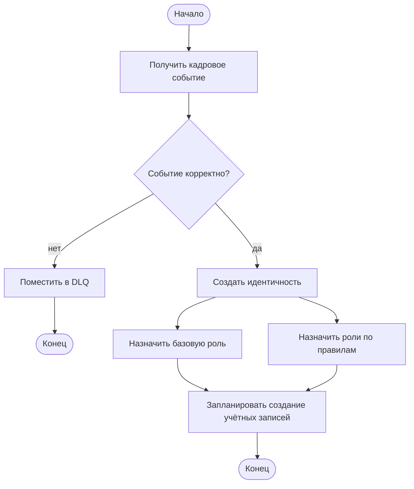
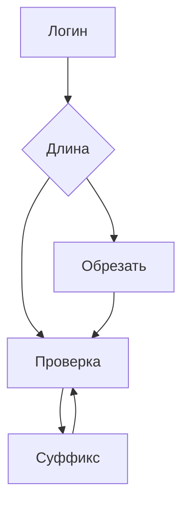
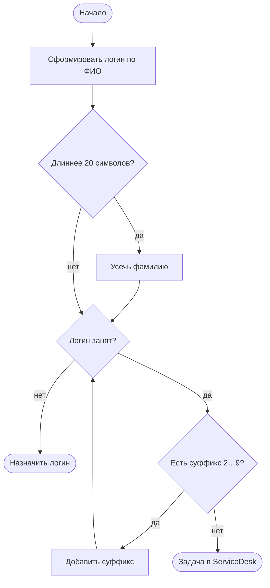

import { Steps, Tabs, TabItem } from '@astrojs/starlight/components';
import Checklist from '../../../components/Checklist.astro';
import Exercise from '../../../components/Exercise.astro';
import PlantUmlDiagram from '../../../components/PlantUmlDiagram.astro';

Теория — [UML: activity](/diagrams/activity/).

## Алгоритм построения

<Steps>

1. **Начало и конец:** что запускает алгоритм и чем он заканчивается (возможны несколько концов).
2. **Основная последовательность** действий «глагол + объект».
3. **Развилки** — ромб с условием на каждой исходящей ветке; не забудьте ветку «иначе».
4. **Циклы** — с явным условием выхода.
5. **Параллельность** — fork / join, если действия действительно независимы.
6. **Дорожки** — если важно, кто (какой компонент) выполняет действие.
7. **Когда остановиться:** каждое правило из требований отражено веткой, все ветки доходят до конца; больше 15–20 действий — выделите под-алгоритм.

</Steps>

## Синтаксис

<Tabs>
<TabItem label="Mermaid">

Отдельной activity-диаграммы в Mermaid нет — используют **flowchart**. Fork/join и дорожки рисуются приближённо (подграфами).



```text title="Mermaid flowchart: элементы"
flowchart TD                 направление: TD, LR, BT, RL
A[Действие]                  прямоугольник
B([Начало / конец])          «стадион» — терминатор
C{Условие?}                  ромб — развилка
A --> B                      стрелка
B -- да --> C                стрелка с подписью
subgraph lane1[Дорожка]      группа — приближение дорожки
  ...
end
```

</TabItem>
<TabItem label="PlantUML">

<PlantUmlDiagram file="howto/activity-min.puml" source="site" title="Минимальная activity" openSource />

```text title="PlantUML activity: элементы"
start / stop / end            начало, конец деятельности, конец потока
:Действие;                    действие
if (Условие?) then (да)       развилка
  ...
else (нет)
  ...
endif
while (Условие?) is (да)      цикл
  ...
endwhile (нет)
repeat ... repeat while (…)   цикл с постусловием
fork / fork again / end fork  параллельность
|Дорожка|                     дорожка (swimlane)
note right : текст            заметка
```

</TabItem>
</Tabs>

## В визуальном редакторе

**draw.io:** библиотека фигур UML содержит начальный и конечный узлы, действие, развилку и полосу fork/join; для дорожек удобен контейнер «пул / дорожки» из той же или BPMN-библиотеки. В draw.io легко нарисовать нестрогую схему — сверяйтесь с чек-листом ниже.

## Чек-лист готовой диаграммы

<Checklist id="howto-activity" items={[
  'Есть начальный узел и хотя бы один конечный',
  'Действия названы «глагол + объект»',
  'У каждой развилки подписаны все ветки, есть ветка «иначе»',
  'Каждый цикл имеет условие выхода',
  'Параллельные ветки начинаются fork и сливаются join',
  'Нет «висящих» действий без продолжения',
  'Каждое правило из требований отражено на диаграмме',
  'Если важен исполнитель — есть дорожки',
]} />

## До и после

<div class="before-after not-content">
<div class="before-after__col" data-kind="bad">
<p class="before-after__label">До</p>



</div>
<div class="before-after__col" data-kind="good">
<p class="before-after__label">После</p>



</div>
</div>

Что изменилось:

- **Есть начало и конец** — в исходной схеме алгоритм нигде не заканчивается, цикл «проверка → суффикс» бесконечен.
- **Действия названы глаголами**, развилки — вопросами, ветки подписаны.
- **Появился выход из цикла:** суффиксы 2…9 закончились — задача в ServiceDesk (как в FR-06).

## Упражнение

<Exercise title="ежедневная сверка с HRMS (UC-10)">

Нарисуйте activity для **UC-10 «Выполнить ежедневную сверку с HRMS»** кейса: в 02:00 IdM запрашивает полный срез сотрудников, сравнивает с реестром, расхождения превращает в события и отчёт (<a href="/case/02-requirements/use-cases/">use cases</a>, FR-05). Учтите, что HRMS может быть недоступна: по карте интеграций — повтор в 03:00, затем алерт. Используйте дорожки «Планировщик» и «IdM».

<Fragment slot="solution">

<PlantUmlDiagram file="howto/activity-uc10-solution.puml" source="site" title="UC-10 — одно из возможных решений" />

- **Недоступность HRMS** — две развилки: повтор в 03:00, затем алерт и завершение. Без этой ветки сверка «молча» не выполнится.
- **Расхождения** превращаются в события на обработку — та же логика, что для обычных кадровых событий, плюс отчёт.
- **Журнал** — результат сверки записывается в любом успешном исходе.

</Fragment>

</Exercise>
