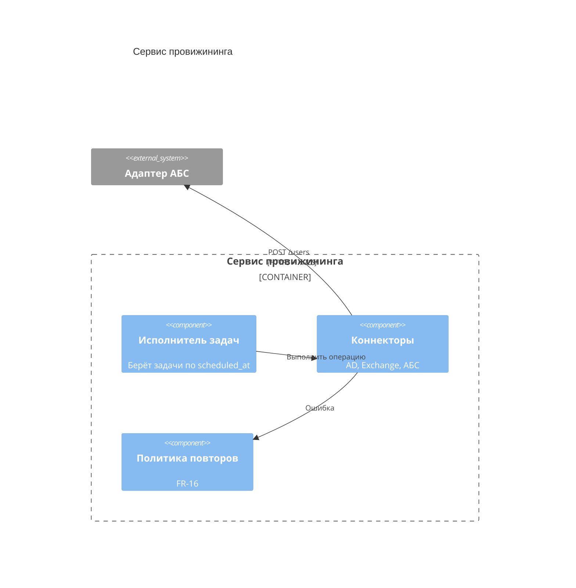
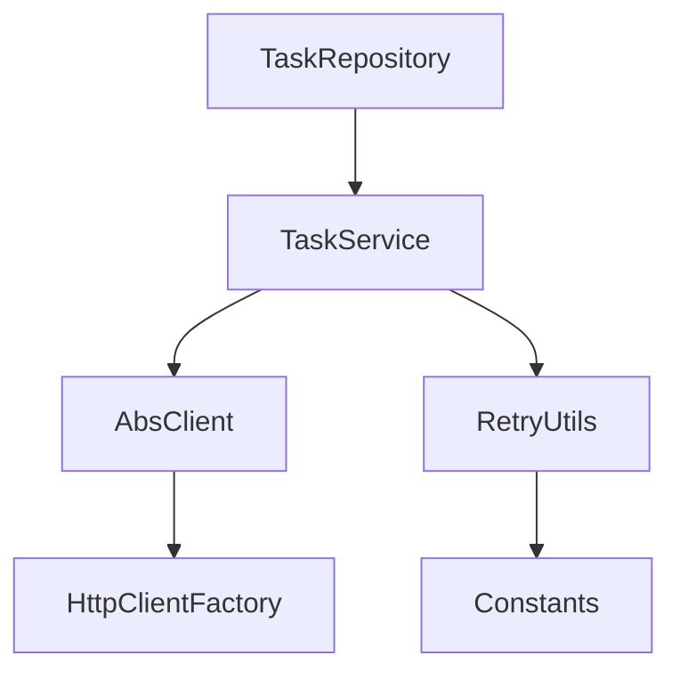
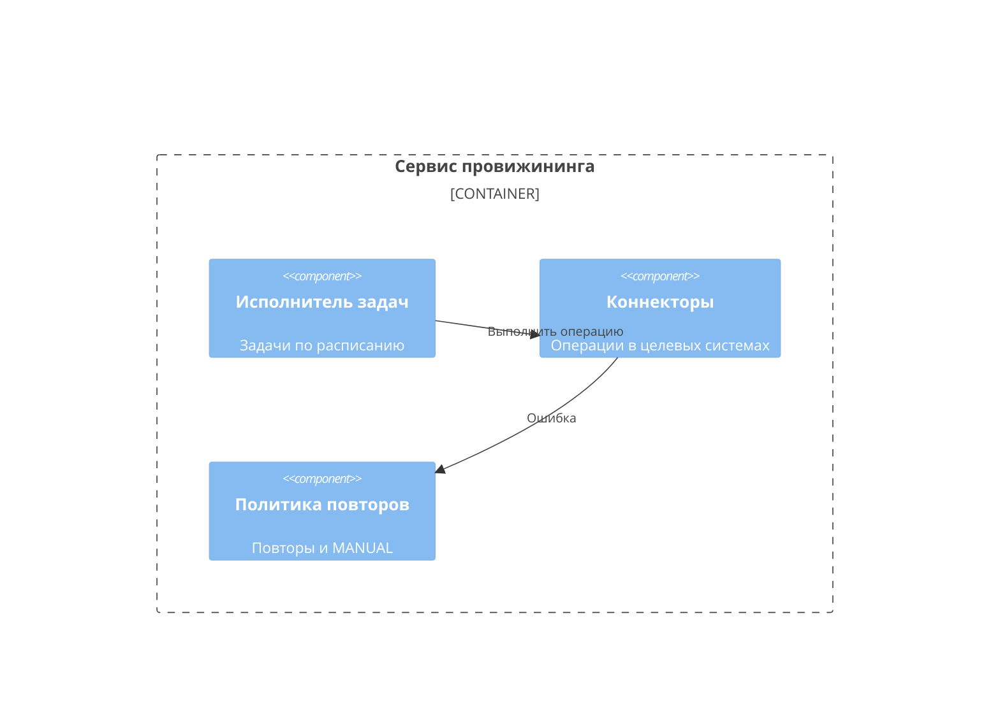
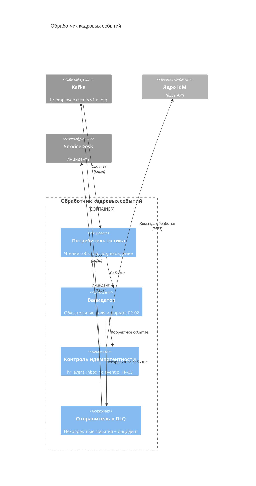

import { Steps, Tabs, TabItem } from '@astrojs/starlight/components';
import Checklist from '../../../components/Checklist.astro';
import Exercise from '../../../components/Exercise.astro';
import PlantUmlDiagram from '../../../components/PlantUmlDiagram.astro';

Теория — [модель C4](/diagrams/c4/).

## Алгоритм построения

<Steps>

1. **Выберите один контейнер** — уровень 3 рисуют только для сложных контейнеров и только если это нужно команде.
2. **Граница контейнера** (Container_Boundary).
3. **Компоненты** — группы функциональности за понятным интерфейсом: «Политика повторов», «Клиент ServiceDesk». Имя, технология, ответственность.
4. **Внешние для контейнера элементы** — другие контейнеры и системы, с которыми общаются компоненты.
5. **Связи** между компонентами и наружу — что и как.
6. **Когда остановиться:** по диаграмме понятно, где реализовано каждое требование к контейнеру. Классы не рисуйте — это уровень 4.

</Steps>

## Синтаксис

<Tabs>
<TabItem label="Mermaid">



```text title="Mermaid / C4-PlantUML: элементы уровня Component"
Container_Boundary(b, "Контейнер") { ... }   граница контейнера
Component(id, "Имя", "Технология", "Описание")
ComponentDb / ComponentQueue                 компонент-хранилище / очередь
Component_Ext(id, ...)                       внешний компонент
Rel(from, to, "Что", "Как")
```

</TabItem>
<TabItem label="C4-PlantUML">

<PlantUmlDiagram file="howto/c4-component-min.puml" source="site" title="C4 Component — сервис провижининга" openSource />

</TabItem>
</Tabs>

## В визуальном редакторе

**draw.io:** те же прямоугольники C4, что на уровне 2, внутри пунктирной границы контейнера. Следите, чтобы на диаграмме не появились классы и таблицы — это другой уровень.

## Чек-лист готовой диаграммы

<Checklist id="howto-c4-component" items={[
  'Диаграмма описывает один контейнер',
  'Компоненты — группы функциональности, а не классы',
  'У каждого компонента имя, технология (если важна) и ответственность',
  'Показаны внешние для контейнера элементы, с которыми общаются компоненты',
  'Связи подписаны',
  'Требования к контейнеру распределены по компонентам',
]} />

## До и после

<div class="before-after not-content">
<div class="before-after__col" data-kind="bad">
<p class="before-after__label">До</p>



</div>
<div class="before-after__col" data-kind="good">
<p class="before-after__label">После</p>



</div>
</div>

Что изменилось:

- **Классы заменены компонентами** — группами функциональности за интерфейсом. Классы — уровень 4, и их генерирует IDE.
- **Технические утилиты убраны** (`Constants`, `HttpClientFactory`): они не помогают понять устройство.
- **Ответственность** указана у каждого компонента.

## Упражнение

<Exercise title="компоненты обработчика кадровых событий">

По <a href="/case/03-architecture/containers/">контейнерам кейса</a> обработчик кадровых событий отвечает за чтение топика, валидацию, идемпотентность и DLQ (FR-01 … FR-03). Нарисуйте его компоненты и внешние связи: Kafka (основной топик и DLQ), ядро IdM, ServiceDesk для инцидентов.

<Fragment slot="solution">



- **Каждое требование — в своём компоненте:** валидация (FR-02), идемпотентность (FR-03), DLQ и инцидент.
- **Идемпотентность до вызова ядра:** повторный `eventId` отсекается сразу и подтверждается без побочных эффектов.
- **DLQ — тот же Kafka**, но отдельный топик.

</Fragment>

</Exercise>
