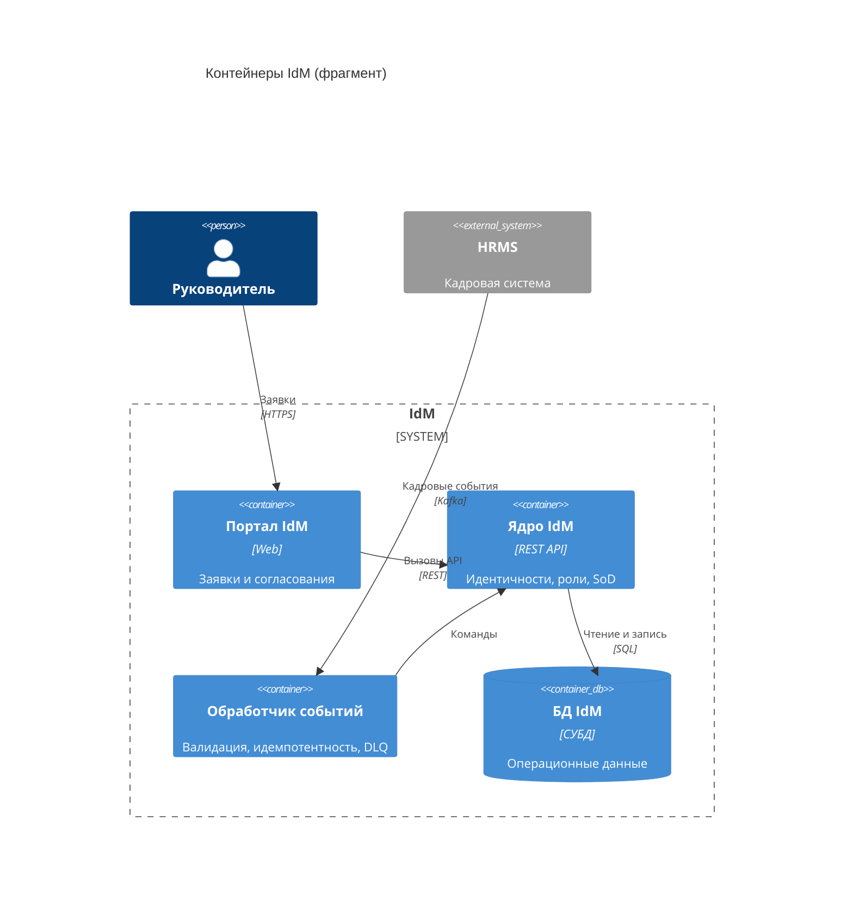
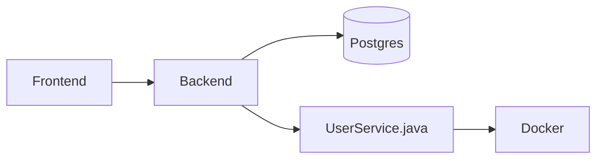
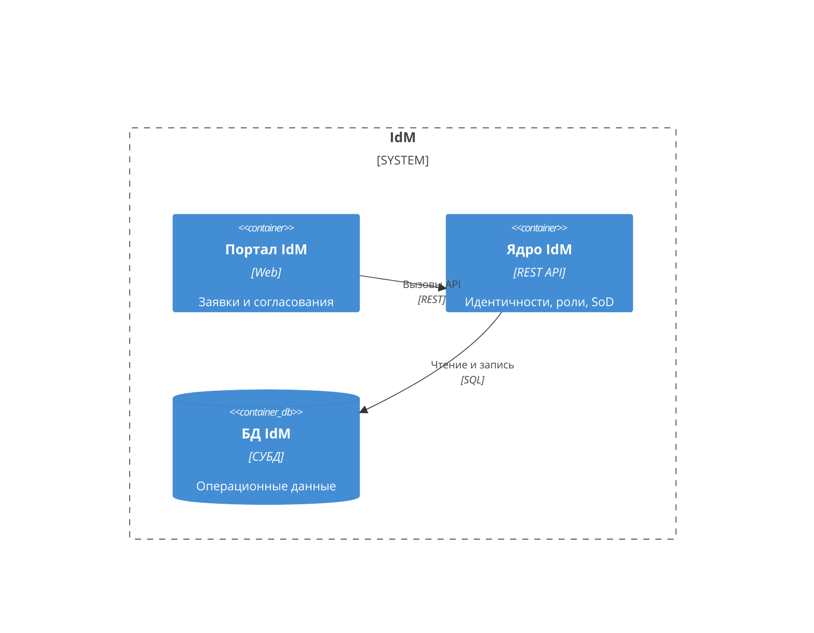
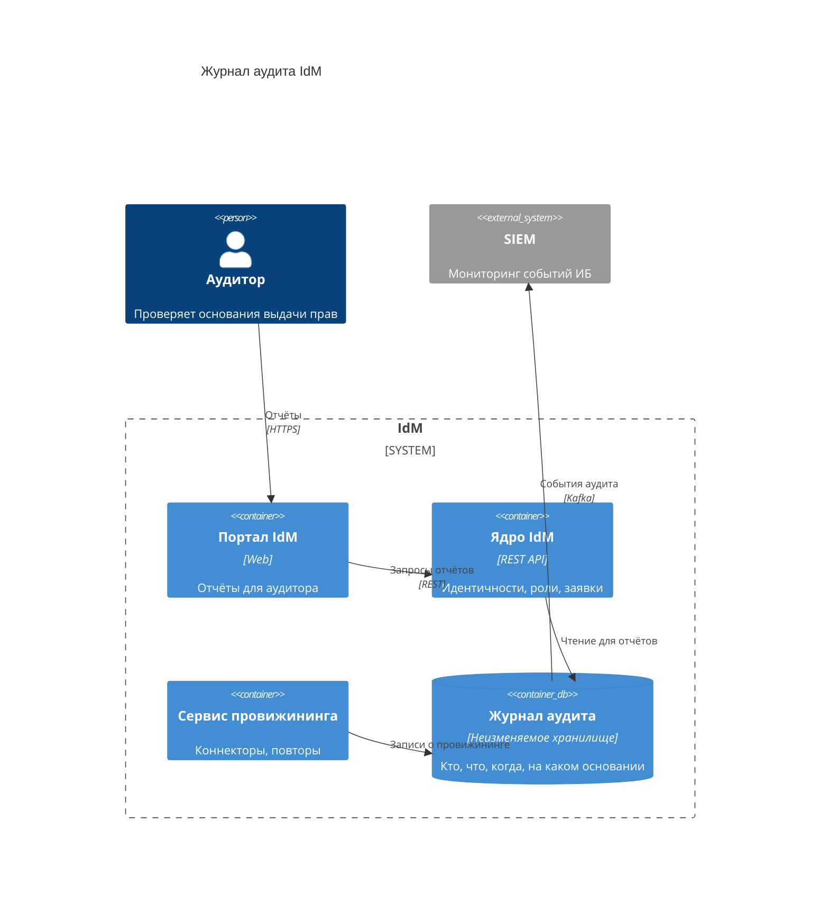

import { Steps, Tabs, TabItem } from '@astrojs/starlight/components';
import Checklist from '../../../components/Checklist.astro';
import Exercise from '../../../components/Exercise.astro';
import PlantUmlDiagram from '../../../components/PlantUmlDiagram.astro';

Теория — [модель C4](/diagrams/c4/).

## Алгоритм построения

<Steps>

1. **Граница системы** (System_Boundary) — всё, что внутри, разворачиваете вы.
2. **Контейнеры:** приложения, сервисы, базы данных, очереди, хранилища файлов. Для каждого — **имя, технология, ответственность**.
3. **Люди и внешние системы** из уровня контекста — снаружи границы.
4. **Связи:** кто кого вызывает, что передаётся, протокол.
5. **Сверка с требованиями:** у каждого ФТ есть контейнер, где оно реализуется.
6. **Когда остановиться:** видно, где живёт каждое требование и через что идёт каждая интеграция; внутренности контейнеров не показаны.

</Steps>

## Синтаксис

<Tabs>
<TabItem label="Mermaid">



```text title="Mermaid / C4-PlantUML: элементы уровня Container"
System_Boundary(b, "Система") { ... }        граница системы
Container(id, "Имя", "Технология", "Описание")
ContainerDb(id, ...)                         база данных
ContainerQueue(id, ...)                      очередь
Container_Ext(id, ...)                       внешний контейнер
Rel(from, to, "Что", "Как")                  связь
```

</TabItem>
<TabItem label="C4-PlantUML">

<PlantUmlDiagram file="howto/c4-container-min.puml" source="site" title="Минимальный C4 Container" openSource />

</TabItem>
</Tabs>

## В визуальном редакторе

**draw.io:** контейнеры — прямоугольники с тремя строками (имя, технология, описание), база данных — цилиндр, граница системы — пунктирный контейнер. Цвета: обычно ваша система и её контейнеры одного цвета, внешние — серые; добавьте легенду.

## Чек-лист готовой диаграммы

<Checklist id="howto-c4-container" items={[
  'Есть граница системы',
  'У каждого контейнера имя, технология и ответственность',
  'Базы данных и очереди — тоже контейнеры',
  'Внешние системы и люди — снаружи границы, как на уровне контекста',
  'Каждая связь подписана: что и как',
  'Нет внутренностей контейнеров (классов, модулей)',
  'Для ключевых ФТ понятно, в каком контейнере они реализуются',
]} />

## До и после

<div class="before-after not-content">
<div class="before-after__col" data-kind="bad">
<p class="before-after__label">До</p>



</div>
<div class="before-after__col" data-kind="good">
<p class="before-after__label">После</p>



</div>
</div>

Что изменилось:

- **Убраны класс и Docker:** класс — уровень кода, Docker — способ развёртывания; ни то, ни другое не контейнер C4.
- **Имена по ответственности**, а не «Frontend / Backend».
- **Технология и описание** у каждого контейнера, стрелки подписаны.

## Упражнение

<Exercise title="журнал аудита на контейнерах">

В <a href="/case/03-architecture/containers/">контейнерах кейса</a> есть «Журнал аудита» — отдельное неизменяемое хранилище (FR-21, NFR-06), выгрузка в SIEM. Нарисуйте фрагмент C4 Container: ядро, сервис провижининга, журнал аудита, SIEM и аудитор, который смотрит отчёты через портал.

<Fragment slot="solution">



- **Журнал — отдельный контейнер** (не таблица в БД IdM): append-only, хранение 5 лет, доступ на чтение только ИБ и аудиту (NFR-06).
- **Пишут несколько контейнеров**, читает ядро для отчётов.
- **SIEM получает события** через шину — как в контексте кейса.

</Fragment>

</Exercise>
