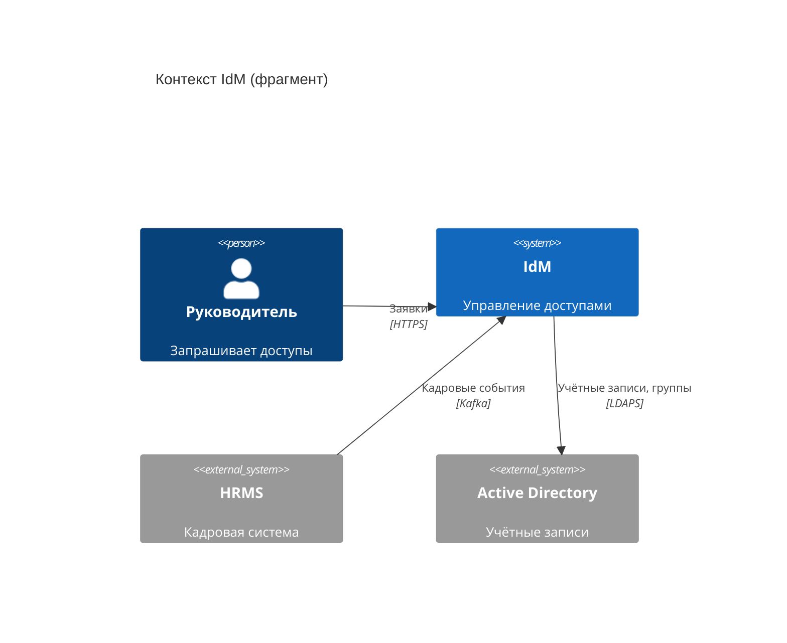
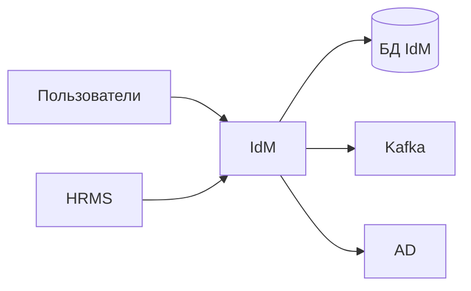
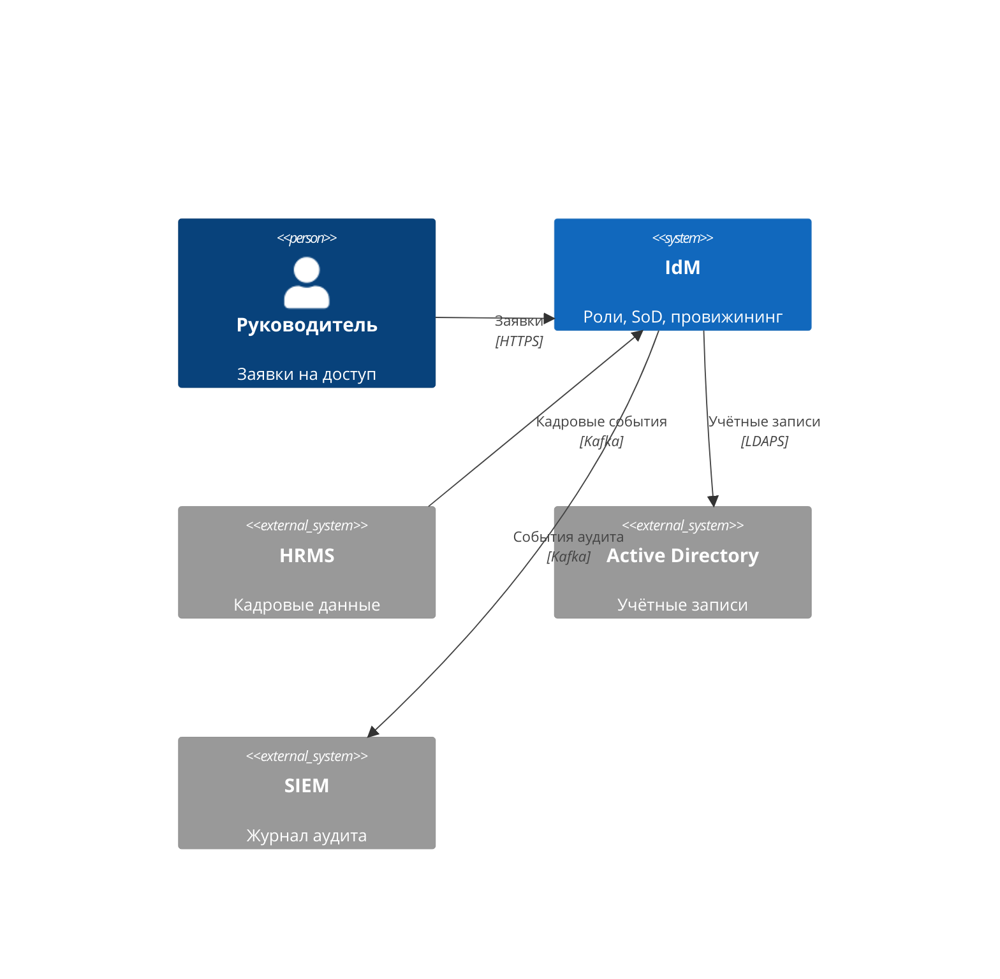
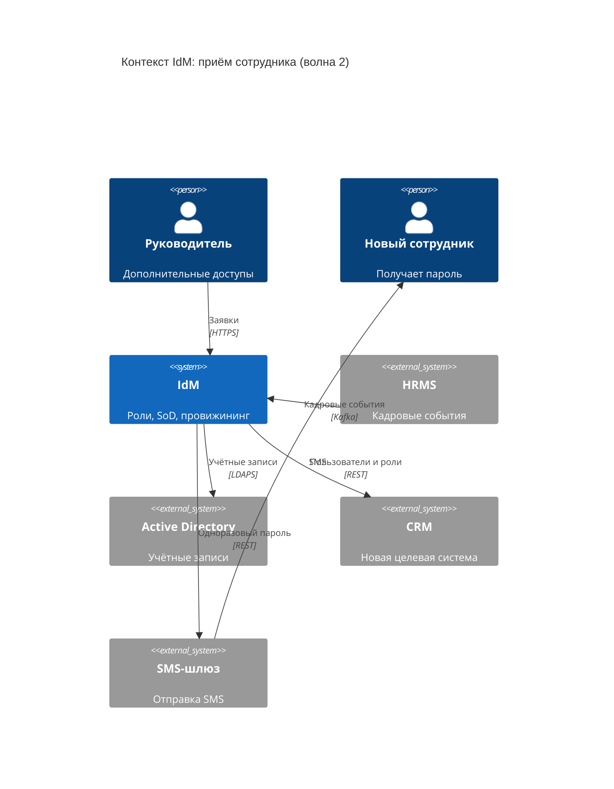

import { Steps, Tabs, TabItem } from '@astrojs/starlight/components';
import Checklist from '../../../components/Checklist.astro';
import Exercise from '../../../components/Exercise.astro';
import PlantUmlDiagram from '../../../components/PlantUmlDiagram.astro';

Теория — [модель C4](/diagrams/c4/).

## Алгоритм построения

<Steps>

1. **Ваша система** — один прямоугольник в центре, с описанием в одну фразу.
2. **Люди** — роли, которые пользуются системой (не фамилии).
3. **Внешние системы** — источники данных, получатели, сервисы (SMS, почта), мониторинг и аудит (SIEM).
4. **Связи** — от кого к кому, **что** передаётся и **как** (технология).
5. **Проверьте «неочевидных соседей»:** справочники, ServiceDesk, SIEM, SMS-шлюз, внешние регуляторы.
6. **Когда остановиться:** каждый сосед имеет владельца, каждая стрелка подписана, внутренности системы не показаны.

</Steps>

## Синтаксис

<Tabs>
<TabItem label="Mermaid">



```text title="Mermaid / C4-PlantUML: элементы уровня Context"
Person(id, "Имя", "Описание")             человек (роль)
Person_Ext(id, ...)                       внешний человек
System(id, "Имя", "Описание")             ваша система
System_Ext(id, "Имя", "Описание")         внешняя система
SystemDb_Ext / SystemQueue_Ext            внешняя БД / очередь
Enterprise_Boundary(b, "Банк") { ... }    граница организации
Rel(from, to, "Что", "Как")               связь
BiRel(a, b, "Что")                        двусторонняя связь
```

Поддержка C4 в Mermaid экспериментальная: синтаксис совместим с C4-PlantUML, но раскладку элементов почти невозможно контролировать. Для документов, которые будут жить долго, надёжнее C4-PlantUML.

</TabItem>
<TabItem label="C4-PlantUML">

<PlantUmlDiagram file="howto/c4-context-min.puml" source="site" title="Минимальный C4 Context" openSource />

`!include <C4/C4_Context>` подключает библиотеку из стандартной поставки PlantUML — сеть не нужна. Дополнительно: `LAYOUT_LEFT_RIGHT()`, `SHOW_LEGEND()`.

</TabItem>
</Tabs>

## В визуальном редакторе

**draw.io:** используйте фигуры C4 (если библиотеки нет в вашей версии — обычные прямоугольники с тремя строками: имя, тип, описание). Главное — соблюдать правила C4: тип элемента, описание, подписанные стрелки.

## Чек-лист готовой диаграммы

<Checklist id="howto-c4-context" items={[
  'В центре одна ваша система, без внутренностей',
  'Люди — роли, а не фамилии',
  'Внешние системы отмечены как внешние',
  'У каждого элемента есть описание',
  'Каждая стрелка подписана: что передаётся и какой технологией',
  'Проверены неочевидные соседи: SIEM, мониторинг, SMS, ServiceDesk, справочники',
  'У каждой внешней системы известен владелец (есть в реестре стейкхолдеров)',
]} />

## До и после

<div class="before-after not-content">
<div class="before-after__col" data-kind="bad">
<p class="before-after__label">До</p>



</div>
<div class="before-after__col" data-kind="good">
<p class="before-after__label">После</p>



</div>
</div>

Что изменилось:

- **Убраны внутренности системы** (БД IdM): на уровне контекста система — чёрный ящик.
- **Шина — не сосед, а способ доставки:** Kafka из отдельного элемента превратилась в технологию на стрелке.
- **«Пользователи» стали ролью** с описанием.
- **Стрелки подписаны,** и появился неочевидный сосед — SIEM.

## Упражнение

<Exercise title="контекст после подключения CRM">

Возьмите <a href="/case/03-architecture/context/">контекст IdM кейса</a> и добавьте подключение CRM (волна 2). Нарисуйте контекст только для потоков, связанных с новым сотрудником: HRMS, IdM, AD, CRM, SMS-шлюз, руководитель, новый сотрудник.

<Fragment slot="solution">



- **CRM — внешняя система** со своим владельцем: его нужно добавить в реестр стейкхолдеров.
- **Технология связи** с CRM — предположение: окончательно выбирается при проектировании интеграции.
- **Пароль** идёт сотруднику только через SMS-шлюз — так требует BRL-08.

</Fragment>

</Exercise>
