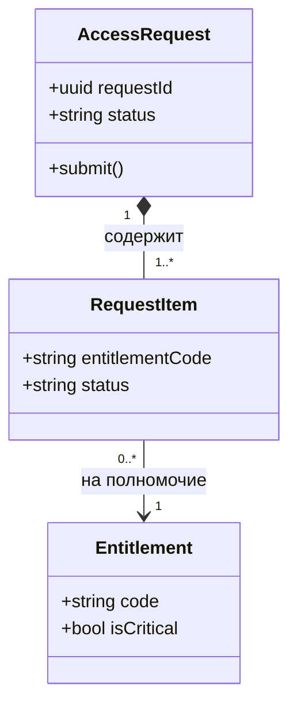
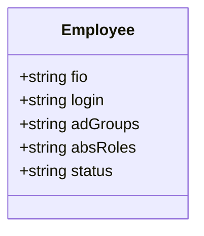
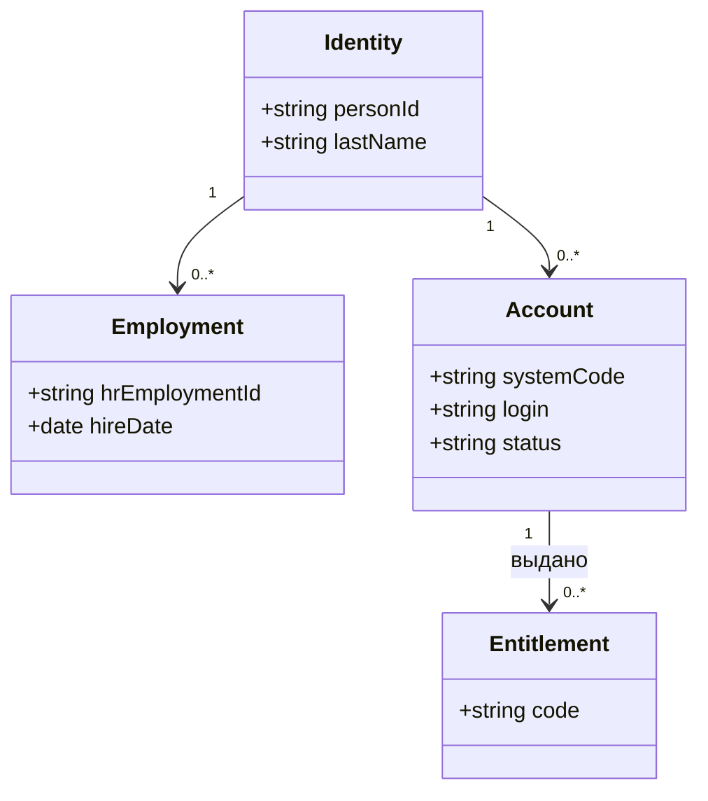
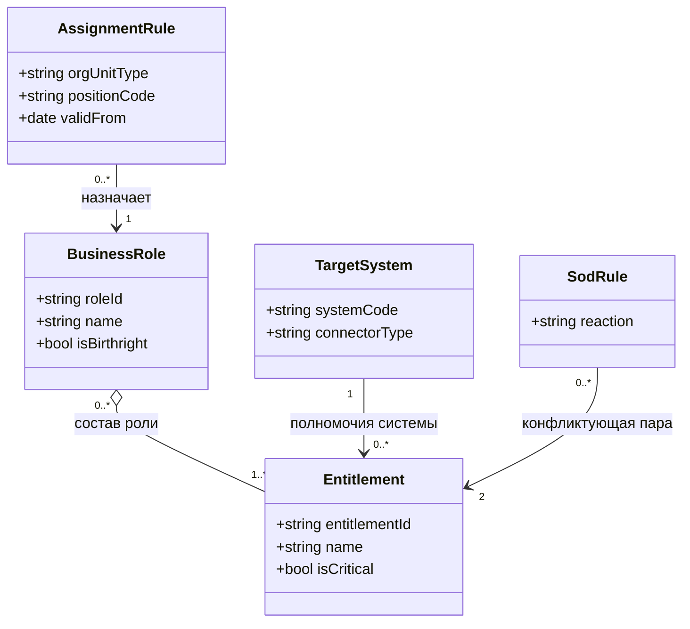

import { Steps, Tabs, TabItem } from '@astrojs/starlight/components';
import Checklist from '../../../components/Checklist.astro';
import Exercise from '../../../components/Exercise.astro';
import PlantUmlDiagram from '../../../components/PlantUmlDiagram.astro';

Теория — [UML: class](/diagrams/class/).

## Алгоритм построения

<Steps>

1. **Существительные** из требований и глоссария — кандидаты в классы.
2. **Отсев:** атрибуты (ФИО), синонимы, роли пользователей, которые не хранятся.
3. **Связи** между оставшимися классами — сначала просто линии.
4. **Тип связи:** композиция (часть не живёт без целого), агрегация, обобщение, ассоциация.
5. **Кратности** с обеих сторон и ключевые атрибуты.
6. **Проверка сценариями:** пройдите 2–3 use case — хватает ли модели? Нет ли склеенных понятий?
7. **Когда остановиться:** все понятия глоссария, нужные сценариям, есть; операции — только если моделируете поведение.

</Steps>

## Синтаксис

<Tabs>
<TabItem label="Mermaid">



```text title="Mermaid classDiagram: связи и элементы"
A <|-- B        обобщение (B наследует A)
A *-- B         композиция
A o-- B         агрегация
A --> B         направленная ассоциация
A -- B          ассоциация
A ..> B         зависимость
A ..|> B        реализация
A "1" --> "*" B кратности
+ - # ~         видимость: public, private, protected, package
<<interface>>   стереотип внутри класса
```

</TabItem>
<TabItem label="PlantUML">

<PlantUmlDiagram file="howto/class-min.puml" source="site" title="Минимальная диаграмма классов" openSource />

```text title="PlantUML class: связи и элементы"
A <|-- B        обобщение
A *-- B         композиция
A o-- B         агрегация
A --> B         ассоциация с направлением
A ..> B         зависимость
A ..|> B        реализация
A "1" *-- "1..*" B : подпись    кратности и подпись
interface I / abstract class A / enum E
hide empty methods              не показывать пустой блок операций
```

</TabItem>
</Tabs>

## В визуальном редакторе

**draw.io:** в библиотеке UML есть класс с секциями атрибутов и операций, интерфейс и все типы стрелок связей (наконечник выбирается в свойствах линии). Кратности — текстовыми подписями у концов линии.

## Чек-лист готовой диаграммы

<Checklist id="howto-class" items={[
  'Классы названы существительными в единственном числе',
  'Нет «склеенных» понятий (сотрудник ≠ учётная запись ≠ трудоустройство)',
  'Тип каждой связи осознан: композиция, агрегация, обобщение, ассоциация',
  'Кратности указаны с обеих сторон',
  'Атрибуты-списки заменены отдельными классами и связями',
  'Модель проверена на 2–3 сценариях use case',
  'Нет деталей реализации, если это аналитическая модель',
]} />

## До и после

<div class="before-after not-content">
<div class="before-after__col" data-kind="bad">
<p class="before-after__label">До</p>



</div>
<div class="before-after__col" data-kind="good">
<p class="before-after__label">После</p>



</div>
</div>

Что изменилось:

- **Один «Сотрудник» разделён на три понятия:** идентичность (человек), трудоустройство (договор), учётная запись (в конкретной системе). Иначе повторный приём и совместительство не помещаются в модель.
- **Списки в строках** (`adGroups`, `absRoles`) заменены связью с полномочиями — их можно выдавать, отзывать и обосновывать по отдельности.
- **Статус** переехал в учётную запись: у каждой системы он свой.

## Упражнение

<Exercise title="доменная модель ролевой модели">

По <a href="/case/02-requirements/role-model/">ролевой модели</a> и <a href="/case/03-architecture/data-model/">модели данных</a> кейса нарисуйте доменную модель: бизнес-роль, полномочие, целевая система, правило назначения, SoD-правило. Покажите, что базовая роль выдаётся всем, а правило назначения сопоставляет тип подразделения и должность с ролью.

<Fragment slot="solution">



- **Агрегация** роль — полномочие: полномочие существует и без роли, одно полномочие входит в несколько ролей. В БД это связующая таблица `role_entitlement`.
- **Базовая роль** — не отдельный класс, а признак `isBirthright`.
- **SoD-правило** связывает **два** полномочия и задаёт реакцию (`DENY` или `APPROVAL`).
- `null` в условиях правила назначения означает «любой» — это стоит записать заметкой на диаграмме или в описании.

</Fragment>

</Exercise>
