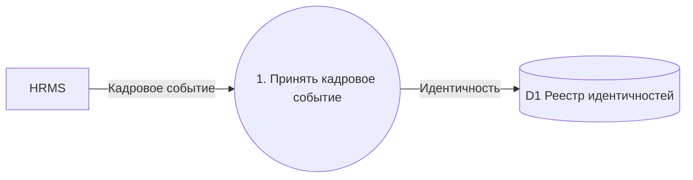
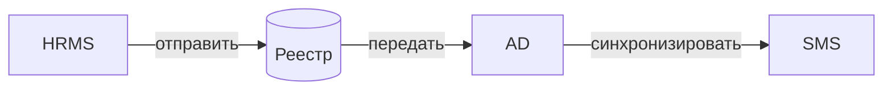
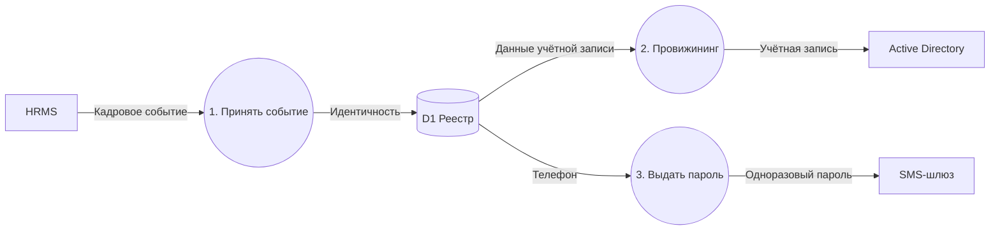
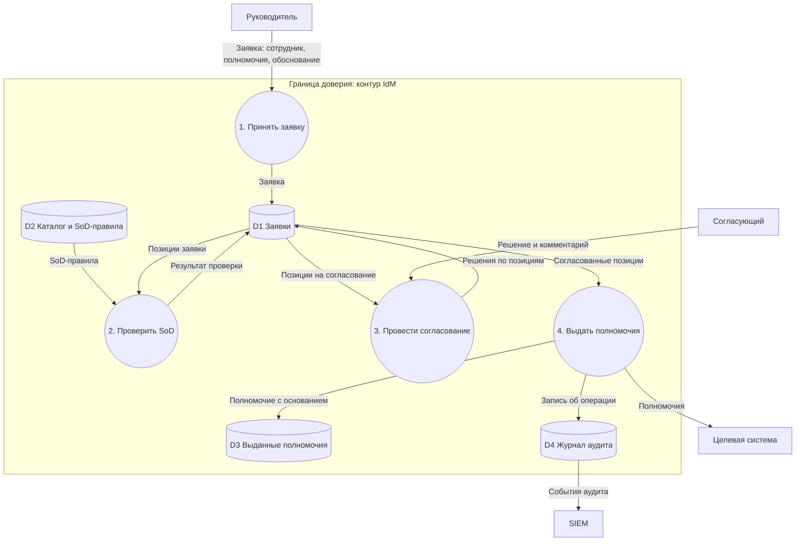

import { Steps, Tabs, TabItem } from '@astrojs/starlight/components';
import Checklist from '../../../components/Checklist.astro';
import Exercise from '../../../components/Exercise.astro';
import PlantUmlDiagram from '../../../components/PlantUmlDiagram.astro';

Теория — [DFD](/diagrams/dfd/).

## Алгоритм построения

<Steps>

1. **Контекстная диаграмма (уровень 0):** система — один процесс, вокруг — внешние сущности, потоки с названиями данных.
2. **Уровень 1:** раскройте систему на 3–9 процессов «глагол + объект», пронумеруйте.
3. **Хранилища** — где данные лежат между процессами (D1, D2…).
4. **Потоки** — каждый подписан данными (существительное).
5. **Баланс:** входы и выходы уровня 1 совпадают с контекстом.
6. **Границы доверия** — если диаграмма для ИБ.
7. **Когда остановиться:** у каждого процесса есть вход и выход, все данные из требований к ПДн учтены, каждый поток через границу доверия разобран.

</Steps>

## Синтаксис

**Ни Mermaid, ни PlantUML не имеют DFD.** Используйте приближение и легенду: что означает каждая фигура.

<Tabs>
<TabItem label="Mermaid (flowchart)">



```text title="Mermaid: соответствие фигур DFD"
E[Имя]               внешняя сущность — прямоугольник
P((1. Процесс))      процесс — круг (нотация Йордона)
D[(D1 Хранилище)]    хранилище — цилиндр (условно)
A -- "Данные" --> B  поток с названием данных
subgraph tb[Граница доверия] ... end   граница доверия
```

</TabItem>
<TabItem label="PlantUML">

<PlantUmlDiagram file="howto/dfd-min.puml" source="site" title="DFD, минимальный пример (приближение)" openSource />

</TabItem>
</Tabs>

## В визуальном редакторе

**draw.io** — самый удобный вариант для DFD: в нём есть фигуры для процессов, хранилищ и внешних сущностей (в том числе в виде открытого справа прямоугольника для хранилища, как в нотации Гейна — Сарсона), а границы доверия рисуются пунктирными рамками. Если готовой библиотеки DFD нет в вашей версии, соберите легенду из базовых фигур и придерживайтесь её.

## Чек-лист готовой диаграммы

<Checklist id="howto-dfd" items={[
  'Есть контекстная диаграмма, уровень 1 сбалансирован с ней',
  'Процессы пронумерованы и названы «глагол + объект»',
  'Каждый поток подписан данными (существительное)',
  'Нет потоков хранилище → хранилище и сущность → сущность напрямую',
  'У каждого процесса есть вход и выход',
  'Хранилища пронумерованы (D1, D2…)',
  'Для ИБ: показаны границы доверия и разобраны потоки через них',
  'Есть легенда, если используется приближённая нотация',
]} />

## До и после

<div class="before-after not-content">
<div class="before-after__col" data-kind="bad">
<p class="before-after__label">До</p>



</div>
<div class="before-after__col" data-kind="good">
<p class="before-after__label">После</p>



</div>
</div>

Что изменилось:

- **Появились процессы:** данные не «перетекают» сами из HRMS в хранилище и из AD в SMS — их перемещает процесс.
- **Подписи — данные, а не действия:** «Кадровое событие», «Телефон», а не «отправить», «синхронизировать».
- **Убран несуществующий поток AD → SMS:** пароль формирует IdM и отправляет через SMS-шлюз.

## Упражнение

<Exercise title="потоки данных заявки на доступ">

Нарисуйте DFD уровня 1 для **UC-03 «Запросить дополнительные доступы»** кейса: руководитель создаёт заявку на портале, IdM проверяет SoD, согласующие принимают решения, полномочия выдаются в целевой системе, всё пишется в журнал аудита. Отметьте границу доверия контура IdM.

<Fragment slot="solution">



- **Через границу доверия** идут заявка от руководителя, решения согласующих, полномочия в целевую систему и события в SIEM — каждый поток нужно защитить (аутентификация, TLS, журналирование).
- **Основание выдачи** сохраняется вместе с полномочием (D3) — это цель G-03 кейса.
- Поток D4 → SIEM формально идёт из хранилища во внешнюю сущность без процесса; строже — добавить процесс «5. Выгрузить события в SIEM».

</Fragment>

</Exercise>
