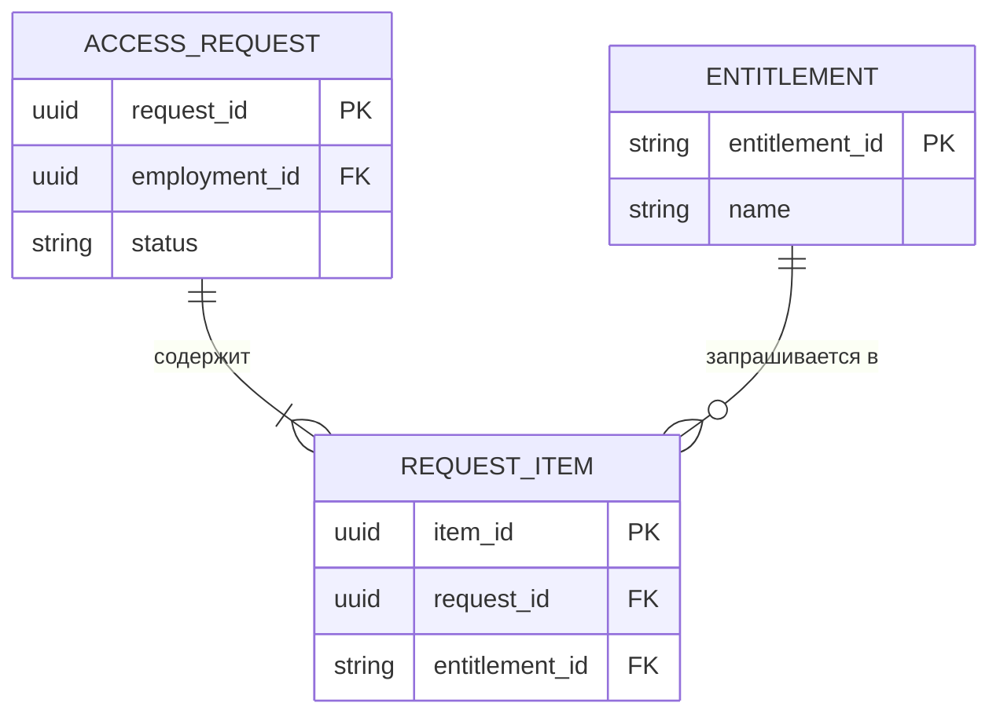
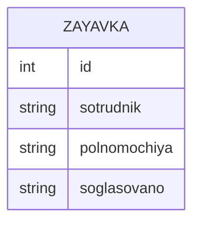
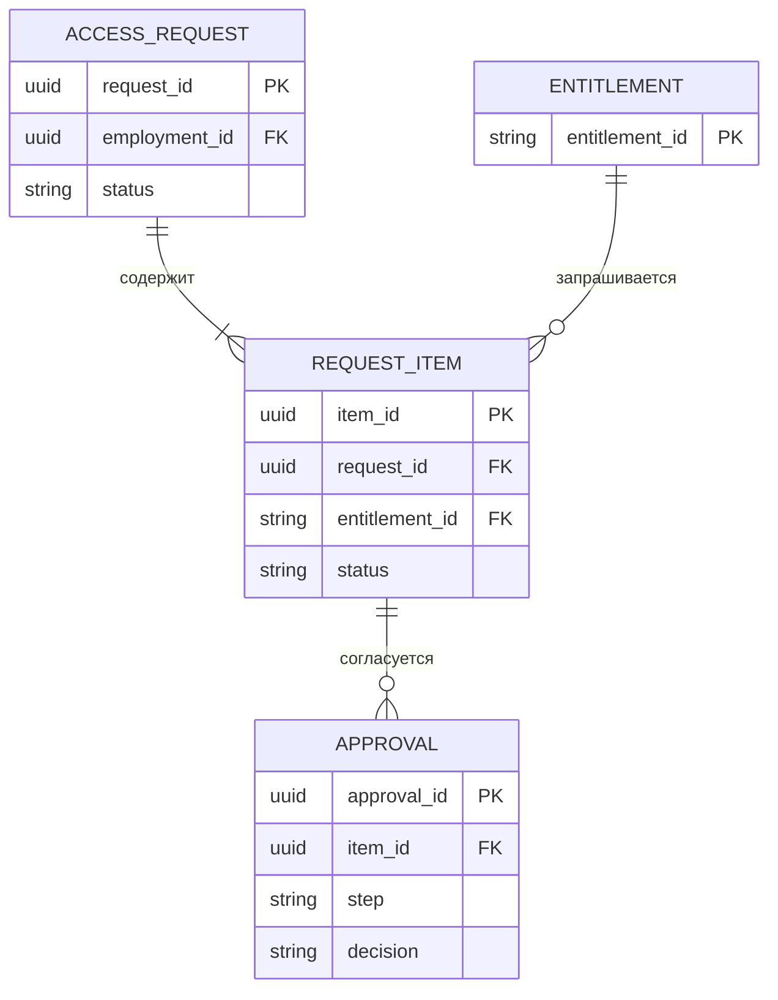
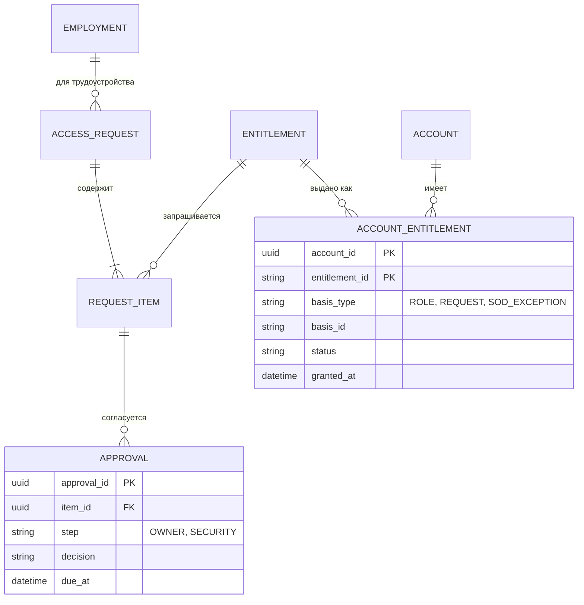

import { Steps, Tabs, TabItem } from '@astrojs/starlight/components';
import Checklist from '../../../components/Checklist.astro';
import Exercise from '../../../components/Exercise.astro';
import PlantUmlDiagram from '../../../components/PlantUmlDiagram.astro';

Теория моделей данных появится в разделе «Данные»; пример полной логической модели — <a href="/case/03-architecture/data-model/">модель данных кейса</a>.

## Алгоритм построения

<Steps>

1. **Сущности** — существительные, о которых нужно хранить данные (из требований, глоссария, use cases).
2. **Первичные ключи** — суррогатный (`*_id`) и, где есть, уникальный бизнес-ключ (UK).
3. **Связи** — между какими сущностями и с какой **кардинальностью** с каждой стороны (ноль / один / много).
4. **«Многие ко многим»** — через связующую сущность.
5. **Атрибуты** — обязательные и необязательные, тип на логическом уровне.
6. **Внешние ключи** — в сущности со стороны «много».
7. **Проверка на сценариях и неудобных случаях:** повторный приём, совместительство, история, аудит. Остановитесь, когда все сценарии укладываются без «костылей».

</Steps>

## Синтаксис

<Tabs>
<TabItem label="Mermaid">



```text title="Mermaid erDiagram: кардинальности и ключи"
||--||   ровно один — ровно один
||--o{   ровно один — ноль или много
||--|{   ровно один — один или много
|o--o{   ноль или один — ноль или много
--       идентифицирующая связь (сплошная)
..       неидентифицирующая (пунктир)
PK, FK, UK      ключи после имени атрибута
"комментарий"   в кавычках после ключа
```

</TabItem>
<TabItem label="PlantUML">

<PlantUmlDiagram file="howto/er-min.puml" source="site" title="Минимальная ER-диаграмма (вороньи лапки)" openSource />

```text title="PlantUML ER: элементы"
entity "имя" as e {          сущность
  * id : uuid <<PK>>          * — обязательный атрибут
  --                          разделитель ключей и атрибутов
  name : varchar
}
a ||--o{ b                   кардинальности, как в Mermaid
hide circle                  убрать значок «E»
skinparam linetype ortho     прямоугольные линии
```

</TabItem>
</Tabs>

## В визуальном редакторе

**draw.io:** библиотека Entity Relation содержит таблицы сущностей и линии с концами «вороньи лапки» (кардинальность выбирается в свойствах конца линии).

**DBeaver** строит ER-диаграмму **по существующей базе данных** — полезно при анализе системы без документации (см. [анализ документов и систем](/elicitation/document-system-analysis/)). Это физическая модель «как есть», а не логическая «как должно быть».

## Чек-лист готовой диаграммы

<Checklist id="howto-er" items={[
  'У каждой сущности есть первичный ключ',
  'Уникальные бизнес-ключи отмечены (UK)',
  'Кардинальность указана с обеих сторон каждой связи',
  'Связи «многие ко многим» реализованы через связующую сущность',
  'Внешние ключи — на стороне «много»',
  'Разные понятия не склеены в одну сущность',
  'Нет списков значений в одном поле',
  'Есть поля для аудита и истории там, где они нужны',
  'Модель проверена на «неудобных» сценариях',
]} />

## До и после

<div class="before-after not-content">
<div class="before-after__col" data-kind="bad">
<p class="before-after__label">До</p>



</div>
<div class="before-after__col" data-kind="good">
<p class="before-after__label">После</p>



</div>
</div>

Что изменилось:

- **Список полномочий в одной строке** заменён позициями заявки — каждую можно согласовать, отклонить и выдать отдельно.
- **Согласование — отдельная сущность на уровне позиции:** у разных полномочий разные владельцы, и шагов может быть несколько (владелец, ИБ).
- **Сотрудник — ссылкой** на трудоустройство, а не текстом с ФИО.
- **Ключи и кардинальности** явно указаны.

## Упражнение

<Exercise title="ER для заявок и выданных полномочий">

Нарисуйте ER-фрагмент кейса: заявка → позиции → согласования, учётная запись → выданные полномочия с **основанием** выдачи (роль, заявка или исключение SoD). Сверьтесь с требованием «у каждого выданного полномочия есть основание» из <a href="/case/03-architecture/data-model/">модели данных</a>.

<Fragment slot="solution">



- **Основание** — пара `basis_type` + `basis_id`: ссылка «на что угодно» (роль, заявку, исключение). Это осознанное решение кейса, оно закрывает цель G-03 (у каждого права есть основание).
- **Составной ключ** `account_id` + `entitlement_id` у выданного полномочия.
- **Срок согласования** (`due_at`) хранится в данных — от него считается эскалация.

</Fragment>

</Exercise>
