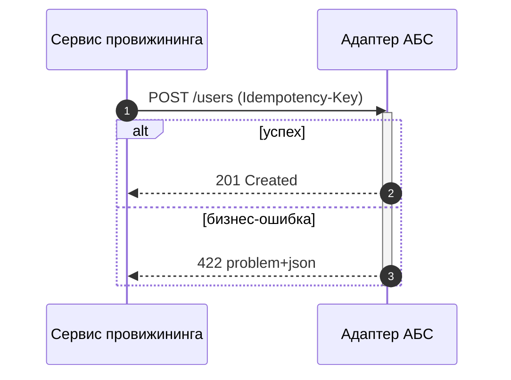
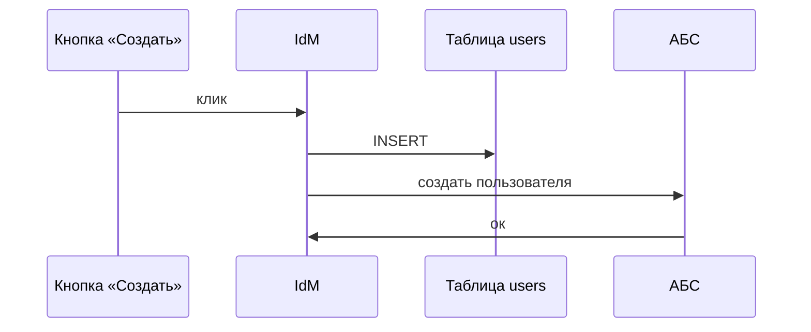
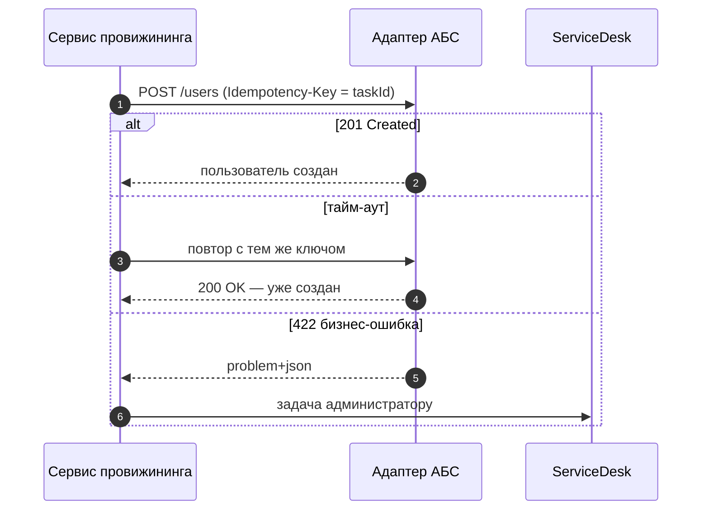
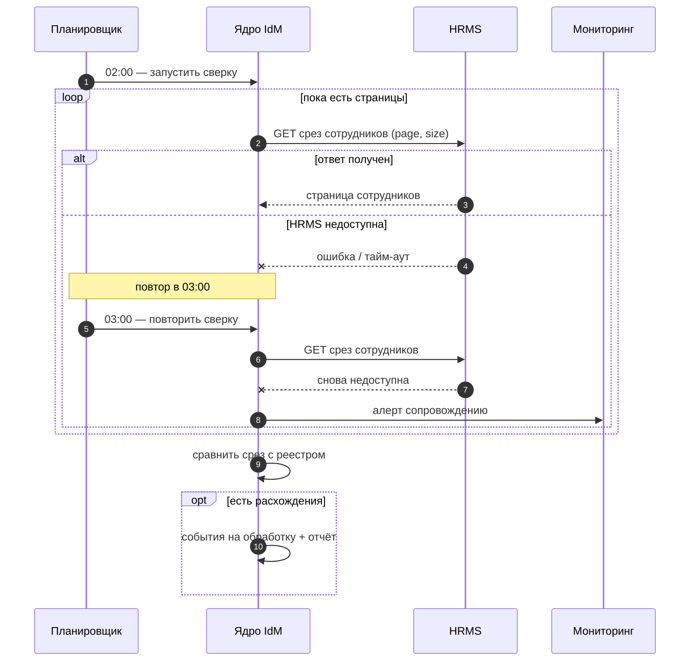

import { Steps, Tabs, TabItem } from '@astrojs/starlight/components';
import Checklist from '../../../components/Checklist.astro';
import Exercise from '../../../components/Exercise.astro';
import PlantUmlDiagram from '../../../components/PlantUmlDiagram.astro';

Теория — [UML: sequence](/diagrams/sequence/).

## Алгоритм построения

<Steps>

1. **Участники.** Выпишите всех, кто обменивается сообщениями в сценарии, и расставьте слева направо: инициатор → посредники → получатели. Один уровень абстракции.
2. **Успешный путь.** Сообщения сверху вниз: операция и ключевые данные (`POST /users (Idempotency-Key)`).
3. **Ответы.** Для каждого синхронного вызова — ответ с кодом или результатом.
4. **Ветки `alt` для ошибок.** Для каждого вызова: тайм-аут, бизнес-ошибка (4xx), техническая ошибка (5xx), недоступность. Что делает вызывающий?
5. **Повторы и ожидания** — `loop` с условием выхода; асинхронные сообщения — отдельным типом стрелки.
6. **Нумерация** (`autonumber`) и, если сценарий растянут во времени, разделители этапов.
7. **Проверка по чек-листу.** Остановитесь, когда каждый вызов имеет ответ и описанное поведение при ошибке.

</Steps>

## Синтаксис

<Tabs>
<TabItem label="Mermaid">



```text title="Mermaid sequence: элементы"
participant A as Имя        участник (actor A — человечек)
A->>B: текст                синхронное сообщение (сплошная, стрелка)
B-->>A: текст               ответ (пунктир)
A-)B: текст                 асинхронное сообщение
A-xB: текст                 сообщение с крестом (потеряно / ошибка)
activate B / deactivate B   активация (или +/- после стрелки: A->>+B)
alt усл ... else ... end    ветвление
opt усл ... end             необязательный фрагмент
loop усл ... end            цикл
par ... and ... end         параллельно
critical ... option ... end критическая секция
break усл ... end           прерывание
rect rgb(...) ... end       подсветка блока
Note over A,B: текст        заметка
autonumber                  нумерация
```

</TabItem>
<TabItem label="PlantUML">

<PlantUmlDiagram file="howto/sequence-min.puml" source="site" title="Минимальная sequence" openSource />

```text title="PlantUML sequence: элементы"
participant "Имя" as A      участник (actor, database, queue, boundary…)
A -> B : текст              вызов
B --> A : текст             ответ
A ->> B : текст             асинхронное сообщение (тонкая стрелка)
A ->x B : текст             потерянное сообщение
A -[#red]> B : текст        цвет стрелки
activate B / deactivate B   активация
alt … else … end            ветвление
opt / loop / par / break / critical / group
== Этап ==                  разделитель этапов
... 5 минут ...             задержка
ref over A, B : SEQ-02      ссылка на другую диаграмму
note over A, B : текст      заметка
autonumber                  нумерация
```

</TabItem>
</Tabs>

## В визуальном редакторе

**draw.io:** в библиотеке UML есть линия жизни, активация и стрелки сообщений; комбинированные фрагменты рисуются рамкой с подписью (`alt`, `loop`). Порядок и выравнивание приходится поддерживать вручную, поэтому для интеграций, которые часто меняются, удобнее текстовые нотации: диаграмма живёт рядом с контрактом в git.

## Чек-лист готовой диаграммы

<Checklist id="howto-sequence" items={[
  'Диаграмма описывает один сценарий; название говорит, какой',
  'Участники на одном уровне абстракции (сервисы, а не классы и кнопки), их не больше 6–8',
  'Синхронные и асинхронные сообщения различаются',
  'У каждого синхронного вызова есть ответ',
  'Для каждого вызова описано поведение при ошибке и тайм-ауте',
  'Повторы — с условием выхода и ключом идемпотентности',
  'Шаги пронумерованы',
  'Подписи сообщений: операция и ключевые данные',
  'Диаграмма согласуется с контрактом (OpenAPI / AsyncAPI) и статусной моделью',
]} />

## До и после

<div class="before-after not-content">
<div class="before-after__col" data-kind="bad">
<p class="before-after__label">До</p>



</div>
<div class="before-after__col" data-kind="good">
<p class="before-after__label">После</p>



</div>
</div>

Что изменилось:

- **Один уровень абстракции:** убраны кнопка и таблица БД — остались сервисы, которые обмениваются сообщениями.
- **Сообщения стали операциями контракта** (`POST /users`) с ключом идемпотентности, ответ — пунктиром.
- **Появились ошибки:** тайм-аут с безопасным повтором и бизнес-ошибка с ручной задачей. В исходной схеме был только успешный путь.
- **Нумерация шагов** — на них можно ссылаться из требований.

## Упражнение

<Exercise title="sequence для ежедневной сверки (UC-10)">

Нарисуйте sequence для **UC-10** кейса: в 02:00 планировщик IdM запускает сверку, IdM запрашивает у HRMS полный срез сотрудников (INT-02, REST, постранично), сравнивает с реестром и отправляет расхождения на обработку. Обязательно покажите, что происходит, если HRMS недоступна.

<Fragment slot="solution">



- **Постраничный запрос** — `loop`, а не один огромный ответ (~4 000 записей).
- **Недоступность HRMS** — `alt` с повтором в 03:00 и алертом, как в карте интеграций.
- **`opt`** для расхождений: обработка выполняется, только если они есть.

</Fragment>

</Exercise>
