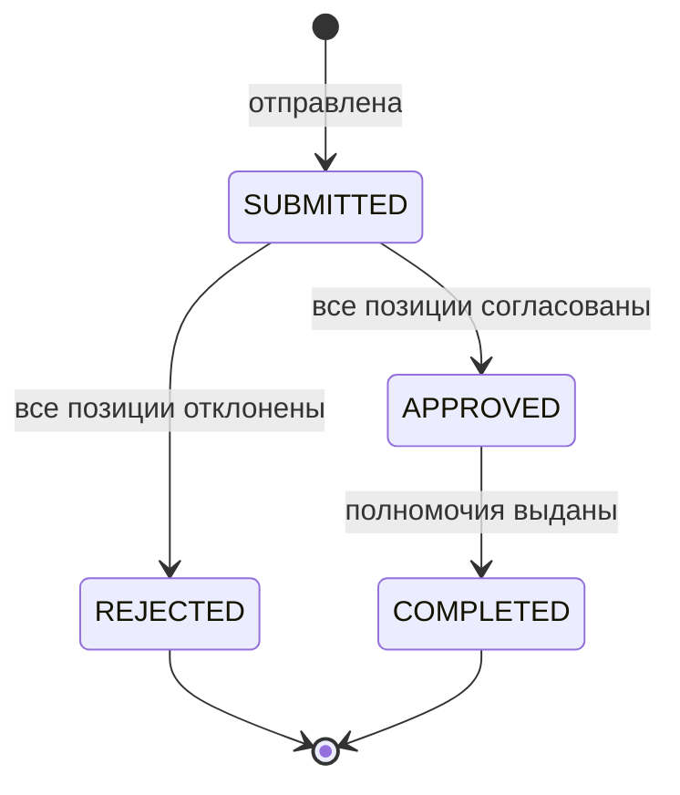
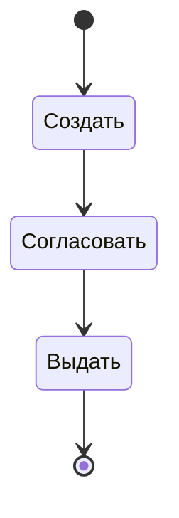
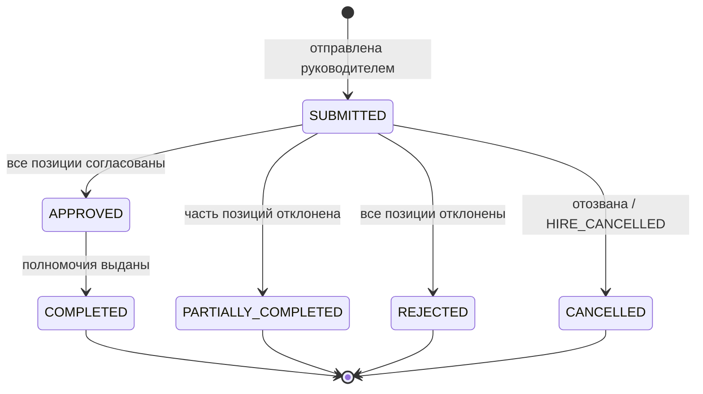
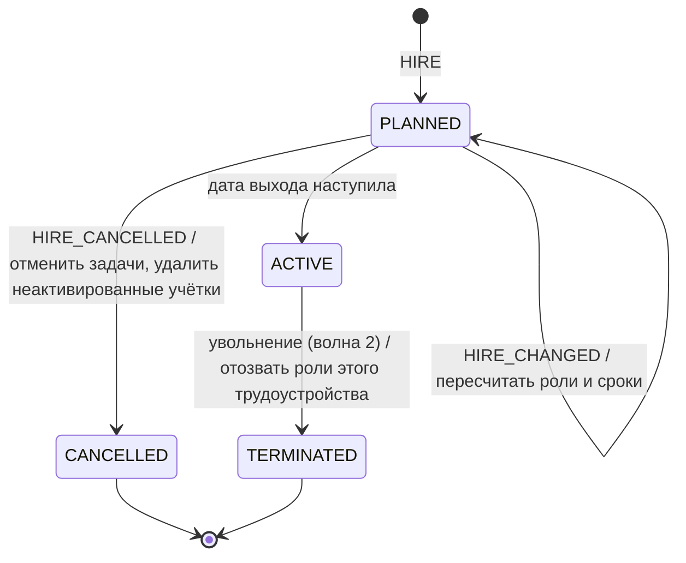

import { Steps, Tabs, TabItem } from '@astrojs/starlight/components';
import Checklist from '../../../components/Checklist.astro';
import Exercise from '../../../components/Exercise.astro';
import PlantUmlDiagram from '../../../components/PlantUmlDiagram.astro';

Теория — [UML: state](/diagrams/state/).

## Алгоритм построения

<Steps>

1. **Выберите один объект** (заявка, учётная запись, задача).
2. **Перечислите состояния** — существительными или причастиями. Спросите: «в каком он сейчас статусе?».
3. **Начальное состояние** — откуда объект появляется и каким событием.
4. **Переходы из каждого состояния:** какие события возможны → куда ведут; `[условие]`, `/ действие`.
5. **Ошибки и отмена** из каждого состояния.
6. **Конечные состояния.**
7. **Таблица переходов и список запрещённых переходов.**
8. **Когда остановиться:** для каждого состояния вы знаете реакцию на каждое значимое событие (или явно её запретили).

</Steps>

## Синтаксис

<Tabs>
<TabItem label="Mermaid">



```text title="Mermaid stateDiagram-v2: элементы"
[*] --> A                   начальное состояние
A --> [*]                   конечное
A --> B: событие [усл] / действие   переход с подписью
state "Длинное имя" as A    состояние с отображаемым именем
state A {                   составное состояние
  [*] --> A1
}
state ch <<choice>>         выбор
state f <<fork>> / <<join>> параллельность
note right of A: текст      заметка
direction LR                направление раскладки
```

</TabItem>
<TabItem label="PlantUML">

<PlantUmlDiagram file="howto/state-min.puml" source="site" title="Минимальная статусная модель" openSource />

```text title="PlantUML state: элементы"
[*] --> A                    начальное
A --> [*]                    конечное
A --> B : событие [усл] / д  переход
A : описание состояния       внутреннее описание
state A {                    составное
  [*] --> A1
}
state c <<choice>>           выбор
hide empty description       не показывать пустые описания
```

</TabItem>
</Tabs>

## В визуальном редакторе

**draw.io:** в библиотеке UML есть состояние, начальное и конечное состояния. Подпись перехода пишите в формате `событие [условие] / действие`. Таблицу переходов удобнее вести рядом — в Confluence или Markdown: её проще согласовывать и превращать в тесты.

## Чек-лист готовой диаграммы

<Checklist id="howto-state" items={[
  'Диаграмма описывает один объект',
  'Состояния — существительные или причастия, не глаголы',
  'Есть начальное состояние; конечные — если жизнь объекта заканчивается',
  'Переходы подписаны событиями; условия в [ ], действия после /',
  'Из каждого состояния описаны ошибки и отмена',
  'Нет состояний без выхода (кроме конечных)',
  'Рядом — таблица переходов и список запрещённых переходов',
  'Понятно, кто или что инициирует каждое событие',
]} />

## До и после

<div class="before-after not-content">
<div class="before-after__col" data-kind="bad">
<p class="before-after__label">До</p>



</div>
<div class="before-after__col" data-kind="good">
<p class="before-after__label">После</p>



</div>
</div>

Что изменилось:

- **Действия заменены состояниями:** «Создать / Согласовать / Выдать» — это activity, а не статусы.
- **Переходы подписаны событиями** — видно, что переводит заявку дальше.
- **Добавлены неуспешные исходы:** отказ, частичное согласование, отмена. В исходной модели заявка «всегда успешна».
- **Частичное выполнение** — как в кейсе: согласование идёт по позициям, поэтому есть PARTIALLY_COMPLETED.

## Упражнение

<Exercise title="статусная модель трудоустройства">

В кейсе нет статусной модели **трудоустройства** (`employment`). Нарисуйте её с учётом: приём (HIRE) до даты выхода, выход на работу, изменение до выхода (HIRE_CHANGED), отмена приёма, увольнение (волна 2) и внутреннее совместительство — у одной идентичности несколько трудоустройств одновременно. См. <a href="/case/03-architecture/data-model/">модель данных</a> и бизнес-правила BRL-05, BRL-07.

<Fragment slot="solution">



- **Самопереход** для HIRE_CHANGED: статус не меняется, но пересчитываются роли и сроки.
- **Совместительство не требует отдельного статуса:** у идентичности просто несколько трудоустройств, каждое со своей моделью; роли назначаются на трудоустройство, поэтому при его завершении понятно, что отзывать.
- **Повторный приём** — новое трудоустройство той же идентичности (BRL-05), а не возврат старого из TERMINATED.
- Запрещённые переходы для тестов: TERMINATED → ACTIVE, CANCELLED → любой.

</Fragment>

</Exercise>
