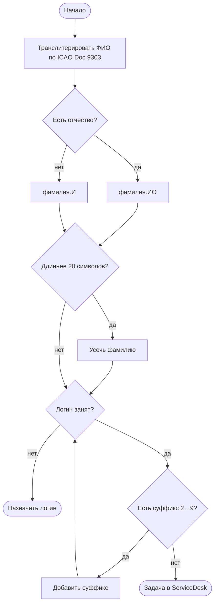

import { Steps, Tabs, TabItem } from '@astrojs/starlight/components';
import Brief from '../../../components/Brief.astro';
import CaseRef from '../../../components/CaseRef.astro';
import InterviewQuestions from '../../../components/InterviewQuestions.astro';
import Related from '../../../components/Related.astro';
import PlantUmlDiagram from '../../../components/PlantUmlDiagram.astro';

<Brief>

**Диаграмма деятельности** (activity diagram) показывает **алгоритм или поток работ**: действия, развилки, циклы, параллельные ветки, а через дорожки — кто выполняет.
Аналитик использует её для **логики внутри системы** (правило расчёта, обработка события) и для потока сценария use case.
Похожа на BPMN, но проще и «системнее»: нет событий-сообщений между организациями, пулов и богатой семантики событий.

</Brief>

## Когда применять

| Применять | Не нужно / лучше другое |
|---|---|
| Алгоритм с ветвлениями: правило генерации, расчёт, валидация | Бизнес-процесс с участниками и передачей работы → BPMN |
| Поток сценария use case с несколькими альтернативами | Кто кого вызывает во времени → sequence |
| Параллельные действия внутри системы | Состояния объекта → state |
| Объяснить разработке «что за чем» без кода | Линейная последовательность из 3 шагов — хватит списка |

## Как делать

<Steps>

1. **Начальный узел** и **конечный** (может быть несколько).

2. **Действия** — «глагол + объект», от имени системы или роли.

3. **Развилки** — ромб с условиями на исходящих стрелках `[условие]`; слияние — тоже ромб.

4. **Параллельность** — fork (толстая черта) и join (ждёт все ветки).

5. **Дорожки** (partitions), если важно, кто выполняет.

6. **Проверьте полноту:** у каждой развилки все варианты; нет «висящих» веток; все циклы имеют выход.

</Steps>

## Нотация

| Элемент | Вид | Значение |
|---|---|---|
| Начальный узел | Закрашенный круг | Старт потока |
| Конечный узел деятельности | Круг с точкой | Вся деятельность завершена |
| Конечный узел потока | Круг с крестом | Завершена одна ветка, остальные продолжаются |
| Действие (action) | Скруглённый прямоугольник | Шаг: «глагол + объект» |
| Решение / слияние | Ромб | Выбор ветки по условию `[guard]` / объединение веток |
| Fork / join | Толстая черта | Разделение на параллельные ветки / ожидание всех |
| Дорожка (partition) | Полоса | Исполнитель: роль, система, компонент |
| Объектный узел | Прямоугольник | Данные между действиями (заявка, файл) |

<Tabs>
<TabItem label="Mermaid (flowchart)">

Mermaid не имеет отдельной activity-диаграммы — её рисуют как flowchart:

</TabItem>
<TabItem label="PlantUML (activity)">

<PlantUmlDiagram file="uml/activity-login.puml" source="site" title="Генерация логина (FR-06) — UML activity" />

</TabItem>
</Tabs>

## Пример из кейса IDM-JOINER

В кейсе нет activity-диаграмм, но для двух мест они напрашиваются.

**Генерация логина** — <CaseRef href="/case/02-requirements/functional-requirements/#fr-06" id="FR-06">FR-06, раздел 2.1</CaseRef>: правило описано шагами и таблицей примеров; диаграмма выше показывает ту же логику с циклом по суффиксам.

**Активация в день выхода** — <CaseRef href="/case/02-requirements/use-cases/#uc-02" id="UC-02">UC-02</CaseRef>: параллельные действия и дорожки компонентов.

<PlantUmlDiagram file="uml/activity-activation.puml" source="site" title="Активация в день выхода: дорожки и параллельность" />

## Типичные ошибки

| Ошибка | Чем плохо | Как правильно |
|---|---|---|
| Activity вместо BPMN для бизнес-процесса | Нет событий, сообщений, участников-организаций | BPMN для бизнеса, activity — для логики системы |
| Условия не подписаны | Непонятно, когда какая ветка | `[условие]` на каждой стрелке из развилки |
| Параллельные ветки без join | Неясно, ждём ли обе | Fork → join |
| Цикл без выхода | Бесконечная логика | Условие выхода из цикла |
| Состояния вместо действий («Создана») | Перепутаны activity и state | Действия: «Создать» |

## Вопросы на собеседовании

<InterviewQuestions topic="diagrams" ids={['diag-activity-vs-bpmn', 'diag-state-vs-activity']} />

## Связанные темы

<Related pages={['processes/bpmn', 'diagrams/state', 'diagrams/choose', 'requirements/use-cases']} />
