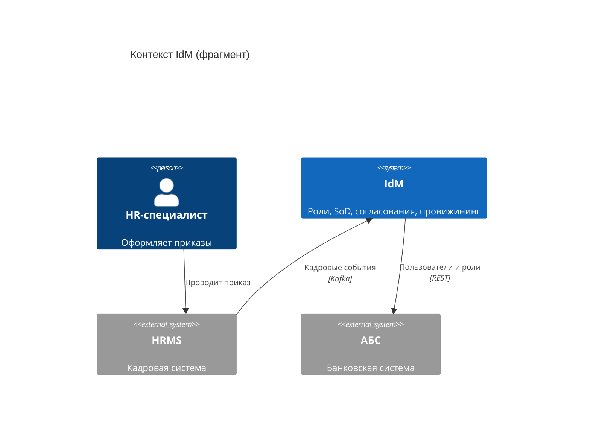

import { Steps, Tabs, TabItem } from '@astrojs/starlight/components';
import Brief from '../../../components/Brief.astro';
import CaseRef from '../../../components/CaseRef.astro';
import InterviewQuestions from '../../../components/InterviewQuestions.astro';
import Related from '../../../components/Related.astro';
import PlantUmlDiagram from '../../../components/PlantUmlDiagram.astro';

<Brief>

**C4** (автор — Simon Brown) — способ показывать архитектуру на **разных уровнях приближения**, как карту с масштабом: **Context** (система и соседи) → **Container** (разворачиваемые части) → **Component** (модули внутри контейнера) → **Code**.
Это не новая нотация, а договорённость об уровнях и простых обозначениях: у каждого элемента — **имя, тип, технология, описание**, у каждой стрелки — **что и как** передаётся.
Аналитик чаще всего рисует или читает уровень 1 и использует уровень 2, чтобы понимать, где живёт требование.

</Brief>

## Когда применять

| Применять | Не нужно |
|---|---|
| Почти любой проект — контекст за 15 минут экономит недели | Уровень 4 (код) — его генерируют IDE, рисовать вручную незачем |
| Объяснить архитектуру людям разной подготовки | Строгая модель интерфейсов → UML component |
| Найти всех соседей системы и их владельцев | Одно приложение и одна БД — уровень 2 можно не рисовать |
| Обсудить, в каком контейнере реализуется требование | — |

## Как делать

<Steps>

1. **Context:** в центре — ваша система; вокруг — люди (роли) и внешние системы. Стрелки — что и как передаётся. Детали внутри системы не показывать.

2. **Проверьте «неочевидных соседей»:** мониторинг, SIEM, SMS-шлюз, ServiceDesk, справочники.

3. **Container:** раскройте систему — приложения, сервисы, БД, очереди. Для каждого: имя, технология, ответственность.

4. **Стрелки контейнеров:** протокол и смысл («Публикует кадровые события / Kafka»).

5. **Component** — только для сложных контейнеров и только если это нужно команде.

6. **Одна диаграмма — один уровень.** Легенда, если используете цвета или стили.

</Steps>

## Нотация

| Уровень | Что показывает | Аудитория |
|---|---|---|
| 1. System Context | Система, пользователи, внешние системы | Все, включая бизнес |
| 2. Container | Приложения, сервисы, БД, очереди внутри системы | Архитекторы, СА, разработка, эксплуатация |
| 3. Component | Модули внутри одного контейнера | Разработка |
| 4. Code | Классы | Обычно не рисуют |

Вспомогательные виды: **System Landscape** (все системы организации), **Dynamic** (сценарий на контейнерах — похоже на sequence), **Deployment** (контейнеры на инфраструктуре).

| Элемент | Обязательная информация |
|---|---|
| Person | Имя роли, описание |
| Software System | Имя, описание; отметка «внешняя» |
| Container | Имя, технология, ответственность |
| Component | Имя, технология, ответственность |
| Relationship | Что передаётся и как (протокол / технология) |

<Tabs>
<TabItem label="PlantUML (C4-PlantUML)">

C4-PlantUML входит в стандартную библиотеку PlantUML: `!include <C4/C4_Context>`, затем макросы `Person`, `System`, `System_Ext`, `Container`, `ContainerDb`, `Rel`. Так нарисованы диаграммы кейса.

</TabItem>
<TabItem label="Mermaid">

Поддержка C4 в Mermaid помечена в документации как экспериментальная: синтаксис совместим с C4-PlantUML, но раскладка элементов управляется хуже.

</TabItem>
</Tabs>

## Пример из кейса IDM-JOINER

<PlantUmlDiagram file="03_architecture/diagrams/c4-context.puml" title="C4 Context — IdM (кейс)" />

- На контексте **8 внешних систем** — значит, 8 потенциальных владельцев, которых нужно вовлечь (сравните с реестром стейкхолдеров).
- У каждой стрелки — смысл и технология: «Публикует кадровые события [Kafka]», «Пользователи и роли [REST через адаптер]».

<PlantUmlDiagram file="03_architecture/diagrams/c4-container.puml" title="C4 Container — решение IdM (кейс)" />

- Кадровые события идут в ядро **не напрямую**, а через обработчик с DLQ — это следствие <CaseRef href="/case/03-architecture/adr/#adr-001" id="ADR-001">ADR-001</CaseRef>.
- В документе <CaseRef href="/case/03-architecture/containers/" id="C4 L2">«Контейнеры»</CaseRef> для каждого контейнера указано, какие ФТ он реализует, — прямая связь архитектуры с требованиями.

## Типичные ошибки

| Ошибка | Чем плохо | Как правильно |
|---|---|---|
| Контейнер C4 = Docker-контейнер | Путаница уровней | Контейнер — любая разворачиваемая часть, включая БД |
| Стрелки без подписей | Не видно, что и как передаётся | «Что / технология» на каждой стрелке |
| Смешение уровней на одной диаграмме | Непонятный масштаб | Один уровень — одна диаграмма |
| Шина одним прямоугольником без топиков | Не видно, кто с кем обменивается | Топики или подписи потоков |
| Забыты «неочевидные соседи» | Интеграции всплывают поздно | SIEM, мониторинг, SMS, ServiceDesk, справочники |
| Нет технологии у контейнеров | Нельзя обсуждать НФТ и сопровождение | Технология обязательна |

## Вопросы на собеседовании

<InterviewQuestions topic="diagrams" ids={['diag-c4-levels', 'diag-c4-container', 'diag-c4-vs-uml']} />

## Связанные темы

<Related pages={['diagrams/component-deployment', 'diagrams/dfd', 'diagrams/choose', 'case/03-architecture/context']} planned={['ADR', 'Монолит и микросервисы']} />
