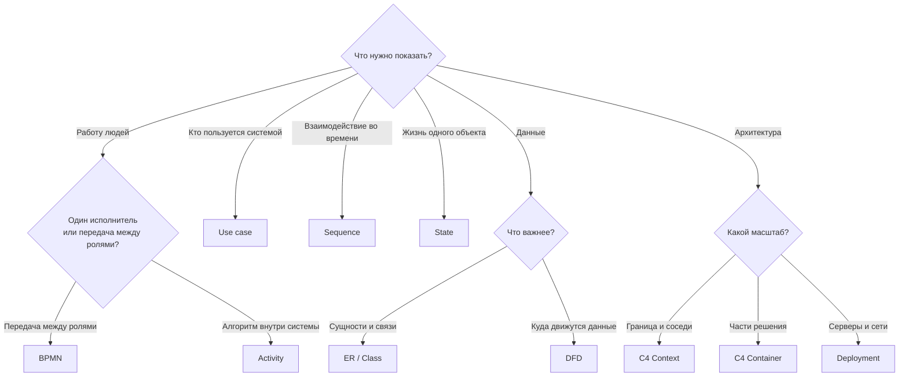

import { Steps } from '@astrojs/starlight/components';
import Brief from '../../../components/Brief.astro';
import CaseRef from '../../../components/CaseRef.astro';
import InterviewQuestions from '../../../components/InterviewQuestions.astro';
import Related from '../../../components/Related.astro';

<Brief>

Диаграмма выбирается **от вопроса**, а не от привычки: «кто что делает» — BPMN, «кто пользуется системой» — use case, «кто кого вызывает» — sequence, «как живёт объект» — state, «что хранится» — ER / class, «где граница и из чего состоит» — C4, «как движутся данные» — DFD.
Одна диаграмма — один вопрос и один уровень детализации.
Точный формат обмена — это не диаграмма, а контракт (OpenAPI, AsyncAPI).

</Brief>

## Когда применять

| Применять | Не нужно |
|---|---|
| Сложно объяснить словами: ветвления, параллельность, много участников | Простая последовательность из 3–4 шагов — хватит списка |
| Нужно договориться: картинка снимает разночтения | Рисовать «для галочки» диаграмму, которую никто не прочитает |
| Нужно передать в разработку и тестирование однозначную модель | Дублировать одно и то же на трёх диаграммах |

## Как делать

<Steps>

1. **Сформулируйте вопрос**, на который должна ответить диаграмма, и аудиторию.

2. **Выберите тип** по таблице или дереву ниже.

3. **Выберите уровень детализации** под аудиторию: бизнесу — контекст и процесс, разработке — sequence и статусы.

4. **Одна диаграмма — один сценарий или один объект.** Больше 15–20 элементов — делите.

5. **Подпишите всё:** название, легенду при необходимости, стрелки — что передаётся.

6. **Свяжите с текстом:** диаграмма дополняет требования, а не заменяет их.

</Steps>

## Нотация: сводная таблица и дерево выбора

| Диаграмма | Главный вопрос | Этап | Кто рисует | Для кого | Детализация |
|---|---|---|---|---|---|
| BPMN | Кто что делает в процессе и в каком порядке? | Обследование, бизнес-анализ | БА | Бизнес, аналитики | Шаг = работа одного исполнителя |
| Use case | Кто и зачем пользуется системой? | Системный анализ | СА | Заказчик, команда | Цели акторов; детали — в спецификациях |
| Activity | Какой алгоритм внутри системы? | Системный анализ | СА | Разработка, QA | Действия системы, ветвления |
| Sequence | Кто кого вызывает и в каком порядке, что при ошибке? | Проектирование интеграций | СА | Разработка, смежные команды | Сообщения между сервисами |
| State | В каких состояниях бывает объект? | Системный анализ, проектирование | СА | Разработка, QA | Все статусы и переходы одного объекта |
| Class / ER | Какие сущности и как связаны? | Проектирование | СА (логическая), DBA (физическая) | Разработка, DBA | Сущности, атрибуты, ключи |
| C4 Context | Где граница системы и кто соседи? | Инициация → проектирование | Архитектор / СА | Все, включая бизнес | Система целиком |
| C4 Container | Из каких разворачиваемых частей состоит решение? | Проектирование | Архитектор | Архитекторы, СА, разработка | Приложения, БД, очереди |
| C4 Component | Как устроен один контейнер? | Проектирование | Архитектор, разработка | Разработка | Модули внутри контейнера |
| Component (UML) | Какие компоненты и через какие интерфейсы связаны? | Проектирование | Архитектор | Разработка | Интерфейсы, зависимости |
| Deployment | Где и на чём работает система? | Проектирование, внедрение | Архитектор, DevOps | Эксплуатация, ИБ | Узлы, среды, сети |
| DFD | Как данные движутся между процессами и хранилищами? | Анализ, моделирование угроз | СА, ИБ | ИБ, аналитики | Потоки данных, границы доверия |

### Частые путаницы

| Пара | Разница |
|---|---|
| BPMN или Activity | BPMN — бизнес-процесс с участниками и обменом между ними; Activity — алгоритм внутри системы |
| BPMN или Sequence | BPMN — что делают участники; Sequence — какие сообщения они передают и в каком порядке |
| State или Activity | State — про объект («учётная запись бывает такой-то»); Activity — про действия («сначала, потом») |
| Class или ER | ER — данные и ключи; Class — объекты с операциями, наследованием, интерфейсами |
| C4 Container или Deployment | Container — логические части решения; Deployment — физические узлы и среды |
| Sequence или контракт | Sequence — порядок и ошибки; точный формат — в OpenAPI / AsyncAPI |

## Пример из кейса IDM-JOINER

В кейсе 14 диаграмм, и каждая отвечает на свой вопрос — см. <CaseRef href="/case/diagrams/" id="Диаграммы">все диаграммы кейса</CaseRef>:

| Вопрос | Диаграмма кейса |
|---|---|
| Как сейчас и как будет работать процесс? | BPMN AS-IS, TO-BE |
| Кто пользуется IdM? | Use case |
| Где граница IdM и кто соседи? | C4 Context — 8 внешних систем |
| Из каких частей состоит решение? | C4 Container |
| Что хранится? | ER-модель |
| Как живут учётная запись, заявка, задача? | 4 state-диаграммы |
| Что происходит при приёме, сбое АБС, отмене, заявке? | 4 sequence-диаграммы |

Чего в кейсе **нет** и где это пригодилось бы: activity для генерации логина (FR-06), deployment для зон безопасности, DFD для потоков персональных данных. Это хорошие упражнения.

## Типичные ошибки

| Ошибка | Чем плохо | Как правильно |
|---|---|---|
| Одна огромная диаграмма «обо всём» | Нечитаема, устаревает целиком | Один вопрос — одна диаграмма |
| Смешение уровней (C4 Context и контейнеры на одной схеме) | Непонятно, о чём диаграмма | Один уровень детализации |
| Стрелки без подписей | Неясно, что и как передаётся | Подпись: что, как (протокол) |
| Диаграмма вместо требований | Правила и исключения не видны | Диаграмма + текст / таблица |
| Нотация «своя» без легенды | Каждый читает по-своему | Стандартная нотация или легенда |

## Вопросы на собеседовании

<InterviewQuestions topic="diagrams" ids={['diag-uml-types', 'diag-choose']} />

## Связанные темы

<Related pages={['processes/bpmn', 'diagrams/sequence', 'diagrams/state', 'diagrams/c4', 'diagram-howto']} />
