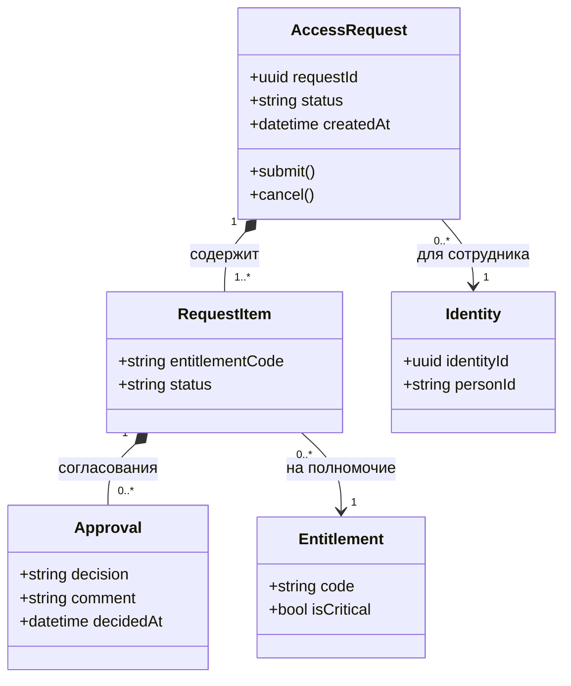

import { Steps } from '@astrojs/starlight/components';
import Brief from '../../../components/Brief.astro';
import CaseRef from '../../../components/CaseRef.astro';
import InterviewQuestions from '../../../components/InterviewQuestions.astro';
import Related from '../../../components/Related.astro';

<Brief>

**Диаграмма классов** (class diagram) показывает **структуру**: классы с атрибутами и операциями и связи между ними — ассоциацию, агрегацию, композицию, обобщение, зависимость, с кратностями.
Аналитику чаще нужна её облегчённая форма — **доменная модель**: понятия предметной области и связи, без операций и деталей реализации.
Для проектирования хранения данных обычно используют ER-модель; диаграмма классов добавляет поведение и наследование.

</Brief>

## Когда применять

| Применять | Не нужно / лучше другое |
|---|---|
| Доменная модель: договориться о понятиях и связях | Проектирование таблиц и ключей → ER |
| Объектная модель API: что внутри ресурса, что вложено | Поток действий → activity |
| Наследование и полиморфизм в предметной области (виды заявок) | Детальный дизайн кода — дело разработки |
| Документирование структуры сообщений и DTO | — |

## Как делать

<Steps>

1. **Выпишите существительные** предметной области из требований и глоссария — кандидаты в классы.

2. **Отсейте атрибуты** (ФИО — атрибут сотрудника, а не класс) и синонимы.

3. **Добавьте ключевые атрибуты** — те, что важны для понимания; операции — только если моделируете поведение.

4. **Проведите связи** и определите тип: ассоциация, агрегация, композиция, обобщение.

5. **Расставьте кратности** с обеих сторон: `1`, `0..1`, `0..*`, `1..*`.

6. **Проверьте на сценариях:** хватает ли модели, чтобы выполнить use case? Нет ли «склеенных» понятий (сотрудник = учётная запись)?

</Steps>

## Нотация

| Связь | Вид | Значение | Пример |
|---|---|---|---|
| Ассоциация | Сплошная линия | Объекты связаны | Сотрудник — подразделение |
| Агрегация | Пустой ромб у целого | Часть может существовать без целого | Роль — полномочие |
| Композиция | Закрашенный ромб у целого | Часть живёт и удаляется вместе с целым | Заявка — позиция заявки |
| Обобщение | Пустой треугольник к родителю | Наследование «является» | Заявка на доступ — заявка |
| Реализация | Пунктир, пустой треугольник | Класс реализует интерфейс | Коннектор AD — Коннектор |
| Зависимость | Пунктирная стрелка | Использует | Сервис провижининга → Коннектор |

Видимость: `+` public, `-` private, `#` protected, `~` package. Кратность: `1`, `0..1`, `*` (= `0..*`), `1..*`.

## Пример из кейса IDM-JOINER

В кейсе модель данных нарисована ER-диаграммой — <CaseRef href="/case/03-architecture/data-model/" id="Данные">логическая модель данных</CaseRef>. Диаграмма выше показывает тот же фрагмент (заявка, позиции, согласования) в нотации классов:

- **Композиция** «заявка — позиции»: позиция не существует без заявки.
- **Согласование на уровне позиции**, а не заявки — потому что у разных полномочий разные владельцы. В кейсе это ключевое решение модели, и из него следует статус PARTIALLY_COMPLETED.
- **Главное решение модели кейса**: идентичность ≠ трудоустройство ≠ учётная запись. Если «склеить» эти понятия, повторный приём и совместительство сломают модель.

## Типичные ошибки

| Ошибка | Чем плохо | Как правильно |
|---|---|---|
| Склеить разные понятия (сотрудник = учётная запись) | Модель ломается на реальных случаях | Проверять модель на сценариях |
| Агрегация вместо композиции и наоборот | Неверные правила удаления и жизни объектов | Вопрос: «живёт ли часть без целого?» |
| Нет кратностей | Неизвестно, «один» или «много» | Кратности с обеих сторон |
| Детальные методы и типы на аналитической модели | Модель устаревает с кодом | Доменная модель без реализации |
| Атрибуты-списки вместо связей | Скрытые сущности | Отдельный класс и связь |

## Вопросы на собеседовании

<InterviewQuestions topic="diagrams" ids={['diag-class-relations', 'diag-class-vs-er']} />

## Связанные темы

<Related pages={['diagrams/state', 'diagrams/choose', 'case/03-architecture/data-model']} planned={['Модели данных и ER', 'Ключи и нормализация']} />
