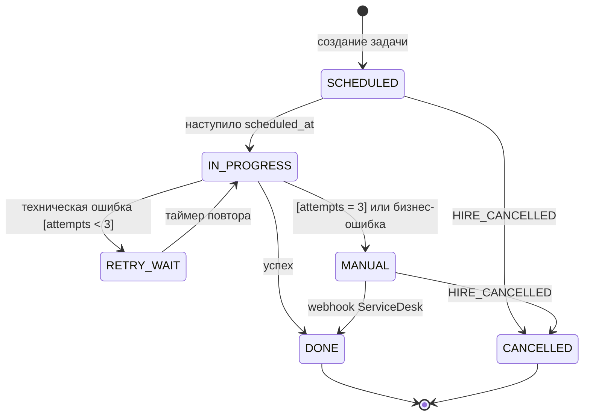

import { Steps } from '@astrojs/starlight/components';
import Brief from '../../../components/Brief.astro';
import CaseRef from '../../../components/CaseRef.astro';
import InterviewQuestions from '../../../components/InterviewQuestions.astro';
import Related from '../../../components/Related.astro';
import PlantUmlDiagram from '../../../components/PlantUmlDiagram.astro';

<Brief>

**Диаграмма состояний** (state machine diagram, статусная модель) описывает жизненный цикл **одного объекта**: в каких состояниях он бывает и какие события переводят его из одного в другое.
Переход записывается как **`событие [условие] / действие`**.
Для разработки это логика, для тестирования — готовый список тестов: каждый переход — позитивный тест, каждый **запрещённый** переход — негативный.

</Brief>

## Когда применять

| Применять | Не нужно / лучше другое |
|---|---|
| У объекта есть статус: заявка, заказ, учётная запись, платёж, задача | Объект без жизненного цикла (справочник) |
| Нужно определить, кто и когда может менять статус | Последовательность действий → activity |
| Интеграции обмениваются статусами — нужна общая модель | Взаимодействие систем → sequence |
| Источник тест-кейсов | — |

## Как делать

<Steps>

1. **Один объект — одна диаграмма.** Статус заявки и статус задачи — разные модели.

2. **Перечислите состояния** — существительные или причастия: «Создана, заблокирована», а не «Создать».

3. **Начальное состояние** — откуда объект появляется.

4. **Переходы:** для каждого состояния — какие события возможны и куда ведут; `[условие]` и `/ действие`, если есть.

5. **Ошибки и отмена:** из каждого состояния — что при сбое, что при отмене.

6. **Конечные состояния** — где жизнь объекта заканчивается.

7. **Таблица переходов** рядом с диаграммой: «из — в — событие — условие — действие». Её легче согласовать и превратить в тесты.

8. **Запрещённые переходы** — списком: это негативные тесты и проверки в коде.

</Steps>

## Нотация

| Элемент | Вид | Правило |
|---|---|---|
| Состояние | Скруглённый прямоугольник | Существительное / причастие |
| Начальное состояние | Закрашенный круг | Одно на модель (уровень) |
| Конечное состояние | Круг с ободком | Может отсутствовать, если объект «живёт вечно» |
| Переход | Стрелка | `событие [условие] / действие` |
| Самопереход | Стрелка в то же состояние | Событие выполняет действие, не меняя состояние |
| Составное состояние | Состояние с вложенными | Группа состояний с общими переходами |
| Внутренние действия | `entry / …`, `exit / …`, `do / …` | При входе, выходе, пока в состоянии |
| Выбор (choice) | Ромб | Ветвление перехода по условию |



```markdown title="Шаблон таблицы переходов"
| Из | В | Событие | Условие | Действие |
|----|---|---------|---------|----------|
| —  | <начальное> | <событие создания> | — | — |

Запрещённые переходы (негативные тесты): <A → B>; <C → любой>
```

## Пример из кейса IDM-JOINER

<CaseRef href="/case/03-architecture/state-models/" id="Статусы">Статусные модели кейса</CaseRef> — четыре объекта: идентичность, учётная запись, заявка, задача провижининга. Модель учётной записи:

<PlantUmlDiagram file="03_architecture/diagrams/state-account.puml" title="Жизненный цикл учётной записи" />

Что показывает кейс:

- **Диаграмма + таблица переходов** для одного объекта. Таблицу удобнее согласовывать и превращать в тесты, диаграмму — объяснять.
- **Запрещённые переходы записаны явно:** ACTIVE → CREATED_DISABLED, DELETED → любой, PLANNED → ACTIVE без создания.
- **Ошибки и отмена из каждого состояния:** FAILED, переходы по HIRE_CANCELLED из PLANNED, CREATED_DISABLED, FAILED.
- **Политика повторов FR-16 целиком** — в модели задачи провижининга (диаграмма выше).
- **Особые статусы:** заявка согласуется по позициям, поэтому есть PARTIALLY_COMPLETED; идентичность из TERMINATED может вернуться в PRE_HIRE (повторный приём, BRL-05).

## Типичные ошибки

| Ошибка | Чем плохо | Как правильно |
|---|---|---|
| Состояния названы действиями («Создать») | Это activity, а не state | Существительные / причастия |
| Нет переходов для ошибок и отмены | Объект «застревает» при сбое | Из каждого состояния: что при ошибке и отмене |
| Не определено «невозможное» событие | Разработка решает сама (отмена после активации) | Явная реакция или запрещённый переход |
| Статусы разных объектов на одной диаграмме | Путаница: статус заявки или задачи? | Одна модель — один объект |
| Нет таблицы переходов | Сложно согласовать и протестировать | Диаграмма + таблица |
| Не указано, кто меняет статус | Права и интеграции неясны | Событие и источник события |

## Вопросы на собеседовании

<InterviewQuestions topic="diagrams" ids={['diag-state-transition', 'diag-state-vs-activity']} />

## Связанные темы

<Related pages={['diagrams/sequence', 'diagrams/activity', 'diagrams/class']} planned={['Тест-дизайн: переходы состояний']} />
