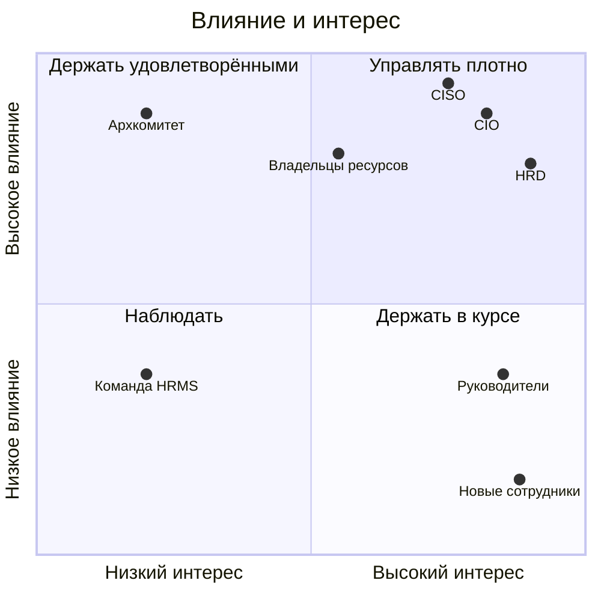

import { Steps } from '@astrojs/starlight/components';
import Brief from '../../../components/Brief.astro';
import CaseRef from '../../../components/CaseRef.astro';
import InterviewQuestions from '../../../components/InterviewQuestions.astro';
import Related from '../../../components/Related.astro';

<Brief>

**Стейкхолдер** (stakeholder) — любой, кто влияет на проект или кого он затрагивает: заказчик, пользователи, владельцы смежных систем, ИБ, аудит, эксплуатация.
Работа строится в три шага: **найти всех → оценить влияние и интерес → выбрать, как вовлекать**. Для оценки удобна **матрица Менделоу** (влияние × интерес).
Самый дорогой просчёт — забытый стейкхолдер с правом вето: он появляется перед запуском и останавливает его.

</Brief>

## Когда применять

| Применять | Не нужно |
|---|---|
| Начало проекта — до первых интервью | Короткая задача внутри одной команды |
| Проект затрагивает несколько подразделений или систем | Список стейкхолдеров очевиден и состоит из 2–3 человек |
| Требования противоречат друг другу — нужно понять, чьё слово решающее | — |
| Смена состава или скоупа проекта | — |

## Как делать

<Steps>

1. **Найдите всех.** Пройдите по процессу (кто участвует на каждом шаге), по контексту системы (у каждой смежной системы есть владелец), спросите каждого «кого ещё позвать?». Проверьте обязательных: ИБ, аудит, юристы, эксплуатация, поддержка.

2. **Опишите интерес:** что каждому важно в проекте, чего он опасается, что выигрывает и что теряет.

3. **Оцените влияние и интерес** (высокое / среднее / низкое) и нанесите на матрицу.

4. **Выберите стратегию** по квадранту и определите формат: интервью, воркшоп, демо, согласование документов, рассылка.

5. **Свяжите с RACI:** кто утверждает какие артефакты.

6. **Обновляйте реестр.** Люди меняются, интересы смещаются, появляются новые участники.

</Steps>

## Нотация: матрица Менделоу и реестр

| | Низкий интерес | Высокий интерес |
|---|---|---|
| **Высокое влияние** | **Держать удовлетворёнными** (keep satisfied): короткие отчёты, согласование ключевых решений | **Управлять плотно** (manage closely): регулярные встречи, участие в решениях |
| **Низкое влияние** | **Наблюдать** (monitor): минимум усилий, следить за изменениями | **Держать в курсе** (keep informed): демо, рассылки, обратная связь |

```text title="Шаблон реестра стейкхолдеров"
| Стейкхолдер | Интерес в проекте | Чего опасается | Влияние | Интерес | Стратегия | Формат и частота | Ответственный |
|-------------|-------------------|----------------|---------|---------|-----------|------------------|---------------|
|             |                   |                | В/С/Н   | В/С/Н   |           |                  |               |
```

**Модель «луковица»** (onion model) — ещё один способ ничего не забыть: в центре система, вокруг — те, кто работает с ней напрямую, дальше — те, кого затрагивает результат, снаружи — регуляторы, аудит, внешние стороны.

## Пример из кейса IDM-JOINER

Часть стейкхолдеров из <CaseRef href="/case/00-project/stakeholders-raci/" id="Реестр">реестра кейса</CaseRef> на матрице. Координаты условные: оценки «высокое / среднее / низкое» из реестра переведены в положение на осях.



| Стейкхолдер | Влияние / интерес | Как работаем в кейсе |
|---|---|---|
| CIO (спонсор), HRD (заказчик), CISO (ИБ) | Высокое / высокий | Управляющий комитет, согласование БТ, ролевой модели, архитектуры |
| Архитектурный комитет | Высокое / низкий | Защита архитектуры и ADR |
| Владельцы ресурсов (АБС, СЭД) | Высокое / средний | Согласование ролей и каталога полномочий |
| Руководители подразделений | Среднее / высокий | Интервью, пилот, обратная связь |
| Команда HRMS (1С) | Среднее / низкий | Интеграционные требования, ограниченное окно — не более 2 спринтов |
| Новые сотрудники | Низкое / высокий | Через HR и руководителей |

Обратите внимание на **команду HRMS**: влияние «среднее», интерес низкий, но от неё зависит вся интеграция — ограничение на 2 спринта записано в уставе. Такие стейкхолдеры становятся риском сроков, если их не вовлечь рано.

## Типичные ошибки

| Ошибка | Чем плохо | Как правильно |
|---|---|---|
| Забыть ИБ, аудит, юристов, эксплуатацию | Вето или новые требования перед запуском | Проверить «обязательных» в начале |
| Забыть владельцев смежных систем | Интеграция упирается в чужие сроки и приоритеты | Пройти по контекстной диаграмме |
| Одна стратегия для всех | Ключевые люди недововлечены, остальные перегружены рассылками | Стратегия по квадранту |
| Реестр составлен один раз | Новые участники и сменившиеся интересы не учтены | Обновлять при смене состава и скоупа |
| Путать влияние с должностью | Недооценены «технические» стейкхолдеры с реальным правом блокировать | Влияние = может ли повлиять на результат или сроки |
| Работать только с теми, кто «за» | Скрытое сопротивление проявится поздно | Выяснять, что каждый теряет, и работать с опасениями |

## Вопросы на собеседовании

<InterviewQuestions topic="elicitation" ids={['elic-stakeholder-identify', 'elic-mendelow']} />

## Связанные темы

<Related pages={['role/raci', 'elicitation/conflicts', 'elicitation/interviews']} />
