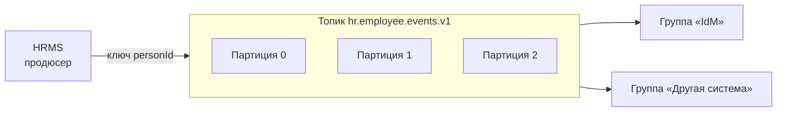

import { Steps, Tabs, TabItem } from '@astrojs/starlight/components';
import Brief from '../../../components/Brief.astro';
import CaseRef from '../../../components/CaseRef.astro';
import InterviewQuestions from '../../../components/InterviewQuestions.astro';
import Related from '../../../components/Related.astro';

<Brief>

**Брокер сообщений** развязывает отправителя и получателя: отправитель публикует, брокер хранит и доставляет, получатель обрабатывает, когда может.
**Kafka** — распределённый **журнал событий**: сообщения хранятся заданное время, потребители сами читают по смещению (offset), можно перечитать; порядок — внутри партиции. **RabbitMQ** — **брокер очередей**: гибкая маршрутизация через обменники, сообщение удаляется после подтверждения.
Почти всегда доставка **at-least-once** — значит, получатель обязан быть **идемпотентным**.

</Brief>

## Когда применять

| Применять брокер | Не нужно |
|---|---|
| Источник не должен зависеть от доступности получателя | Нужен немедленный ответ пользователю → синхронный API |
| Несколько получателей одного события | Простой вызов между двумя сервисами без пиков |
| Пики нагрузки — сгладить очередью | Нет компетенций эксплуатировать брокер, а требования этого не стоят |
| Событийная архитектура, повторное чтение истории (Kafka) | — |

| Выбирать Kafka | Выбирать RabbitMQ |
|---|---|
| Поток событий, который читают многие независимые потребители | Очереди задач («сделать работу»), распределение между обработчиками |
| Нужно перечитывать историю, подключать новых потребителей к старым событиям | Сложная маршрутизация по ключам и заголовкам |
| Большие объёмы, высокая пропускная способность | Приоритеты, отложенная доставка, запрос-ответ |

## Как делать

Что аналитик описывает для асинхронной интеграции:

<Steps>

1. **Событие или команда:** «что произошло» (`EmployeeHired`) или «что сделать» (`CreateAccount`). События — в прошедшем времени, у них может быть много подписчиков.

2. **Топик / очередь и ключ сообщения** — от ключа зависит порядок (Kafka).

3. **Схема сообщения** с версией и примерами — в AsyncAPI.

4. **Гарантии:** at-least-once → идентификатор события и идемпотентная обработка.

5. **Ошибки:** что делать с некорректным сообщением (DLQ), со временно необрабатываемым (повторы), кто разбирает DLQ.

6. **Хранение и нагрузка:** срок хранения (retention), объём в день и пики.

7. **Мониторинг:** отставание потребителя (lag), размер DLQ, алерты.

</Steps>

## Нотация

<Tabs>
<TabItem label="Kafka">

| Понятие | Смысл |
|---|---|
| Топик (topic) | Именованный поток событий |
| Партиция (partition) | Часть топика; упорядоченный журнал. Порядок гарантирован **только внутри партиции** |
| Ключ сообщения | Определяет партицию: одинаковый ключ → одна партиция → порядок |
| Смещение (offset) | Позиция сообщения в партиции; потребитель хранит своё смещение |
| Группа потребителей (consumer group) | Несколько экземпляров одного сервиса делят партиции между собой; разные группы читают топик независимо |
| Срок хранения (retention) | Сколько хранится сообщение — независимо от того, прочитано ли |
| Брокер, реплика | Узел кластера; копии партиций для отказоустойчивости |

</TabItem>
<TabItem label="RabbitMQ">

| Понятие | Смысл |
|---|---|
| Обменник (exchange) | Принимает сообщения и маршрутизирует в очереди |
| Очередь (queue) | Хранит сообщения до доставки и подтверждения |
| Привязка (binding) | Правило «обменник → очередь» (с ключом маршрутизации) |
| Ключ маршрутизации (routing key) | По нему обменник выбирает очереди |
| Подтверждение (ack) | Потребитель сообщает об успешной обработке — сообщение удаляется |
| Dead Letter Exchange (DLX) | Куда уходят отклонённые или просроченные сообщения |

| Тип обменника | Маршрутизация |
|---|---|
| direct | Точное совпадение ключа маршрутизации |
| topic | Шаблон ключа (`hr.*.hired`, `hr.#`) |
| fanout | Во все привязанные очереди |
| headers | По заголовкам сообщения |

RabbitMQ реализует протокол AMQP 0-9-1; в новых версиях появились и потоки (streams) с поведением, похожим на журнал.

</TabItem>
<TabItem label="Сравнение">

| | Kafka | RabbitMQ |
|---|---|---|
| Модель | Распределённый журнал | Брокер очередей |
| После прочтения | Сообщение остаётся до истечения retention | Удаляется после ack (классические очереди) |
| Повторное чтение | Да, сдвигом offset | Нет (кроме streams) |
| Маршрутизация | Топик + ключ → партиция | Обменники и привязки, гибко |
| Порядок | Внутри партиции | Внутри очереди (нарушается при повторах и нескольких потребителях) |
| Масштабирование потребителей | Не больше числа партиций в группе | Конкурирующие потребители одной очереди |
| Сильные стороны | Потоки событий, история, большие объёмы | Очереди задач, маршрутизация, приоритеты |

</TabItem>
</Tabs>

| Гарантия | Смысл | Что нужно от получателя |
|---|---|---|
| At-most-once | Не более одного раза, возможна потеря | Смириться с потерями (метрики, телеметрия) |
| At-least-once | Не менее одного раза, возможны дубли | **Идемпотентная обработка** по идентификатору |
| Exactly-once | Ровно один раз | Между разными системами — at-least-once + идемпотентность |

## Пример из кейса IDM-JOINER

<CaseRef href="/case/04-integrations/api-hr-events/" id="INT-01">Контракт кадровых событий</CaseRef> (AsyncAPI) и <CaseRef href="/case/03-architecture/adr/#adr-001" id="ADR-001">ADR-001</CaseRef>:

- **Почему Kafka:** HRMS не зависит от доступности IdM; событие о приёме могут читать и другие системы без доработки HRMS.
- **Ключ `personId`** — все события одного человека в одной партиции, порядок HIRE → HIRE_CHANGED → HIRE_CANCELLED сохраняется.
- **At-least-once + идемпотентность:** `eventId` — ключ идемпотентности, обработанные события хранятся в `hr_event_inbox` (<CaseRef href="/case/02-requirements/functional-requirements/#fr-03" id="FR-03">FR-03</CaseRef>).
- **DLQ** — отдельный топик `hr.employee.events.v1.dlq` для событий, не прошедших валидацию; разбирает команда HRMS (<CaseRef href="/case/02-requirements/functional-requirements/#fr-02" id="FR-02">FR-02</CaseRef>).
- **Версия в имени топика** (`.v1`) и поле `schemaVersion` — несовместимые изменения уходят в новый топик.
- **Хранение 7 дней** — время на восстановление IdM после сбоя без потери событий; сверка раз в сутки страхует от остального.

## Типичные ошибки

| Ошибка | Чем плохо | Как правильно |
|---|---|---|
| Получатель не идемпотентен | Дубли при повторной доставке | Идентификатор события и проверка обработанных |
| Ключ сообщения не задан или случаен | Нет порядка по объекту | Ключ = идентификатор объекта |
| Нет DLQ и владельца DLQ | «Ядовитое» сообщение блокирует обработку или теряется | DLQ, алерт, ответственный за разбор |
| Не описан срок хранения | Потеря событий при долгом сбое потребителя | Retention ≥ допустимого времени простоя |
| Событие = снимок всей базы | Огромные сообщения, утечки лишних данных | Только нужные поля (минимизация ПДн) |
| Нет мониторинга отставания | Обработка «встала», а узнали от пользователей | Lag потребителя, алерты |

## Вопросы на собеседовании

<InterviewQuestions topic="integrations" ids={['int-kafka-rabbit', 'int-kafka-order', 'int-delivery-guarantees']} />

## Связанные темы

<Related pages={['integrations/styles', 'case/04-integrations/api-hr-events', 'diagrams/sequence', 'data/transactions-acid']} planned={['Паттерны надёжности: DLQ, outbox, saga', 'Контракты: OpenAPI и AsyncAPI']} />
