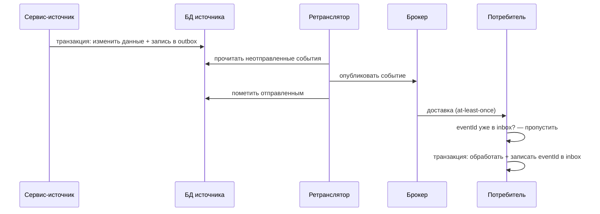
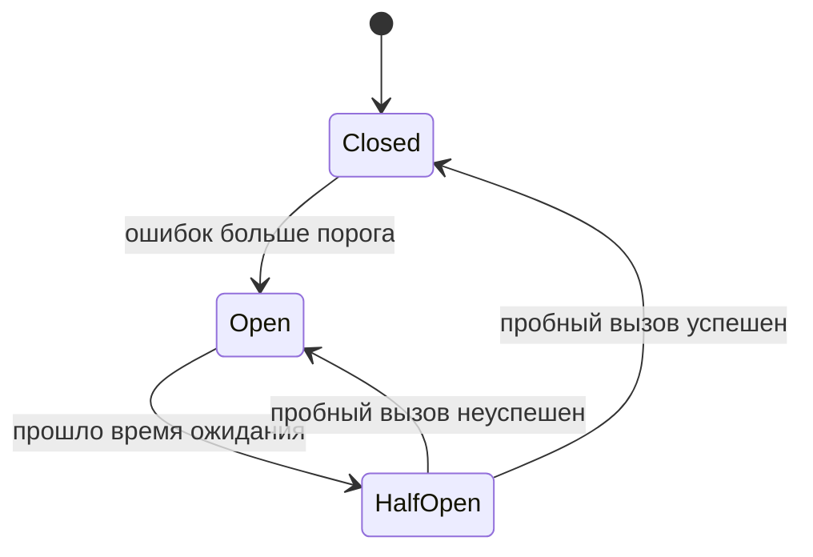

import { Steps, Tabs, TabItem } from '@astrojs/starlight/components';
import Brief from '../../../components/Brief.astro';
import CaseRef from '../../../components/CaseRef.astro';
import InterviewQuestions from '../../../components/InterviewQuestions.astro';
import Related from '../../../components/Related.astro';

<Brief>

Сеть ненадёжна: вызовы теряются, отвечают с опозданием, системы бывают недоступны. Надёжная интеграция отвечает на вопрос **«что происходит при сбое»** для каждого вызова.
Базовый набор: **тайм-ауты**, **повторы** с экспоненциальной задержкой, **идемпотентность** (повтор безопасен), **DLQ** для необрабатываемых сообщений, **outbox** против потери событий, **сага** с компенсациями вместо распределённой транзакции, **circuit breaker** против каскадных отказов и **сверка** как последняя страховка.
Аналитик описывает **поведение** (что повторять, сколько, что потом, кто разбирает), а разработка выбирает реализацию.

</Brief>

## Когда применять

| Паттерн | Когда нужен |
|---|---|
| Тайм-аут | Всегда, на каждом удалённом вызове |
| Повторы | Временные ошибки: тайм-ауты, 5xx, 429, недоступность |
| Идемпотентность | Всегда, если возможны повторы или доставка at-least-once |
| DLQ | Асинхронная обработка: сообщения, которые нельзя обработать |
| Outbox / inbox | Нужно изменить свою БД **и** отправить событие — без потерь и дублей |
| Сага | Бизнес-операция затрагивает несколько систем, нужен откат при ошибке |
| Circuit breaker | Зависимость может «лечь», а вызовов много |
| Сверка | Потеря данных недопустима; страховка от всего остального |

## Как делать

<Steps>

1. **Для каждого вызова** в sequence-диаграмме спросите: что, если ответа нет? Если ответ — ошибка? Если ответ пришёл дважды?

2. **Классифицируйте ошибки:** временные (повторять) и постоянные (не повторять, сразу в разбор).

3. **Политика повторов:** число попыток, задержки, общий срок; уважать `Retry-After`.

4. **Идемпотентность:** чем вызов идентифицирован (ключ), что вернётся на повтор.

5. **После исчерпания повторов:** ручная задача, DLQ, алерт, уведомление пользователя.

6. **Многошаговые операции:** какие компенсации при ошибке на каждом шаге.

7. **Сверка:** что, как часто и с кем сверяется; что делать с расхождениями.

8. **Мониторинг:** метрики (ошибки, повторы, размер DLQ, отставание), пороги алертов.

</Steps>

## Нотация

<Tabs>
<TabItem label="Повторы">

| Параметр | Пример |
|---|---|
| Что повторяем | Тайм-ауты, 5xx, 429, `UNAVAILABLE` |
| Что не повторяем | 400, 401, 403, 404, 409, 422 — бизнес-ошибки и ошибки клиента |
| Число попыток | 3 |
| Задержки | Экспоненциальные: 1 с, 2 с, 4 с … + случайная добавка (jitter) |
| Предел | Не дольше N минут в сумме; учитывать `Retry-After` |
| После исчерпания | Ручная задача / DLQ / алерт |

Без случайной добавки все клиенты, получившие ошибку одновременно, повторят тоже одновременно — и снова перегрузят сервис.

</TabItem>
<TabItem label="Outbox и inbox">

Outbox решает проблему **двойной записи** (в БД и в брокер). Ретранслятор читает таблицу опросом или журнал изменений БД (CDC). Возможны дубли — поэтому на стороне потребителя **inbox**.

</TabItem>
<TabItem label="Сага">

| Шаг | Действие | Компенсация |
|---|---|---|
| 1 | Создать учётную запись AD (заблокирована) | Удалить учётную запись AD |
| 2 | Создать почтовый ящик | Удалить ящик |
| 3 | Создать пользователя АБС | Удалить пользователя АБС (если не было операций) |
| 4 | Задача в ServiceDesk для СЭД | Отменить задачу |

**Хореография** — сервисы реагируют на события друг друга; **оркестрация** — координатор вызывает шаги и компенсации и хранит состояние. Компенсация — это не откат, а отдельная бизнес-операция; она тоже может не удаться и тоже должна быть идемпотентной.

</TabItem>
<TabItem label="Circuit breaker">

Пока выключатель открыт, вызовы сразу отклоняются — не ждём тайм-аутов и не добиваем больной сервис. Требование аналитика: что видит пользователь и что происходит с операцией в это время (откладывается, ставится в очередь, возвращается ошибка).

</TabItem>
</Tabs>

## Пример из кейса IDM-JOINER

Политика повторов **<CaseRef href="/case/02-requirements/functional-requirements/#fr-16" id="FR-16">FR-16</CaseRef>** и статусная модель задачи провижининга:

| Паттерн | Как в кейсе |
|---|---|
| Повторы | Технические ошибки — 3 попытки, задержка 1 мин после первой, 5 мин после второй; 4xx (кроме 429) не повторяются |
| Идемпотентность | `Idempotency-Key = taskId` в адаптере АБС; `eventId` для кадровых событий |
| После исчерпания | Статус MANUAL, задача в ServiceDesk, уведомление руководителя; закрытие — webhook (<CaseRef href="/case/02-requirements/functional-requirements/#fr-17" id="FR-17">FR-17</CaseRef>) |
| DLQ | `hr.employee.events.v1.dlq` для невалидных событий + инцидент (<CaseRef href="/case/02-requirements/functional-requirements/#fr-02" id="FR-02">FR-02</CaseRef>) |
| Inbox | `hr_event_inbox`: обработанные `eventId` |
| Сага / компенсации | Отмена приёма удаляет созданные учётные записи и отменяет ручные задачи (<CaseRef href="/case/04-integrations/scenarios/#seq-03" id="SEQ-03">SEQ-03</CaseRef>, BRL-06) |
| Сверка | Ежедневно с HRMS (<CaseRef href="/case/02-requirements/functional-requirements/#fr-05" id="FR-05">FR-05</CaseRef>) — страховка от потерянных событий |
| Буфер | Журнал аудита для SIEM: при недоступности шины «буфер в журнале, CDC догоняет» (INT-09) — по сути outbox |

## Типичные ошибки

| Ошибка | Чем плохо | Как правильно |
|---|---|---|
| Повторять все ошибки | Бесконечные повторы бизнес-ошибок, нагрузка | Только временные |
| Повторы без идемпотентности | Дубли при тайм-ауте | Ключ идемпотентности |
| Повторы без задержки и предела | «Шторм» повторов, отказ зависимости | Экспонента, jitter, предел |
| Нет поведения после исчерпания | Операции «пропадают» | Ручная задача, DLQ, алерт |
| Запись в БД и отправка события отдельно | Потерянные или ложные события | Outbox |
| «Распределённая транзакция» в требованиях | Невыполнимо или очень дорого | Сага с компенсациями |
| Нет сверки | Потерянные данные не обнаружатся никогда | Периодическая сверка |

## Вопросы на собеседовании

<InterviewQuestions topic="integrations" ids={['int-retry', 'int-dlq', 'int-outbox', 'int-saga', 'int-circuit-breaker', 'int-delivery-guarantees']} />

## Связанные темы

<Related pages={['integrations/messaging', 'integrations/webhooks', 'data/transactions-acid', 'diagrams/sequence', 'diagrams/state']} />
