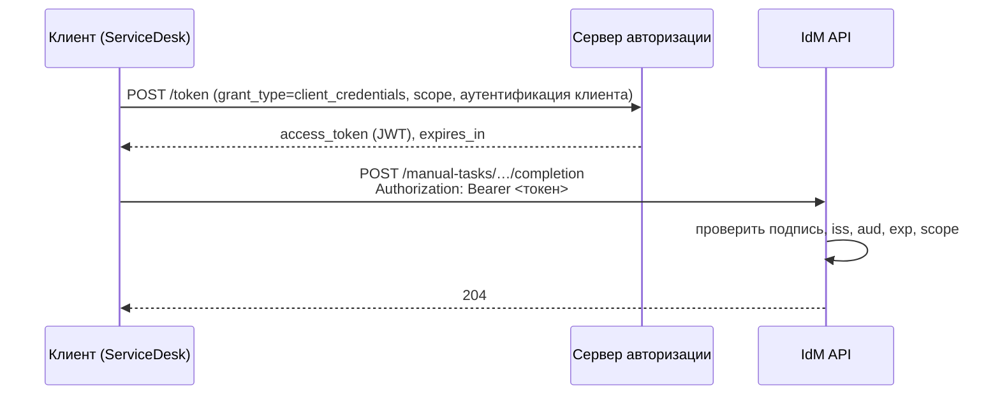

import { Steps, Tabs, TabItem } from '@astrojs/starlight/components';
import Brief from '../../../components/Brief.astro';
import Check from '../../../components/Check.astro';
import CaseRef from '../../../components/CaseRef.astro';
import InterviewQuestions from '../../../components/InterviewQuestions.astro';
import Related from '../../../components/Related.astro';

<Brief>

**Аутентификация** — «кто ты?», **авторизация** — «что тебе можно?». **OAuth 2.0** (RFC 6749) — протокол **делегированной авторизации**: клиент получает у сервера авторизации **токен доступа** и предъявляет его API.
**OpenID Connect** добавляет поверх OAuth 2.0 **аутентификацию** пользователя — ID-токен с данными о том, кто вошёл.
Токены часто передают в формате **JWT** (RFC 7519): подписанный, но обычно не зашифрованный набор утверждений; получатель обязан проверить подпись, издателя, аудиторию и срок.

</Brief>

## Когда применять

| Сценарий | Что использовать |
|---|---|
| Пользователь входит в веб- или мобильное приложение | OAuth 2.0 Authorization Code + PKCE, с OpenID Connect для входа |
| Система вызывает API от своего имени | OAuth 2.0 Client Credentials (часто + mTLS) |
| Внутрикорпоративный вход без ввода пароля | SSO: Kerberos, SAML 2.0 или OIDC — см. [mTLS, SSO, Kerberos](/integrations/mtls-sso/) |
| Простой внутренний вызов с минимальными требованиями | Ключ API — только если это допускают требования ИБ |

## Как делать

Что аналитик фиксирует в требованиях и контракте:

<Steps>

1. **Кто клиенты API:** пользователи через приложение, системы, партнёры.

2. **Поток OAuth** для каждого типа клиента.

3. **Права (scopes)** — минимальные для каждой операции; связь с ролевой моделью.

4. **Токены:** формат, срок жизни токена доступа, использование токена обновления.

5. **Что проверяет API:** подпись, издатель (`iss`), аудитория (`aud`), срок, scopes; ответы 401 и 403.

6. **Где хранятся секреты** клиентов (хранилище секретов, не конфигурация) и как они меняются.

7. **Журналирование** — кто и что вызывал, без записи токенов в логи.

</Steps>

## Нотация

<Tabs>
<TabItem label="Потоки OAuth 2.0">

| Поток | Кто клиент | Как работает |
|---|---|---|
| Authorization Code + PKCE | Приложение, действующее от имени пользователя | Пользователь входит у сервера авторизации, приложение получает код и обменивает его на токены; PKCE защищает обмен от перехвата |
| Client Credentials | Система без пользователя | Клиент аутентифицируется своим секретом или сертификатом и получает токен на свои права |
| Device Authorization | Устройство без удобного ввода | Пользователь подтверждает вход на другом устройстве по коду |
| Refresh Token | Любой клиент с пользователем | Новый токен доступа без повторного входа |
| ~~Implicit~~, ~~Password~~ | — | Устаревшие, не рекомендуются |



</TabItem>
<TabItem label="OAuth и OIDC">

| | OAuth 2.0 | OpenID Connect |
|---|---|---|
| Задача | Авторизация: доступ к ресурсу | Аутентификация пользователя поверх OAuth |
| Главный артефакт | Токен доступа (access token) | ID-токен (JWT о пользователе) + токен доступа |
| Кто читает | API (сервер ресурса) | Клиентское приложение |
| Дополнительно | Scopes | Scope `openid`, эндпоинт `userinfo`, discovery-документ |

</TabItem>
<TabItem label="JWT">

```text title="Структура JWT: header.payload.signature (Base64URL)"
eyJhbGciOiJSUzI1NiIsInR5cCI6IkpXVCJ9.eyJpc3MiOiJodHRwczovL3Nzby5iYW5rLmxvY2FsIi…signature
```

```json title="Полезная нагрузка (claims) — пример"
{
  "iss": "https://sso.bank.local",
  "sub": "servicedesk",
  "aud": "idm-api",
  "scope": "idm.manual-tasks.write",
  "iat": 1773570000,
  "exp": 1773570300
}
```

| Claim | Смысл |
|---|---|
| `iss` | Кто выдал токен |
| `sub` | О ком токен (пользователь или клиент) |
| `aud` | Для кого предназначен (какой API) |
| `exp`, `nbf`, `iat` | Истекает, действует с, выдан в |
| `jti` | Уникальный идентификатор токена |

**Проверка на стороне API:** подпись ключом издателя и допустимым алгоритмом (никогда не принимать `alg: none`); `iss` и `aud` — ожидаемые; время (`exp`, `nbf`) с небольшим допуском; права (scope, роли). JWT **читается кем угодно** — не кладите в него секреты и лишние персональные данные.

</TabItem>
</Tabs>

Стандарты: OAuth 2.0 — RFC 6749; Bearer-токены — RFC 6750; PKCE — RFC 7636; JWT — RFC 7519; лучшие практики безопасности OAuth 2.0 — отдельный документ IETF (Security BCP).

<Check id="int-03">
Сверить номер и статус документа «OAuth 2.0 Security Best Current Practice» (по имеющимся данным — RFC 9700) и статус OAuth 2.1 (черновик IETF) в IETF Datatracker.
</Check>

## Пример из кейса IDM-JOINER

В <CaseRef href="/case/04-integrations/api-idm/" id="IdM API">контракте IdM API</CaseRef> две схемы безопасности — по двум типам клиентов:

| Схема | Клиент | Как |
|---|---|---|
| `portalAuth` | Портал IdM (пользователи) | HTTP Bearer, JWT, выданный порталу после SSO (Kerberos / AD) |
| `serviceAuth` | Системы (ServiceDesk) | OAuth 2.0 client credentials, `tokenUrl: https://sso.bank.local/oauth2/token`, scope `idm.manual-tasks.write`; дополнительно mTLS |

Связанные требования ИБ: <CaseRef href="/case/05-security/security-requirements/#sec-08" id="SEC-08">SEC-08</CaseRef> (TLS 1.2+, API — mTLS + OAuth 2.0), <CaseRef href="/case/05-security/security-requirements/#sec-10" id="SEC-10">SEC-10</CaseRef> (портал — только через SSO, руководитель видит только подчинённых — авторизация на уровне данных, а не только scope), <CaseRef href="/case/02-requirements/non-functional-requirements/#nfr-07" id="NFR-07">NFR-07</CaseRef>.

## Типичные ошибки

| Ошибка | Чем плохо | Как правильно |
|---|---|---|
| Путать аутентификацию и авторизацию | 401 вместо 403, неверные проверки | «Кто» — 401, «нельзя» — 403 |
| Implicit / Password flow в новых решениях | Уязвимы, устарели | Authorization Code + PKCE; Client Credentials |
| Не проверять `aud` | Токен для другого API принимается | Проверка аудитории |
| Длинноживущие токены доступа | Утечка = долгий доступ, отозвать сложно | Короткий срок + refresh |
| Персональные данные и секреты в JWT | Любой может прочитать | Минимум данных в токене |
| Широкие scopes «на всё» | Нарушение минимальных привилегий | Scope на операцию или группу операций |
| Только scope без проверки «чьи данные» | Руководитель видит чужих сотрудников | Авторизация на уровне объектов |

## Вопросы на собеседовании

<InterviewQuestions topic="integrations" ids={['int-oauth', 'int-oidc', 'int-jwt', 'int-401-403-400-422']} />

## Связанные темы

<Related pages={['integrations/mtls-sso', 'integrations/rest', 'integrations/contracts', 'case/05-security/security-requirements']} />
