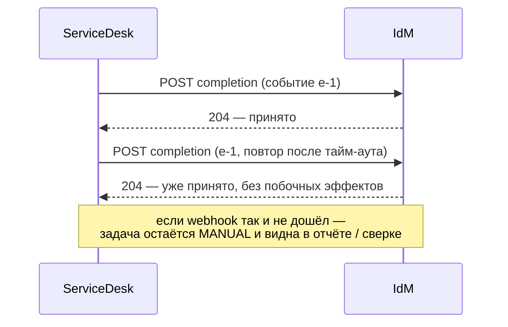

import { Steps } from '@astrojs/starlight/components';
import Brief from '../../../components/Brief.astro';
import CaseRef from '../../../components/CaseRef.astro';
import InterviewQuestions from '../../../components/InterviewQuestions.astro';
import Related from '../../../components/Related.astro';

<Brief>

**Webhook** — обратный HTTP-вызов: вместо того чтобы постоянно опрашивать внешнюю систему, вы даёте ей адрес, и она **сама вызывает его**, когда происходит событие (задача закрыта, платёж прошёл).
Webhook — это обычный входящий API, только вызывает его чужая система. Поэтому нужны **аутентификация отправителя**, **идемпотентность** (повторы неизбежны), **быстрый ответ** и **сверка** на случай, если вызов так и не дошёл.

</Brief>

## Когда применять

| Применять | Не нужно / лучше другое |
|---|---|
| Внешняя система умеет уведомлять, а опрос дорог или медленен | Событие нужно многим получателям → брокер сообщений |
| Нужна реакция на событие быстрее, чем интервал опроса | Получатель недоступен извне, а открыть входящий доступ нельзя → опрос |
| Интеграция с SaaS и платёжными сервисами (часто единственный вариант) | Важен строгий порядок событий → брокер с ключом |

## Как делать

<Steps>

1. **Контракт webhook** — как обычный API в OpenAPI: метод, путь, тело, коды ответа. Тело — с идентификатором события и временем.

2. **Аутентификация отправителя:** подпись тела HMAC с общим секретом в заголовке, mTLS или OAuth-токен. Проверка IP — только как дополнительная мера.

3. **Защита от воспроизведения:** метка времени, включённая в подпись, и окно допустимости (например, 5 минут).

4. **Идемпотентность:** повтор того же события — тот же результат, без побочных эффектов.

5. **Быстрый ответ:** принять, сохранить, ответить 2xx; тяжёлую обработку — асинхронно.

6. **Повторы на стороне отправителя:** при ошибке или тайм-ауте — с увеличивающейся задержкой; журнал доставок.

7. **Сверка:** периодически сравнивать состояние — webhook может не дойти никогда.

8. **Регистрация и смена секрета:** как выдаётся адрес, как меняется секрет без простоя.

</Steps>

## Нотация

```http title="Webhook с подписью (иллюстрация)"
POST /api/v1/manual-tasks/3f2c…/completion
Content-Type: application/json
X-Signature: t=1773570000,v1=5257a869e7ecebeda32affa62cdca3fa51cad7e77a0e56ff536d0ce8e108d8bd
X-Event-Id: sd-evt-88231

{ "result": "DONE", "ticketId": "SD-7781", "externalId": "ABS-USR-88231" }

→ 204 No Content   принято (или уже было принято)
→ 401              подпись неверна
→ 404              неизвестная задача
```

| Элемент | Зачем |
|---|---|
| Идентификатор события | Идемпотентность, журнал, поиск при разборе |
| Метка времени в подписи | Защита от повторного воспроизведения перехваченного запроса |
| Подпись тела (HMAC) или mTLS / OAuth | Убедиться, что вызывает именно отправитель и тело не изменено |
| Быстрый 2xx | Отправитель не повторяет из-за тайм-аута |
| Повторы отправителя | Временные сбои получателя |
| Сверка | Последняя страховка от недошедших вызовов |



## Пример из кейса IDM-JOINER

Webhook ServiceDesk о закрытии ручной задачи — <CaseRef href="/case/04-integrations/api-idm/" id="IdM API">`POST /manual-tasks/{taskId}/completion`</CaseRef> (<CaseRef href="/case/04-integrations/integration-map/#int-06" id="INT-06">INT-06</CaseRef>, <CaseRef href="/case/02-requirements/functional-requirements/#fr-17" id="FR-17">FR-17</CaseRef>):

- **Контракт описывает IdM** — сторона, которая принимает вызов (принцип «владелец контракта — тот, кто предоставляет API»).
- **Идемпотентность:** «повторный вызов для уже завершённой задачи возвращает 204».
- **Аутентификация:** OAuth 2.0 client credentials со scope `idm.manual-tasks.write` плюс mTLS — подпись тела не нужна, отправитель аутентифицирован на уровне канала и токена.
- **Связь с задачей** — `taskId` из пути: IdM передаёт его в ServiceDesk при создании задачи.
- **Статусы:** webhook переводит задачу провижининга MANUAL → DONE (<CaseRef href="/case/03-architecture/state-models/" id="Статусы">статусная модель</CaseRef>).

## Типичные ошибки

| Ошибка | Чем плохо | Как правильно |
|---|---|---|
| Нет аутентификации отправителя | Любой может «закрыть задачу» | Подпись, mTLS или OAuth |
| Подпись без метки времени | Перехваченный запрос можно повторить | Метка времени и окно |
| Неидемпотентная обработка | Повторы создают дубли и ошибки | Идентификатор события |
| Долгая обработка до ответа | Тайм-аут у отправителя → повтор → дубли | Быстрый 2xx, обработка асинхронно |
| Ответ 500 на «уже обработано» | Бесконечные повторы | Идемпотентный успех |
| Нет сверки | Потерянный webhook = зависшая задача навсегда | Отчёт или сверка состояний |

## Вопросы на собеседовании

<InterviewQuestions topic="integrations" ids={['int-webhook', 'int-push-pull']} />

## Связанные темы

<Related pages={['integrations/reliability', 'integrations/rest', 'integrations/security-oauth', 'integrations/styles']} />
