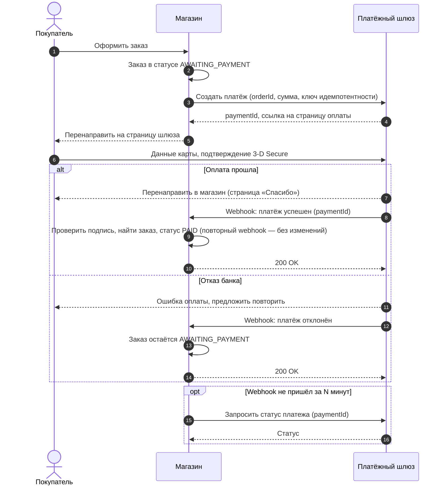
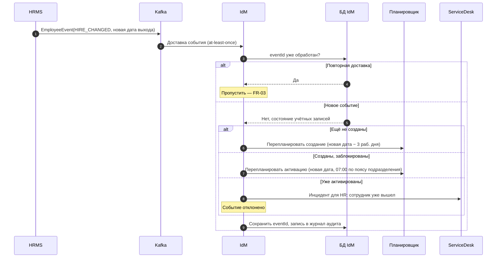

import { Steps } from '@astrojs/starlight/components';
import Brief from '../../../../components/Brief.astro';
import CaseRef from '../../../../components/CaseRef.astro';
import Exercise from '../../../../components/Exercise.astro';
import Related from '../../../../components/Related.astro';

<Brief>

Задачу «нарисуйте sequence» дают почти на каждом собеседовании аналитика интеграций. Интервьюер смотрит не на красоту, а на то, **показаны ли ошибки**: тайм-ауты, повторы, недоступность системы, дубли.
Порядок: **участники → успешный путь → ответы → `alt` для ошибок и альтернатив → примечания** про идемпотентность и сроки.
Рисуйте на доске или в Mermaid и рассуждайте вслух.

</Brief>

## Как решать

<Steps>

1. **Уточните сценарий:** кто инициатор, синхронно или асинхронно, что считать успехом.

2. **Выпишите участников** слева направо в порядке обращения.

3. **Нарисуйте успешный путь** — запросы и ответы.

4. **Добавьте ошибки:** для каждого вызова спросите себя, что будет при тайм-ауте, ошибке и дубле.

5. **Проговорите неочевидное** примечаниями: идемпотентность, повторы, асинхронные уведомления.

</Steps>

## Задача 1. Оплата заказа через платёжный шлюз

<Exercise title="оплата заказа">

Интернет-магазин принимает оплату картой через внешний платёжный шлюз. Покупатель вводит данные карты на странице шлюза, магазин узнаёт о результате оплаты. Нарисуйте sequence-диаграмму, включая ошибки.

**Что стоит уточнить у интервьюера:** как магазин узнаёт результат — редирект, уведомление (webhook) или опрос? Что делать, если уведомление не пришло? Можно ли оплатить заказ дважды?

<Fragment slot="solution">

**Что оценивает интервьюер:**
- результат оплаты магазин берёт из **уведомления шлюза** (или запроса статуса), а не из редиректа браузера — редирект можно подделать или потерять;
- webhook может прийти **повторно** — обработка идемпотентна по `paymentId`;
- подпись уведомления проверяется;
- есть страховка на случай потерянного уведомления — опрос статуса;
- создание платежа с ключом идемпотентности — повтор запроса не создаёт второй платёж.

</Fragment>

</Exercise>

## Задача 2. Перенос даты выхода (кейс IDM-JOINER)

<Exercise title="HIRE_CHANGED: перенос даты выхода">

HR перенёс дату выхода сотрудника. HRMS публикует событие `HIRE_CHANGED` в Kafka. Нарисуйте, как IdM его обрабатывает. Правила — в таблице реакций <CaseRef href="/case/02-requirements/functional-requirements/" id="FR-18">FR-18</CaseRef> (раздел 2.4 ФТ): реакция зависит от того, созданы ли уже учётные записи.

<Fragment slot="solution">

**Что оценивает интервьюер:**
- проверка дубля по `eventId` **до** обработки (FR-03);
- три ветки по состоянию учётных записей — ровно по таблице FR-18;
- активация пересчитывается по **часовому поясу подразделения** (FR-08);
- аудит каждого действия (FR-21).

**Хороший уточняющий вопрос:** в FR-18 сказано «создать инцидент HR», но не указано, через какую систему. На диаграмме — ServiceDesk, как для других задач и уведомлений (INT-06); на собеседовании стоит проговорить это как допущение и вопрос к требованиям.

</Fragment>

</Exercise>

## Типичные ошибки

| Ошибка | Чем плохо | Как правильно |
|---|---|---|
| Только успешный путь | Не видно, что вы думаете об отказах | `alt` для каждой ошибки |
| Нет ответов на запросы | Непонятно, синхронный ли вызов | Ответ пунктирной стрелкой |
| Асинхронный вызов нарисован как синхронный | Неверное понимание интеграции | Разные стрелки, брокер — отдельный участник |
| Нет идемпотентности при повторах | Дубли платежей и учётных записей | Ключ идемпотентности, проверка дубля |

## Связанные темы

<Related pages={['diagrams/sequence', 'diagram-howto/sequence', 'integrations/reliability', 'integrations/webhooks', 'interview/tasks/integration']} />
