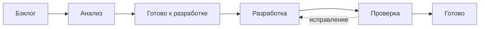

import { Steps } from '@astrojs/starlight/components';
import Brief from '../../../components/Brief.astro';
import CaseRef from '../../../components/CaseRef.astro';
import InterviewQuestions from '../../../components/InterviewQuestions.astro';
import Related from '../../../components/Related.astro';

<Brief>

**Доска (board)** показывает, где находится работа и что мешает её завершить. Карточка — единица работы, колонка — представление этапа, статус — состояние задачи в трекере.
Для Kanban нужны явные правила и контроль WIP; для Scrum доска помогает вести план спринта. Одинаковые колонки не делают эти процессы одинаковыми.
Сначала договоритесь о потоке и ответственности, затем настройте Jira или другой инструмент.

</Brief>

## Когда применять

| Применять | Не нужно / недостаточно |
|---|---|
| Задачи проходят через анализ, разработку и проверку | Доска не заменяет описание требований и контрактов |
| Нужно видеть очереди, зависимости и блокировки | Цвет карточки не заменяет договорённость о приоритете |
| Команда хочет управлять потоком и сроками | Перенос в Done без проверки не доказывает готовность |

Перед практикой изучите [Scrum](/methodologies/scrum/), [Kanban](/methodologies/kanban/) и [критерии приёмки](/requirements/acceptance-criteria/). Настраивать платный аккаунт необязательно: упражнение можно выполнить на бумаге или в таблице, затем повторить в доступном трекере.

## Как делать

<Steps>

1. **Определите границы доски.** Например, только развитие IdM одной командой. В Jira состав карточек может зависеть от фильтра доски; проверьте, попадают ли нужные задачи и доступны ли они участникам.

2. **Опишите реальный поток.** Начало — взяли в анализ; конец — изменение проверено и документация обновлена. Если выпуск отдельный, явно покажите «Готово к выпуску» и определите, входит ли это ожидание в ваш срок.

3. **Сопоставьте статусы колонкам.** Workflow определяет допустимые переходы задачи. Колонка может объединять несколько статусов, например «Code Review» и «Testing» в общий этап проверки. Статус без отображения может скрыть карточку с доски.

4. **Запишите правила переходов и лимиты.** Договоритесь, что нужно для начала, как проверяется завершение, кто вытягивает следующую задачу, как учитывать очередь и блокировки. Лимиты в интерфейсе помогают заметить перегрузку, но правила должна соблюдать команда.

5. **Наполните очередь небольшими задачами.** У каждой — цель, критерии, ссылки, приоритет, зависимости и ответственный за следующий шаг. Используйте [шаблон тикета](/methodologies/scrum/#как-оформить-тикет). Связь «блокирует» полезнее копирования одной задачи на две доски.

6. **Работайте вытягиванием.** Есть свободная ёмкость следующего этапа — берите подходящую задачу из согласованной очереди. Нет ёмкости — помогите завершить начатое, устранить блокер или проверить результат.

7. **Обновляйте карточку при изменении фактов.** Статус, исполнитель следующего шага, причина ожидания, ссылка на решение и результаты тестов должны соответствовать реальности. Существенное изменение требований согласуйте, а затем отразите в документации.

8. **Разбирайте поток регулярно.** Смотрите старые и заблокированные карточки, время цикла и очереди; меняйте одну понятную договорённость и проверяйте эффект. Не измеряйте личную продуктивность количеством перетащенных карточек.

</Steps>

## Шаблон: доска, правила и карточки

### Учебный поток для команды IdM

Ниже — пример лимитов, не универсальные нормы. Общий WIP от «Анализа» до «Проверки» — **не более 6**; лимиты отдельных колонок ограничивают локальные очереди. «Бэклог» ещё не начат, «Готово» уже завершено.

| Колонка | Лимит | Условие перехода дальше | Кто обеспечивает следующий шаг |
|---|---|---|---|
| Бэклог | Ограничиваем объём ближайшего отбора договорённостью | Потребность и порядок понятны; в анализе есть место | PO в Scrum или назначенный владелец очереди в Kanban |
| Анализ | 2 | Есть критерии, зависимости и достаточные ссылки на требования | Аналитик вместе с нужными специалистами |
| Готово к разработке | 2 | Есть ёмкость разработки и общий WIP не превышен | Developers выбирают задачу по правилам команды |
| Разработка | 3 | Реализация готова к согласованной проверке, приложены ссылки на изменения | Разработчик и коллеги по ревью |
| Проверка | 2 | Проверены критерии и качество, обновлены документы | Проверяющие с авторами изменения |
| Готово | — | Внутри выбранной границы работа завершена | Инициатору доступен результат; выпуск учитывается отдельно, если он вне границы |

Если тест выявил дефект, он остаётся видимым: карточка возвращается на исправление с причиной и сохраняет дату начала. Команда учитывает возврат в WIP; нельзя обнулить возраст задачи, переименовав её. Если переход приводит к превышению лимита, факт показывают и сначала разгружают поток.

### Jira: что настраивать и проверять

В Jira Cloud доступность настроек зависит от типа проекта / пространства (company-managed или team-managed), прав и версии интерфейса. В новой терминологии документации задачи также называются work items, проекты — spaces. Ниже — опорные настройки, а не универсальная последовательность кнопок для всех редакций.

| Настройка | Действие и проверка |
|---|---|
| Состав доски | Убедиться, что фильтр включает нужный проект, типы и задачи; проверить права просмотра |
| Колонки | Администратор доски сопоставляет статусы колонкам; тестовая карточка видна на каждом этапе |
| Бэклог Kanban | Для company-managed доски включение отдельного бэклога выполняется через настройку колонок и привязку статуса к панели бэклога |
| Лимиты колонок | Задать согласованные пределы и проверить индикацию превышения. Не полагаться на автоматический запрет перехода |
| Завершение | Проверить отображение конечных статусов: в company-managed доске Jira считает завершённой работу в крайней правой колонке |
| Видимость карточки | Показывать ключ, заголовок, исполнителя, приоритет и признак блокировки; детали и доказательства хранить внутри |

Сопоставление статусов, бэклог и права описаны в [документации Jira Cloud о колонках](https://support.atlassian.com/jira-software-cloud/docs/configure-columns/); действия с карточками — в [руководстве по Kanban-доске](https://support.atlassian.com/jira-software-cloud/docs/monitor-work-in-a-kanban-project/).

**Карточка пропала?** Проверьте фильтр доски и быстрые фильтры, права, отображение её статуса, попадание в отдельный бэклог и настройки показа завершённой работы. В Scrum дополнительно проверьте выбранный спринт. Сначала найдите причину, затем меняйте настройку; создавать дубликат задачи не нужно.

### Блокировки, срочность и ежедневная работа

Заблокированную карточку помечают флагом или меткой и записывают: причину, связанную задачу / команду, следующий шаг, ответственного и время повторной проверки. Например: «Нет тестовых событий HRMS; аналитик согласует набор с владельцем HRMS; вернуться к вопросу завтра». Она остаётся в WIP: ожидание тоже увеличивает срок.

Срочная дорожка допустима по явной договорённости. Например, только подтверждённый производственный инцидент, не более одной срочной задачи, решение принимает дежурный ответственный. Срочная работа остаётся видимой и учитывается в потоке; исключение из лимита фиксируют вместе с последствиями для остальных сроков.

На коротком разборе доски начните справа: что можно завершить, что блокирует проверку, какая начатая задача стареет, кому нужна помощь. Новую карточку берут после этих вопросов. В Scrum такой обход может помочь Daily, если обсуждение связано с целью спринта.

### Как перенести практику в другой трекер

| Инструмент | Что повторить |
|---|---|
| YouTrack | Настроить Agile Board, отображение состояний, очередь и пределы WIP. Для потока без спринтов использовать соответствующую конфигурацию |
| Kaiten, Яндекс Трекер или другой доступный менеджер | Найти эквиваленты карточки, этапов, связей и блокировок; проверить поддержку нужных ограничений в своей редакции |
| Таблица или бумажная доска | Те же колонки, карточки, явные лимиты и даты; метрики придётся считать вручную |

Конкретные настройки YouTrack приведены в [Configure an Agile Board](https://www.jetbrains.com/help/youtrack/cloud/configure-agile-board.html) и [Limit Work in Progress](https://www.jetbrains.com/help/youtrack/cloud/limit-work-in-progress-kanban.html). Название продукта не меняет смысл очередей и ответственности.

## Пример из кейса IDM-JOINER

Возьмите <CaseRef href="/case/02-requirements/backlog/" id="US-01 / US-03 / US-06">бэклог кейса</CaseRef>. Карточки ссылаются на ФТ, а подтверждения готовности — на проверки. Ниже — учебная ситуация; данные о статусах и лимитах добавлены для упражнения.

### Упражнение: день на доске

1. Создайте карточку US-01 с критериями обработки нового события и повтора. Свяжите её с EPIC-01 и FR-01, FR-03.
2. Поместите две другие начатые карточки в «Проверку» (лимит 2), US-06 — в «Разработку» с блокировкой доступа к стенду, US-01 — в «Готово к разработке». Добавьте учебную техническую задачу в «Разработку»: её реализация уже ждёт проверки. Итого WIP = 5.
3. У US-03 в бэклоге ещё не уточнены критерии обработки некорректного события. Опишите, что сделать до передачи в разработку и кто нужен для уточнения.
4. Разработчик предлагает переместить техническую задачу в переполненную «Проверку» и начать реализацию US-01. Решите, как поступить, и запишите следующий шаг по блокеру US-06.
5. Одна карточка прошла проверку. Зафиксируйте доказательства завершения и пересчитайте WIP. Объясните, является ли это автоматически релизом.

Разбор после самостоятельной попытки

У US-01 должны быть проверяемые исходы, а не описание «сделать интеграцию». US-03 уточняют аналитик, эксперт HRMS, разработчик и тестировщик; ответственному за порядок очереди нужно подтвердить её место. Если взять US-03 в анализ, WIP станет 6 — общий предел доски.

Полная «Проверка» — повод помочь проверяющим и устранить очередь. Не следует молча повышать лимит или скрывать готовую реализацию. Если реализация действительно завершена, её ожидание проверки остаётся видимым и входит в WIP; команда фиксирует перегрузку и прекращает начинать лишнее. Перемещение уже начатой карточки между этапами не увеличивает общий WIP, но может нарушить лимит колонки.

US-06 остаётся начатой: фиксируем, кто получит доступ к стенду, у кого его запрашивает и когда проверит ответ. Нельзя убрать карточку в бэклог ради красивой цифры WIP.

После завершения одной из исходных пяти карточек WIP = 4 (или 5, если US-03 уже взяли в анализ). В задаче есть результаты проверок и ссылки на актуальные документы. Если выпуск за границей доски, это готовность к выпуску, а не доказательство поставки пользователям.

## Типичные ошибки

| Ошибка | Чем плохо | Как правильно |
|---|---|---|
| «Доска есть — значит у нас Kanban» | Нет управления перегрузкой и сроками | Определить поток, правила и метрики |
| Исполнитель не меняется при передаче | Непонятно, кто делает следующий шаг | Явно согласовывать ответственность |
| Заблокированное не входит в WIP | Метрики скрывают ожидание | Учитывать всё начатое и незавершённое |
| Колонка называется Done, но статус не сопоставлен | Отчёты и видимость расходятся с ожиданиями | Проверить настройку на тестовой карточке |
| Закрывать историю при написанном коде | Проверки и документация остаются незавершёнными | Соблюдать критерии и DoD / правила завершения |

## Вопросы на собеседовании

<InterviewQuestions topic="methodologies" ids={['meth-ticket', 'meth-board-blocked', 'meth-board-status']} />

## Связанные темы

<Related pages={['methodologies/kanban', 'methodologies/scrum', 'software/tasks-docs', 'requirements/user-stories', 'requirements/traceability', 'role/change-lifecycle']} />
