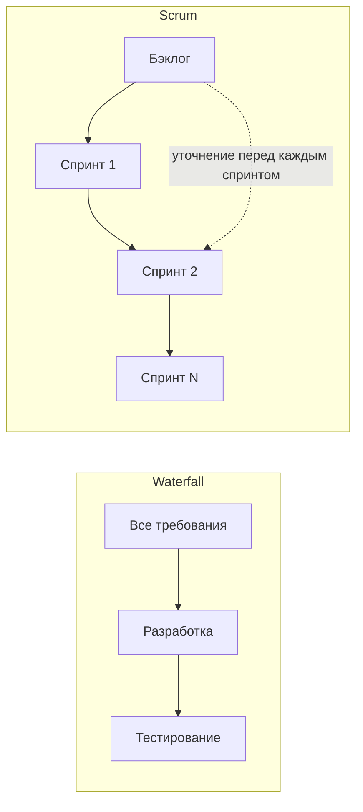

import { Steps } from '@astrojs/starlight/components';
import Brief from '../../../components/Brief.astro';
import CaseRef from '../../../components/CaseRef.astro';
import InterviewQuestions from '../../../components/InterviewQuestions.astro';
import Related from '../../../components/Related.astro';

<Brief>

**Waterfall** — последовательные этапы и требования заранее; **Scrum** — итерации фиксированной длины и бэклог, уточняемый каждый спринт; **Kanban** — непрерывный поток с лимитами незавершённой работы; **гибрид** — фундамент заранее, детали итерациями.
От подхода зависит не то, **что** делает аналитик (выявление, требования, данные, интеграции нужны везде), а **когда, сколько заранее и в каком виде**.
**Agile** задаёт ценности и принципы, **Scrum** — конкретный фреймворк, **Kanban** — управление потоком, **Waterfall** — последовательную модель жизненного цикла. Это понятия разных уровней.

</Brief>

## Когда применять

| Подход | Подходит | Не подходит |
|---|---|---|
| Waterfall | Стабильные требования, договор с фиксированным объёмом, приёмка по ТЗ, регуляторика | Высокая неопределённость, рынок меняется быстрее, чем пишется ТЗ |
| Scrum | Новый продукт, неопределённость, нужен ранний результат, доступный PO | Поток мелких заявок и поддержка; нет вовлечённого владельца продукта |
| Kanban | Поддержка, развитие и создание продукта, где нужно управлять потоком и перегрузкой | Одна доска без правил, контроля WIP и метрик не решает проблему потока |
| Гибрид | Корпоративные проекты: архитектура и ИБ согласуются заранее, разработка — спринтами | Маленький продукт одной команды — лишняя бюрократия |

## Как делать

Как выбрать подход и место аналитика:

<Steps>

1. **Оцените неопределённость требований:** насколько хорошо понятно, что нужно.

2. **Учтите внешние рамки:** договор, регуляторика, архитектурный комитет, ИБ.

3. **Определите характер работы:** новый продукт, развитие, поддержка.

4. **Найдите зависимости:** смежные команды, их циклы и окна.

5. **Решите, что делается заранее** (фундамент) и что — итерациями (детали).

6. **Договоритесь о форме требований:** ТЗ, ФТ в Confluence, истории в Jira — и о том, что из этого долгоживущее.

</Steps>

## Нотация: сравнение

| | Waterfall | Scrum | Kanban | Гибрид из этой главы |
|---|---|---|---|---|
| Как приходят требования | Базовая версия до проектирования, затем контроль изменений | Product Backlog, уточняется постоянно | Очередь задач, работа вытягивается по ёмкости | Фундамент заранее, детали итерациями |
| Где живёт документация | Согласованные документы в выбранном хранилище | Долгоживущие документы + задачи в трекере | Документы + карточки потока | Документы, бэклог и результаты формальных согласований |
| Когда пишется | Основная детализация до разработки; обновления при изменениях | По мере необходимости; ближайшее детальнее дальнего | По мере подготовки и выполнения задачи | Фундамент — в начале; детали — к реализации и в ходе работы |
| Роль аналитика | Пишет ТЗ, затем сопровождает | Член команды: рефайнмент, критерии приёмки, проектирование | Готовит задачи к взятию в работу | Оба режима |
| Изменения | Оценка влияния и согласование обновлённой базы | Объём уточняют с PO в спринте, сохраняя цель и качество | Порядок пересматривают, новую работу берут с учётом WIP | Фундамент — через согласования, детали — через бэклог |
| Проверка результата | По согласованной программе и критериям; форма приёмки определяется проектом | Инкремент соответствует DoD; Review даёт обратную связь, а не разрешение на релиз | По правилам завершения каждой задачи | Критерии и DoD внутри работы + приёмка релиза по ПМИ |

Инструменты вроде Jira и Confluence не обязательны ни для одного подхода. ГОСТ 34 не является синонимом Waterfall: применимые стандарты и документы определяются отдельно.

### Когда ждать результат и кто за него отвечает

| Подход | Ритм | Результат | Ответственность |
|---|---|---|---|
| Agile | Выбирается командой | Работающая ценность, обратная связь и адаптированный план; универсального набора артефактов нет | Манифест не задаёт роли; их определяет выбранный процесс |
| Waterfall | Границы этапов | Требования → проект решения → сборка → результаты испытаний → внедрённая система | Состав ролей определяет проект: заказчик, руководитель, аналитик, архитектор, разработка, тестирование, эксплуатация |
| Scrum | Каждый спринт, до месяца | Пригодный инкремент, актуальные Product Backlog и Sprint Backlog | PO — ценность и Product Backlog; Developers — план и качество; Scrum Master — Scrum и эффективность команды |
| Kanban | Каждая задача и обзоры потока | Завершённое изменение и его проверки; актуальные правила и метрики | Команда распределяет приоритеты, выполнение и проверку; обязательных новых должностей нет |
| Гибрид | Этапы согласований + выбранный цикл реализации + релизы | Базовые решения, результаты итераций / задач и комплект релиза | Участники проекта и команды; границы решений закрепляются явно |

Поэтому вопрос «что на выходе каждого спринта» напрямую относится к Scrum. В остальных подходах сначала уточните, **какая единица работы и какая граница завершения** приняты.

## Пример из кейса IDM-JOINER

Кейс — **гибрид**:

- **Заранее и документами:** устав, БТ и TO-BE, ФТ, архитектура и интеграции — согласованы архитектурным комитетом и ИБ к январю 2027 года (<CaseRef href="/case/00-project/project-charter/" id="Устав">вехи устава</CaseRef>).
- **Итерациями:** разработка и подключение систем — спринтами; <CaseRef href="/case/02-requirements/backlog/" id="Бэклог">бэклог</CaseRef> показывает те же ФТ в виде эпиков и историй с DoR и DoD.
- **Приёмка релиза** — по <CaseRef href="/case/07-testing/test-program/" id="ПМИ">ПМИ</CaseRef>, историй — по DoD.

Почему так: ИБ и архитектурный комитет банка требуют согласованных документов до разработки, а смежная команда HRMS даёт только 2 спринта — интеграции нужно продумать заранее.

## Типичные ошибки

| Ошибка | Чем плохо | Как правильно |
|---|---|---|
| «В Agile документация не нужна» | Знания теряются, интеграции ломаются | Долгоживущее — документировать; детали — в историях |
| Водопад для продукта с высокой неопределённостью | Год разработки по устаревшим требованиям | Итерации, ранняя обратная связь |
| Любое пожелание сразу добавляют в текущий спринт | Цель оказывается под угрозой | PO и Developers обсуждают влияние и объём, сохраняя цель и качество |
| Kanban без лимитов WIP | Это просто доска задач | Лимиты и управление потоком |
| Гибрид без договорённости, что заранее, а что нет | Бюрократия без гибкости | Явно разделить фундамент и детали |

## Вопросы на собеседовании

<InterviewQuestions topic="methodologies" ids={['meth-compare', 'meth-manifesto', 'meth-choose']} />

## Связанные темы

Рекомендуемый порядок: сравнение → [Agile](/methodologies/agile/) → [Waterfall](/methodologies/waterfall/) → [Scrum](/methodologies/scrum/) → [Kanban](/methodologies/kanban/) → [гибриды](/methodologies/hybrid/). После тем о требованиях закрепите материал в [практике досок](/methodologies/boards/).

<Related pages={['methodologies/agile', 'methodologies/waterfall', 'methodologies/scrum', 'methodologies/kanban', 'methodologies/hybrid', 'methodologies/boards', 'role/lifecycle']} />
