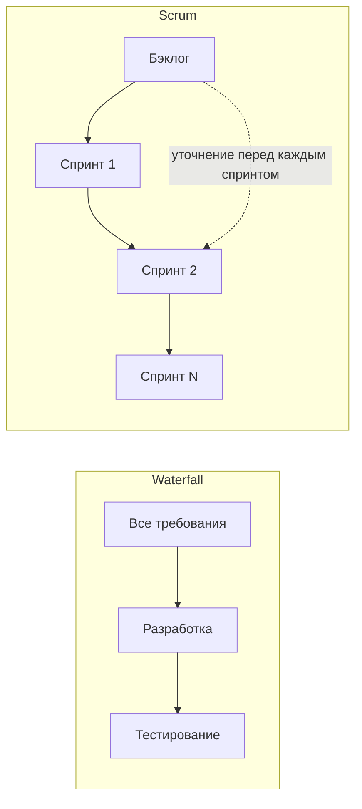

import { Steps } from '@astrojs/starlight/components';
import Brief from '../../../components/Brief.astro';
import CaseRef from '../../../components/CaseRef.astro';
import InterviewQuestions from '../../../components/InterviewQuestions.astro';
import Related from '../../../components/Related.astro';

<Brief>

**Waterfall** — последовательные этапы и требования заранее; **Scrum** — итерации фиксированной длины и бэклог, уточняемый каждый спринт; **Kanban** — непрерывный поток с лимитами незавершённой работы; **гибрид** — фундамент заранее, детали итерациями.
От подхода зависит не то, **что** делает аналитик (выявление, требования, данные, интеграции нужны везде), а **когда, сколько заранее и в каком виде**.
В банках чаще всего встречается гибрид.

</Brief>

## Когда применять

| Подход | Подходит | Не подходит |
|---|---|---|
| Waterfall | Стабильные требования, договор с фиксированным объёмом, приёмка по ТЗ, регуляторика | Высокая неопределённость, рынок меняется быстрее, чем пишется ТЗ |
| Scrum | Новый продукт, неопределённость, нужен ранний результат, доступный PO | Поток мелких заявок и поддержка; нет вовлечённого владельца продукта |
| Kanban | Поддержка, эксплуатация, поток заявок разного размера, непредсказуемые поступления | Крупная разработка с общей целью, требующая планирования вех |
| Гибрид | Корпоративные проекты: архитектура и ИБ согласуются заранее, разработка — спринтами | Маленький продукт одной команды — лишняя бюрократия |

## Как делать

Как выбрать подход и место аналитика:

<Steps>

1. **Оцените неопределённость требований:** насколько хорошо понятно, что нужно.

2. **Учтите внешние рамки:** договор, регуляторика, архитектурный комитет, ИБ.

3. **Определите характер работы:** новый продукт, развитие, поддержка.

4. **Найдите зависимости:** смежные команды, их циклы и окна.

5. **Решите, что делается заранее** (фундамент) и что — итерациями (детали).

6. **Договоритесь о форме требований:** ТЗ, ФТ в Confluence, истории в Jira — и о том, что из этого долгоживущее.

</Steps>

## Нотация: сравнение

| | Waterfall / ГОСТ 34 | Scrum | Kanban | Гибрид |
|---|---|---|---|---|
| Как приходят требования | Все заранее, единым ТЗ | Бэклог, уточняется каждый спринт | Поток задач без итераций | Фундамент заранее, детали итерациями |
| Где живёт документация | Документы, согласованные подписями | Confluence (долгоживущее) + Jira (истории) | Confluence + Jira | Confluence + Jira + согласованные документы для ИБ и комитетов |
| Когда пишется | До разработки | За 1–2 спринта до реализации | По мере появления задачи | Фундамент — в начале; ФТ и истории — перед спринтом |
| Роль аналитика | Пишет ТЗ, затем сопровождает | Член команды: рефайнмент, критерии приёмки, проектирование | Готовит задачи к взятию в работу | Оба режима |
| Изменения | Формальный запрос на изменение | Через бэклог, после спринта | В любой момент при свободной ёмкости | Фундамент — через изменения, детали — через бэклог |
| Приёмка | По ПМИ, акт | Демонстрация на ревью спринта, DoD | По готовности каждой задачи | ПМИ для релиза + DoD для историй |

Таблица основана на разделе 8 <CaseRef href="/case/cheatsheet/" id="Шпаргалка">шпаргалки кейса</CaseRef>.

## Пример из кейса IDM-JOINER

Кейс — **гибрид**:

- **Заранее и документами:** устав, БТ и TO-BE, ФТ, архитектура и интеграции — согласованы архитектурным комитетом и ИБ к январю 2027 года (<CaseRef href="/case/00-project/project-charter/" id="Устав">вехи устава</CaseRef>).
- **Итерациями:** разработка и подключение систем — спринтами; <CaseRef href="/case/02-requirements/backlog/" id="Бэклог">бэклог</CaseRef> показывает те же ФТ в виде эпиков и историй с DoR и DoD.
- **Приёмка релиза** — по <CaseRef href="/case/07-testing/test-program/" id="ПМИ">ПМИ</CaseRef>, историй — по DoD.

Почему так: ИБ и архитектурный комитет банка требуют согласованных документов до разработки, а смежная команда HRMS даёт только 2 спринта — интеграции нужно продумать заранее.

## Типичные ошибки

| Ошибка | Чем плохо | Как правильно |
|---|---|---|
| «В Agile документация не нужна» | Знания теряются, интеграции ломаются | Долгоживущее — документировать; детали — в историях |
| Водопад для продукта с высокой неопределённостью | Год разработки по устаревшим требованиям | Итерации, ранняя обратная связь |
| «Scrum», в котором требования приходят в середине спринта | Хаос, цели спринтов не достигаются | Рефайнмент и DoR |
| Kanban без лимитов WIP | Это просто доска задач | Лимиты и управление потоком |
| Гибрид без договорённости, что заранее, а что нет | Бюрократия без гибкости | Явно разделить фундамент и детали |

## Вопросы на собеседовании

<InterviewQuestions topic="methodologies" ids={['meth-compare', 'meth-manifesto', 'meth-choose']} />

## Связанные темы

<Related pages={['methodologies/waterfall', 'methodologies/scrum', 'methodologies/kanban', 'methodologies/hybrid', 'role/lifecycle']} />
