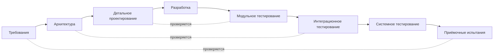

import { Steps } from '@astrojs/starlight/components';
import Brief from '../../../components/Brief.astro';
import CaseRef from '../../../components/CaseRef.astro';
import InterviewQuestions from '../../../components/InterviewQuestions.astro';
import Related from '../../../components/Related.astro';

<Brief>

**Waterfall** (каскадная модель) — этапы идут последовательно: требования → проектирование → разработка → тестирование → внедрение; каждый заканчивается **утверждённым результатом**, и следующий начинается после него.
Сильные стороны — **предсказуемость**, понятная приёмка, удобство для договоров и регуляторики. Слабая — **поздняя обратная связь**: ошибку в требованиях находят на тестировании или приёмке, когда исправлять дорого.
В России водопад часто связан с ГОСТ 34 — стадиями создания АС и ТЗ.

</Brief>

## Когда применять

| Применять | Не нужно |
|---|---|
| Требования стабильны и хорошо понятны | Новый продукт, пользователи и рынок ещё изучаются |
| Фиксированный объём и цена в договоре, тендер | Заказчик хочет менять приоритеты каждый месяц |
| Регуляторные требования к документам и приёмке | Нужен ранний работающий результат для обратной связи |
| Интеграция с «тяжёлыми» системами с длинным циклом изменений | — |

## Как делать

<Steps>

1. **Обследование и требования** — полностью до проектирования; ТЗ согласуется подписями.

2. **Проектирование** — технический проект, модель данных, интеграции.

3. **Разработка** по проекту; вопросы и отклонения — через аналитика и формальные изменения.

4. **Тестирование** по ПМИ: проверяется соответствие ТЗ.

5. **Внедрение и приёмка** — акт.

6. **Снижайте риск поздней обратной связи:** прототипы и макеты на этапе требований, ранние демонстрации, трассировка требований к тестам, пилот.

</Steps>

## Нотация: этапы и V-модель

| Этап | Результат | Что делает аналитик |
|---|---|---|
| Требования | ТЗ, согласованное заказчиком | Основная работа: обследование, требования, ТЗ |
| Проектирование | Технический проект | Данные, интеграции, статусы — с архитектором |
| Разработка | Система | Ответы на вопросы, изменения через запросы |
| Тестирование | Протокол испытаний | Разбор спорных дефектов, трассировка |
| Внедрение | Акт ввода | Миграция, инструкции |

**V-модель** подчёркивает: для каждого уровня требований заранее определяется, каким тестированием он будет проверен. Аналитику это напоминание — критерии приёмки пишутся вместе с требованиями, а не после разработки.

## Пример из кейса IDM-JOINER

Кейс не водопадный, но его «водопадная» часть хорошо видна по <CaseRef href="/case/00-project/project-charter/" id="Устав">вехам устава</CaseRef>: «БТ и TO-BE согласованы» → «ФТ, архитектура, интеграции согласованы (архитектурный комитет, ИБ)» → разработка → «Приёмочные испытания по ПМИ» → пилот → промышленная эксплуатация.

Если бы проект шёл чистым водопадом по ГОСТ 34, артефакты кейса стали бы разделами ТЗ — соответствие показано на странице [ТЗ по ГОСТ 34](/documentation/tz-gost34/#пример-из-кейса-idm-joiner).

## Типичные ошибки

| Ошибка | Чем плохо | Как правильно |
|---|---|---|
| Требования без прототипов и демонстраций | Расхождение ожиданий выясняется на приёмке | Макеты, ранние показы |
| «ТЗ подписано — изменений не будет» | Реальность меняется, ТЗ устаревает | Управление изменениями, дополнения |
| Аналитик уходит после ТЗ | Вопросы разработки решаются без него | Сопровождение до приёмки |
| Критерии приёмки пишет QA после разработки | Неясно, что проверять | ПМИ и критерии — вместе с требованиями |
| Нет трассировки | Изменения затрагивают неизвестно что | Матрица трассировки |

## Вопросы на собеседовании

<InterviewQuestions topic="methodologies" ids={['meth-waterfall-analyst', 'meth-compare']} />

## Связанные темы

<Related pages={['methodologies/comparison', 'documentation/tz-gost34', 'role/lifecycle', 'methodologies/hybrid']} />
