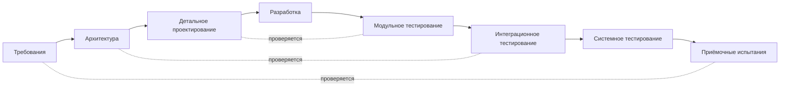

import { Steps } from '@astrojs/starlight/components';
import Brief from '../../../components/Brief.astro';
import CaseRef from '../../../components/CaseRef.astro';
import InterviewQuestions from '../../../components/InterviewQuestions.astro';
import Related from '../../../components/Related.astro';

<Brief>

**Waterfall** (каскадная модель) — этапы идут последовательно: требования → проектирование → разработка → тестирование → внедрение; каждый заканчивается **утверждённым результатом**, и следующий начинается после него.
Сильные стороны — **предсказуемость**, понятная приёмка, удобство для договоров и регуляторики. Слабая — **поздняя обратная связь**: ошибку в требованиях находят на тестировании или приёмке, когда исправлять дорого.
Waterfall не предписывает единого набора должностей и документов. ГОСТ 34 — отдельная система стандартов, требования которой учитывают, если она применима к проекту.

</Brief>

## Когда применять

| Применять | Не нужно |
|---|---|
| Требования стабильны и хорошо понятны | Новый продукт, пользователи и рынок ещё изучаются |
| Фиксированный объём и цена в договоре, тендер | Заказчик хочет менять приоритеты каждый месяц |
| Регуляторные требования к документам и приёмке | Нужен ранний работающий результат для обратной связи |
| Интеграция с «тяжёлыми» системами с длинным циклом изменений | — |

## Как делать

<Steps>

1. **Зафиксируйте цель и границы.** Заказчик объясняет потребность, руководитель проекта уточняет бюджет и сроки, аналитик обследует существующий процесс. Результат — согласованное понимание того, какую проблему решаем.

2. **Согласуйте требования и проверку результата.** Аналитик описывает сценарии, правила, данные и ограничения; заказчик проверяет смысл, тестировщик — проверяемость. Утверждённая версия становится базой для проектирования и контроля изменений.

3. **Спроектируйте решение.** Архитектор, аналитик и технические специалисты согласуют компоненты, модель данных, контракты и поведение при ошибках. Владельцы смежных систем подтверждают договорённости.

4. **Реализуйте и интегрируйте.** Разработчики создают код, миграции и автоматические проверки. Аналитик разбирает вопросы; отклонение от согласованного поведения проходит оценку влияния.

5. **Проверьте систему.** Тестировщики проверяют функциональность и интеграции; представители заказчика участвуют в приёмочных сценариях. Дефект исправляют и перепроверяют, изменение потребности оформляют отдельно.

6. **Внедрите и передайте в сопровождение.** Выполните план миграции и запуска, проверьте результат, передайте инструкции и ответственность эксплуатации. Заказчик оформляет приёмку в согласованном проектом порядке.

7. **Снижайте риск поздней обратной связи на всех этапах.** Используйте прототипы, ранние проверки интеграций, трассировку требований к тестам и пилот. Возврат к предыдущим решениям возможен, но требует пересмотра связанных артефактов и плана.

</Steps>

## Нотация: этапы и V-модель

**В Waterfall нет обязательных спринтов.** Результат оценивают на границе этапа. Ниже — учебная схема проекта: названия этапов, документов и согласующих могут отличаться. Общую логику последовательных фаз описывает [обзор Waterfall](https://www.atlassian.com/agile/project-management/waterfall-methodology); таблицы ниже раскрывают её на собственном примере.

### Роли по ходу проекта

| Участник | За что отвечает |
|---|---|
| Заказчик / спонсор | Цель, финансирование, бизнес-приоритеты; согласует границы и принимает результат в рамках своих полномочий |
| Руководитель проекта | План, бюджет, риски, зависимости, организация согласований и переходов между этапами |
| Бизнес-аналитик и системный аналитик | Потребности, требования, модели и трассировка; сопровождение вопросов и изменений до эксплуатации |
| Архитектор и технические лидеры | Технические решения, ограничения и согласованность частей системы |
| Разработчики | Реализация, ревью кода, модульные проверки, исправления |
| Тестировщики и представители пользователей | Тестировщики проверяют систему; пользователи проверяют пригодность для своей работы |
| Эксплуатация и специалисты ИБ | Требования к запуску и сопровождению, доступам и безопасности; проверки в своей области |

Роли могут совмещаться. Для конкретного проекта закрепите, кто готовит, проверяет и утверждает каждый результат, в [RACI](/role/raci/). Waterfall сам не назначает заказчика единственным согласующим всех документов.

### Входы, выходы и переходы

| Этап и вход | Работа и результат на выходе | Кто готовит и проверяет | Когда переходить дальше |
|---|---|---|---|
| Инициация: бизнес-проблема | Обследование; устав, границы, список участников и рисков | Руководитель проекта и аналитик; заказчик подтверждает цель | Цель, полномочия и границы понятны |
| Требования: устав и обследование | БТ, ФТ, нефункциональные требования, ТЗ и критерии приёмки | Аналитик; заказчик, ИБ, технические эксперты и тестировщики проверяют свою часть | Согласована базовая версия и разрешены критичные вопросы |
| Проектирование: согласованные требования | Архитектура, модель данных, контракты, план проверок | Архитектор и аналитик с разработкой; смежные системы и ИБ согласуют решения | Ключевые интерфейсы и технические риски разобраны |
| Разработка: проект решения | Код, сборка, миграции, результаты модульных проверок | Разработчики; коллеги проводят ревью, аналитик уточняет смысл | Сборку можно передать на согласованные системные проверки |
| Испытания: сборка и программа проверок | Тестовые результаты, реестр дефектов, протоколы | Тестировщики, разработка, аналитик; заказчик участвует в приёмке | Выполнены критерии выхода, остаточные риски явно согласованы |
| Внедрение: проверенная версия | Развёрнутая система, результаты миграции, инструкции, документы приёмки | Эксплуатация и команда внедрения; заказчик и ответственные за запуск | Система работоспособна, есть мониторинг и порядок отката |
| Сопровождение: система в эксплуатации | Решённые обращения, исправления, запросы на изменение, актуальная документация | Поддержка с командой продукта; владельцы сервиса проверяют результат | Каждое обращение закрывается по своим критериям; новые изменения планируются отдельно |

**V-модель** подчёркивает: для каждого уровня требований заранее определяется, каким тестированием он будет проверен. Аналитику это напоминание — критерии приёмки пишутся вместе с требованиями, а не после разработки.

## Пример из кейса IDM-JOINER

Кейс не водопадный, но его «водопадная» часть хорошо видна по <CaseRef href="/case/00-project/project-charter/" id="Устав">вехам устава</CaseRef>: «БТ и TO-BE согласованы» → «ФТ, архитектура, интеграции согласованы (архитектурный комитет, ИБ)» → разработка → «Приёмочные испытания по ПМИ» → пилот → промышленная эксплуатация.

Если бы проект шёл чистым водопадом по ГОСТ 34, артефакты кейса стали бы разделами ТЗ — соответствие показано на странице [ТЗ по ГОСТ 34](/documentation/tz-gost34/#пример-из-кейса-idm-joiner).

### Одна функция через весь цикл

Рассмотрим учебный проход <CaseRef href="/case/02-requirements/backlog/" id="US-01 / FR-01 / FR-03">приёма кадрового события</CaseRef>. Это иллюстрация Waterfall на материалах гибридного кейса, а не его фактический календарь.

| Этап | Практический пример и проверяемый выход |
|---|---|
| Обследование | HR объясняет, как приказ запускает подготовку доступов; аналитик описывает участников и ручные действия |
| Требования | Фиксируем запуск по событию HIRE и отсутствие повторного создания при том же eventId; HR проверяет смысл, тестировщик формулирует сценарии |
| Проектирование | Аналитик с разработчиком определяет контракт события и хранение идентификатора обработки; владелец HRMS подтверждает формат |
| Разработка | Команда реализует обработчик и проверки повторной доставки; результат — воспроизводимая сборка |
| Испытания | Отправляем новое событие, затем повтор; проверяем единственную идентичность и отсутствие новых задач провижининга; результат отражаем в протоколе |
| Внедрение | Подключаем согласованный контур, проверяем обработку и наблюдаемость; поддержка получает инструкцию диагностики |
| Сопровождение | При новом варианте события оформляем запрос на изменение и оцениваем затронутые требования, контракт и тесты |

**Если HR просит дополнительное поле после согласования ТЗ:** аналитик описывает влияние, разработка и тестирование оценивают работу, руководитель проекта пересматривает сроки и бюджет, уполномоченные участники утверждают решение. Затем обновляются базовые документы и задачи. Запрос на изменение не означает автоматический отказ.

## Типичные ошибки

| Ошибка | Чем плохо | Как правильно |
|---|---|---|
| Требования без прототипов и демонстраций | Расхождение ожиданий выясняется на приёмке | Макеты, ранние показы |
| «ТЗ подписано — изменений не будет» | Реальность меняется, ТЗ устаревает | Управление изменениями, дополнения |
| Аналитик уходит после ТЗ | Вопросы разработки решаются без него | Сопровождение до приёмки |
| Критерии приёмки пишет QA после разработки | Неясно, что проверять | ПМИ и критерии — вместе с требованиями |
| Нет трассировки | Изменения затрагивают неизвестно что | Матрица трассировки |

## Вопросы на собеседовании

<InterviewQuestions topic="methodologies" ids={['meth-waterfall-analyst', 'meth-waterfall-handoff', 'meth-compare']} />

## Связанные темы

<Related pages={['methodologies/comparison', 'methodologies/agile', 'documentation/tz-gost34', 'role/lifecycle', 'role/artifacts-by-stage', 'methodologies/hybrid']} />
