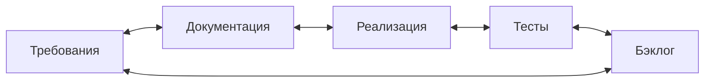

import { Steps } from '@astrojs/starlight/components';
import Brief from '../../../components/Brief.astro';
import CaseRef from '../../../components/CaseRef.astro';
import Checklist from '../../../components/Checklist.astro';
import InterviewQuestions from '../../../components/InterviewQuestions.astro';
import Related from '../../../components/Related.astro';

<Brief>

Вы пришли на проект, который идёт уже несколько месяцев: **половина функций реализована, часть контрактов согласована, часть требований устарела**, решения принимались в чатах и на созвонах. Вопрос — **где мы на самом деле**.
Работа начинается со **сверки**: требования ↔ документация ↔ реализация ↔ тесты ↔ бэклог.
Первый результат — **не новый документ требований и не новая C4**, а **оценка состояния проекта** (Project State Assessment): что сделано, что в работе, что изменилось, что открыто и где расхождения.

</Brief>

## Что известно на входе

- Есть требования, бэклог, часть реализации, тесты, контракты — но они **не совпадают** друг с другом.
- Предыдущий аналитик ушёл или переключился; часть договорённостей нигде не записана.
- Команда в ритме спринтов, от вас ждут задачи уже на следующий спринт.
- Сроки и обязательства перед заказчиком уже есть.

## Главная задача аналитика

Восстановить **достоверную картину состояния проекта** и сделать её общей для команды и заказчика, чтобы дальнейшие требования опирались на реальность, а не на устаревшие документы.

## Что запросить в первый день

<Checklist
  id="onboarding-mid-day1"
  items={[
    'Исходные требования и историю их изменений (версии, запросы на изменение)',
    'Бэклог с эпиками и статусами, доска текущего спринта',
    'Матрицу трассировки или хотя бы связи «требование → задача → тест»',
    'Согласованные контракты интеграций и их версии',
    'Список решений: ADR, протоколы, ключевые ветки обсуждений',
    'Последние демо и отчёты о спринтах',
    'Доступ к стенду, где развёрнута текущая версия',
    'План релизов и ближайшие обязательства перед заказчиком',
  ]}
/>

## С кем поговорить

| Кто | Что выяснить |
|---|---|
| РП, владелец продукта | Обязательства и сроки, что важнее всего, какие решения ещё открыты |
| Предыдущий аналитик (если доступен) | Что менялось устно, где «подводные камни», какие вопросы висят |
| Тимлид, разработчики | Что реально сделано и как, где реализация отошла от требований и почему |
| QA | Что проверено, какие дефекты открыты, какие требования не покрыты тестами |
| Заказчик, ключевые пользователи | Что видели на демо, чего ждут, что для них изменилось |
| Смежные команды | Статус их части интеграций, их сроки |

## Что изучить

<Steps>

1. **Требования и их изменения.** Что было согласовано изначально и что поменялось — и кем.

2. **Реализация.** Пройдите на стенде функции, которые числятся готовыми.

3. **Тесты.** Какие требования покрыты, какие дефекты открыты.

4. **Бэклог.** Что в работе, что отложено, что потерялось.

5. **Контракты и интеграции.** Что согласовано со смежными системами, а что ещё нет.

6. **Сверка.** Сопоставьте всё в одной таблице — расхождения и есть главная находка.

</Steps>



## Что проверить самостоятельно

- Функции со статусом «готово» действительно работают на стенде и делают то, что написано.
- У каждого требования приоритета M есть задача и тест — или явное решение отложить.
- Контракт в документации совпадает с реализованным API.
- Задачи бэклога ссылаются на актуальные, а не на исходные требования.
- Открытые решения имеют владельца и срок, а не «обсудим потом».

## Какие артефакты создать

| Артефакт | Зачем |
|---|---|
| Оценка состояния проекта (Project State Assessment) | Общая картина для команды и заказчика |
| Обновлённая матрица трассировки | Видно, что покрыто, а что нет |
| Реестр открытых решений и вопросов | Владельцы и сроки вместо «где-то обсуждали» |
| Журнал изменений требований | Что поменялось и кем решено — задним числом, но зафиксировано |

## Первый результат работы

**Оценка состояния проекта** — одна страница или таблица, согласованная с РП и владельцем продукта. После неё понятно, что делать дальше, а у вас есть мандат обновлять требования.

```markdown title="Оценка состояния проекта (Project State Assessment)"
# <Проект>: состояние на <дату>
Источники: требования v…, бэклог (спринт …), стенд …, беседы с …

| Область / эпик | Реализовано и проверено | В разработке | Согласовано, не начато | Изменилось | Риски |
|---|---|---|---|---|---|

## Открытые решения
| Вопрос | Варианты | Кто решает | Срок |

## Зависимости
| От кого | Что нужно | Срок | Статус |

## Расхождения
| Где | Написано | На самом деле | Что делать |

## Предложение по следующим шагам
```

## Пример из кейса IDM-JOINER

Учебный сценарий: вы пришли в проект на 12-м спринте. Что из документации кейса станет инструментом сверки:

- <CaseRef href="/case/02-requirements/traceability-matrix/" id="Трассировка">матрица трассировки</CaseRef> — по ней видно, какое требование какими UC, интеграциями и тестами закрыто, а где пусто;
- <CaseRef href="/case/02-requirements/backlog/" id="Бэклог">бэклог</CaseRef> — эпики EPIC-01…EPIC-06 со спринтами: сравните план со стендом;
- <CaseRef href="/case/03-architecture/adr/" id="ADR">ADR</CaseRef> — решения с последствиями: например, ADR-002 требует удалять созданные учётные записи при отмене приёма (FR-18) — проверьте, реализовано ли это и есть ли тест;
- требование FR-23 (статус подготовки для руководителя) имеет приоритет C — типичный кандидат на «согласовано, но не реализовано», который стоит явно подтвердить с владельцем продукта.

## Типичные ошибки

| Ошибка | Чем плохо | Как правильно |
|---|---|---|
| Писать новые требования поверх старых | Два набора требований, команда не знает, какой верный | Сначала сверка и оценка состояния |
| Верить статусу задачи «готово» | Сюрпризы на приёмке | Проверить на стенде |
| Переделывать согласованное без запроса на изменение | Конфликт с заказчиком и смежными командами | Изменения — через владельца и запрос на изменение |
| Не фиксировать устные решения | Через месяц спор «мы так не договаривались» | Журнал решений задним числом |
| Сделать отчёт ради отчёта | Никто не читает, решения не принимаются | Одна страница, по которой можно решать |

## Вопросы на собеседовании

<InterviewQuestions topic="onboarding" ids={['onb-mid-project', 'onb-psa']} />

## Связанные темы

<Related pages={['onboarding', 'interview/tasks/mid-project', 'requirements/traceability', 'methodologies/scrum', 'architecture/adr', 'elicitation/conflicts']} />
