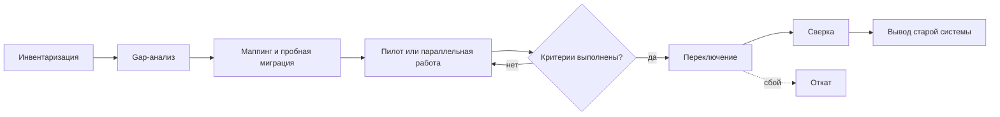

import { Steps } from '@astrojs/starlight/components';
import Brief from '../../../components/Brief.astro';
import CaseRef from '../../../components/CaseRef.astro';
import Checklist from '../../../components/Checklist.astro';
import InterviewQuestions from '../../../components/InterviewQuestions.astro';
import Related from '../../../components/Related.astro';

<Brief>

Замена системы — **legacy и новая система одновременно**: нужно понять старую так же глубоко, как в сценарии D, и спроектировать новую, как в сценарии A, — плюс **переход** между ними.
Главный вопрос — **что нельзя потерять и как переключиться без остановки бизнеса**. Ключевые работы: функциональная инвентаризация, gap-анализ, маппинг и миграция данных, стратегия перехода, переключение (cutover), откат (rollback) и сверка.
Самая дорогая ошибка — перенести систему «как написано в документации» и потерять поведение, которое нигде не записано, но на которое опираются люди и смежные системы.

</Brief>

## Что известно на входе

- Решение о замене принято (или обсуждается): старая система не устраивает по стоимости, поддержке, функциям, требованиям ИБ.
- Новая система выбрана (коробка, платформа) или будет разрабатываться.
- Старая система работает, у неё есть пользователи, данные за годы и интеграции.
- Есть срок вывода старой системы — часто жёсткий (окончание лицензии, поддержки).

## Главная задача аналитика

Обеспечить, чтобы после перехода **бизнес мог делать всё, что нужно** — включая неочевидные вещи, — **данные перенесены и сверены**, смежные системы переключены, а **откат возможен**, если что-то пошло не так.

## Что запросить в первый день

<Checklist
  id="onboarding-replacement-day1"
  items={[
    'Причины замены и критерии успеха — что должно стать лучше',
    'Документацию и доступ к старой системе (стенд, БД на чтение, логи)',
    'Описание или стенд новой системы, её возможности и ограничения',
    'Перечень интеграций старой системы и их владельцев',
    'Объёмы данных и требования к их хранению (сроки, архив, ПДн)',
    'Ограничения по времени: окна обслуживания, периоды, когда переключаться нельзя',
    'Кто принимает решение о переключении и об откате',
  ]}
/>

## С кем поговорить

| Кто | Что выяснить |
|---|---|
| Ключевые пользователи старой системы | Что они делают каждый день, раз в месяц, раз в год; обходные пути |
| Сопровождение старой системы | Неочевидное поведение, ночные задания, ручные операции, известные проблемы |
| Владельцы смежных систем | Как переключать интеграции, сколько им нужно времени, могут ли работать с двумя системами |
| Поставщик или команда новой системы | Что умеет «из коробки», что требует доработки, как загружать данные |
| ИБ, аудит, архив | Что с историческими данными, сроки хранения, требования к журналам |
| Эксплуатация | Окна переключения, мониторинг, план отката |

## Что изучить

<Steps>

1. **Функциональная инвентаризация старой системы** — всё, что она делает, включая отчёты, выгрузки, ночные задания, «странное» поведение (как в сценарии D).

2. **Gap-анализ** старое ↔ новое: что переносим как есть, что меняем, что сознательно не переносим — и кто это решил.

3. **Маппинг данных** и качество данных: что переносим, как сопоставляем, что делаем с мусором и дублями.

4. **Интеграции:** кто вызывает старую систему и как каждый потребитель переключится.

5. **Стратегия перехода** — см. таблицу ниже.

6. **Переключение и откат:** критерии готовности, порядок действий, кто решает, что будет с данными при откате.

7. **Сверка** после переключения: как убедиться, что новая система даёт те же результаты.

</Steps>

| Стратегия перехода | Как | Когда подходит | Риск |
|---|---|---|---|
| Одномоментно («большой взрыв») | Все переходят в один день | Небольшая система, мало интеграций | Высокий: при сбое страдают все |
| Поэтапно | По подразделениям, регионам, типам операций | Можно разделить пользователей | Период, когда работают две системы |
| Параллельная эксплуатация | Обе системы работают, результаты сверяются | Критичные расчёты, высокая цена ошибки | Двойная работа, нужна сверка |
| Постепенное вытеснение (strangler fig) | Функции по одной переносятся в новую систему, старая «сжимается» | Большая система, переписываемая частями | Долгий переходный период, маршрутизация запросов |

## Что проверить самостоятельно

- В инвентаризации есть не только экранные функции, но и отчёты, выгрузки, задания по расписанию.
- Для каждой функции старой системы есть решение: перенести, изменить или отказаться — с владельцем решения.
- Пробная миграция на копии данных прошла, результаты сверены по количеству и выборочно по содержанию.
- План отката описывает судьбу данных, созданных в новой системе после переключения.
- Каждый потребитель интеграций знает дату и порядок переключения.

## Какие артефакты создать

| Артефакт | Зачем |
|---|---|
| Функциональная инвентаризация и gap-анализ | Ничего не потерять и не перенести лишнее |
| Маппинг данных и стратегия миграции | Что, откуда, как сопоставлять, что с мусором |
| План перехода: этапы, критерии, переключение, откат | Управляемый переход вместо «в понедельник включаем» |
| Правила сверки | Как доказать, что новая система работает верно |
| Карта переключения интеграций | Кто, когда и в каком порядке |

## Первый результат работы

**Функциональная инвентаризация с решением по каждой функции** (перенести / изменить / отказаться) и **черновик стратегии перехода** с вариантами и рисками. На этом основании заказчик выбирает стратегию, а команда — объём работ.

## Пример из кейса IDM-JOINER

Кейс заменяет не программу, а **ручной процесс** — заявки руководителей в ServiceDesk на доступы новичкам, — но переход устроен по тем же правилам:

- <CaseRef href="/case/06-rollout/migration-strategy/" id="Миграция">стратегия миграции</CaseRef>: что загружается (идентичности, учётные записи AD и АБС, зарезервированные логины, справочники), как сопоставляется и что делать с несопоставленным;
- <CaseRef href="/case/06-rollout/rollout-plan/" id="Внедрение">план внедрения</CaseRef> — **поэтапный переход**: приёмочные испытания, пилот на двух подразделениях (старый процесс работает для остальных), тиражирование по регионам, затем отключение старой категории заявок в ServiceDesk;
- **переключение и откат**: автоматизация включается флагом на уровне подразделения; откат — выключение флага, руководители снова создают заявки по старому регламенту, уже созданные учётные записи сверяются вручную;
- **сверка**: после загрузки — ежедневная сверка с HRMS полным срезом (FR-05).

## Типичные ошибки

| Ошибка | Чем плохо | Как правильно |
|---|---|---|
| Инвентаризация по документации старой системы | Теряется недокументированное поведение | Интерфейс, данные, логи, задания по расписанию, пользователи |
| «Перенесём всё как было» | Новая система повторяет старые проблемы | Решение по каждой функции: перенести, изменить или отказаться |
| Миграция «в день переключения» без пробы | Сюрпризы в данных в самый неудобный момент | Пробные миграции на копии со сверкой |
| Нет плана отката | При сбое — импровизация и простой | Откат с критериями и судьбой новых данных |
| Забыть смежные системы | После переключения ломаются интеграции | Карта переключения потребителей |

## Вопросы на собеседовании

<InterviewQuestions topic="onboarding" ids={['onb-replacement', 'onb-cutover']} />

## Связанные темы

<Related pages={['onboarding', 'onboarding/legacy', 'processes/gap-analysis', 'case/06-rollout/migration-strategy', 'case/06-rollout/rollout-plan', 'data/reference-data']} />
