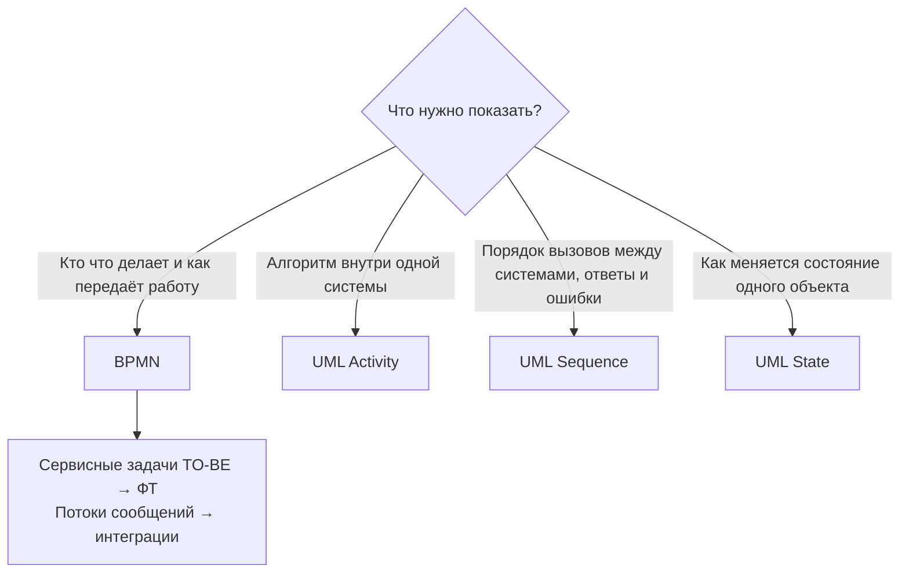

import { Steps, Tabs, TabItem, Aside } from '@astrojs/starlight/components';
import Brief from '../../../components/Brief.astro';
import Check from '../../../components/Check.astro';
import CaseRef from '../../../components/CaseRef.astro';
import InterviewQuestions from '../../../components/InterviewQuestions.astro';
import Related from '../../../components/Related.astro';
import BpmnSymbol from '../../../components/BpmnSymbol.astro';
import BpmnViewer from '../../../components/BpmnViewer.tsx';

<Brief>

**BPMN** (Business Process Model and Notation) — стандарт OMG для схем бизнес-процессов. Схема отвечает на вопрос: **кто, что, в каком порядке и при каких условиях делает** и **где работа передаётся между участниками**.
Пять групп элементов: **события** (круги), **действия** (скруглённые прямоугольники), **шлюзы** (ромбы), **потоки** (стрелки), **пулы и дорожки** (участники).
Аналитик рисует AS-IS, чтобы найти потери, и TO-BE, чтобы договориться о целевом процессе.

</Brief>

## Когда применять

| Применять | Не нужно |
|---|---|
| Процесс с **несколькими участниками** и передачей работы между ними | Алгоритм внутри одной системы → [UML Activity](#bpmn-или-другая-диаграмма) |
| Обследование: показать AS-IS и **где теряется время** (очереди, возвраты, ручной труд) | Порядок вызовов между системами с ответами и ошибками → Sequence |
| Согласование TO-BE с бизнесом: одна картинка вместо пяти страниц текста | Жизненный цикл одного объекта (статусы заявки) → State |
| Поиск точек автоматизации и интеграций: сервисные задачи → ФТ, потоки сообщений → интеграции | Процесс из 3–4 шагов одного исполнителя: хватит нумерованного списка |
| Исполняемые процессы в BPM-движке (Camunda, Flowable) | Точный формат данных → OpenAPI / AsyncAPI, а не диаграмма |

**Стандарт.** BPMN 2.0 — спецификация консорциума OMG. Актуальная редакция — **2.0.2**. Стандарт также принят как международный **ISO/IEC 19510**.

<Check id="bpmn-01">
Соответствие редакций: ISO/IEC 19510:2013 по распространённым данным соответствует BPMN **2.0.1**, а 2.0.2 (OMG, 2013–2014) содержит только мелкие правки. Сверить с сайтом OMG (omg.org/spec/BPMN) и каталогом ISO.
</Check>

## Как делать

<Steps>

1. **Определи границы.** Чем процесс начинается (событие-триггер) и чем заканчивается (результат). В кейсе: старт — «Кандидат принял оффер», финиш — «Сотрудник работает с 09:00 первого дня».

2. **Определи участников.** Внешние организации и самостоятельные системы — пулы. Роли и подразделения внутри — дорожки. Для каждого участника подумай: он делает работу или только обменивается сообщениями?

3. **Нарисуй основной (счастливый) путь** слева направо: старт → 5–10 задач → конец. Названия задач — «глагол + объект»: «Создать заявку», «Проверить SoD».

4. **Добавь развилки.** Каждое место, где процесс может пойти по-разному, — шлюз с вопросом («Согласовано?»). Ветки подписаны ответами («Да» / «Нет»).

5. **Добавь ожидания и исключения.** Таймеры («День выхода, 07:00»), приход сообщений, таймауты на задачах (граничные события), отмены, ошибки.

6. **Прогони токен.** Пройди по схеме мысленно, «пальцем», для каждого варианта. Везде ли есть выход? Не выполняется ли шаг дважды после параллельных веток? Нет ли тупиков?

7. **Проверь уровень детализации.** Шаг — работа одного исполнителя за один подход, а не клик мышью. Больше 20–25 задач — выноси части в подпроцессы.

8. **Подпиши проблемы (для AS-IS) и правила (для TO-BE)** аннотациями со ссылками на ID: P-01, BRL-02. Покажи схему участникам процесса и исправь по их замечаниям.

</Steps>

## Нотация

### События

Событие — то, что **происходит** (а не делается): триггер, ожидание, результат. Называется **состоянием**: «Заявка подана», «Наступил день выхода».

| Символ | Элемент | Значение и правила |
|---|---|---|
| <BpmnSymbol name="start" label="Стартовое событие" /> | Стартовое событие (start event) | Начало процесса. Тонкий одинарный круг. У процесса верхнего уровня обычно одно стартовое событие. |
| <BpmnSymbol name="intermediate" label="Промежуточное событие" /> | Промежуточное событие (intermediate event) | Происходит по ходу процесса. Двойной круг. **Ловящее** (catching) — ждёт; **бросающее** (throwing) — создаёт событие. |
| <BpmnSymbol name="end" label="Конечное событие" /> | Конечное событие (end event) | Результат процесса или ветки. Жирный круг. Называется итоговым состоянием: «Доступы выданы». |
| <BpmnSymbol name="timer" label="Промежуточное событие-таймер" /> | Таймер (timer) | Ждать дату, время или интервал. В TO-BE кейса — «День выхода, 07:00 по времени подразделения». |
| <BpmnSymbol name="message-catch" label="Ловящее событие-сообщение" /> | Сообщение, ловящее (message catch) | Ждать сообщение от другого участника. Пустой конверт. |
| <BpmnSymbol name="message-throw" label="Бросающее событие-сообщение" /> | Сообщение, бросающее (message throw) | Отправить сообщение. Закрашенный конверт. Закрашенный маркер = бросающее событие. |
| <BpmnSymbol name="error-end" label="Конечное событие-ошибка" /> | Ошибка (error) | Конечное событие-ошибка бросает ошибку, граничное — ловит её на задаче или подпроцессе. |
| <BpmnSymbol name="terminate-end" label="Конечное событие-завершение" /> | Завершение (terminate) | Немедленно останавливает **весь** процесс, включая параллельные ветки. |
| <BpmnSymbol name="boundary" label="Граничное событие на задаче" /> | Граничное событие (boundary event) | Висит на границе задачи: таймаут, ошибка, сообщение во время её выполнения. Сплошная обводка — **прерывающее** (задача отменяется), пунктирная — **непрерывающее** (задача продолжается, стартует ещё одна ветка). |

Кроме этих, есть события сигнала, эскалации, компенсации, условия, отмены (только для транзакций) и составные (multiple). В аналитических схемах чаще всего хватает таймера, сообщения и ошибки.

### Действия

Действие (activity) — **работа**, которую кто-то выполняет. Название — «глагол + объект» в неопределённой форме.

| Символ | Элемент | Когда использовать |
|---|---|---|
| <BpmnSymbol name="task" label="Задача" /> | Задача (task) | Атомарная работа без уточнения типа. |
| <BpmnSymbol name="user-task" label="Пользовательская задача" /> | Пользовательская задача (user task) | Человек работает **в системе**: форма, портал. В кейсе — T1 «Оформить приказ о приёме в HRMS». |
| <BpmnSymbol name="service-task" label="Сервисная задача" /> | Сервисная задача (service task) | Система делает сама. В кейсе — T2–T5, T7, T9, T10: всё, что делает IdM. |
| — | Ручная задача (manual task), маркер «рука» | Человек работает **без системы**: позвонить, передать бумагу. В AS-IS кейса — A6–A11. |
| — | Отправка и получение (send / receive task), маркер «конверт» | Отправить сообщение или дождаться его. |
| — | Скриптовая (script) и бизнес-правило (business rule) | Скрипт в движке процессов; вызов таблицы решений DMN. Нужны в исполняемых моделях. |
| <BpmnSymbol name="subprocess" label="Свёрнутый подпроцесс" /> | Подпроцесс (sub-process), свёрнутый | Группа шагов внутри этого процесса. Знак «+» — можно развернуть. |
| <BpmnSymbol name="call-activity" label="Вызываемая активность" /> | Вызываемая активность (call activity) | Жирная рамка: вызов **отдельного переиспользуемого** процесса. |

**Маркеры повторения** внизу задачи: круговая стрелка — цикл (loop); три вертикальные черты — параллельные экземпляры (multi-instance parallel); три горизонтальные — последовательные экземпляры. Пример: «Согласовать с каждым владельцем ресурса» — multi-instance.

### Шлюзы

Шлюз (gateway) **не выполняет работу**, он только направляет поток. Ветвящий шлюз называется **вопросом**, ветки — **ответами**.

| Символ | Шлюз | Ветвление | Слияние |
|---|---|---|---|
| <BpmnSymbol name="xor" label="Исключающий шлюз XOR" /> | Исключающий (exclusive, XOR) | Ровно **одна** ветка — первая, чьё условие истинно. Можно отметить ветку по умолчанию (default flow). | Пропускает каждый пришедший токен, **не ждёт** |
| <BpmnSymbol name="and" label="Параллельный шлюз AND" /> | Параллельный (parallel, AND) | **Все** ветки одновременно, условия не проверяются | **Ждёт все** входящие ветки |
| <BpmnSymbol name="or" label="Включающий шлюз OR" /> | Включающий (inclusive, OR) | **Одна или несколько** веток с истинным условием | Ждёт все ветки, которые **были активированы** |
| <BpmnSymbol name="event-based" label="Шлюз по событию" /> | По событию (event-based) | Путь выбирает **событие, которое наступит первым**. За шлюзом — ловящие события или задачи получения. | — |

Есть ещё сложный шлюз (complex, маркер «*») с произвольным правилом слияния. В аналитических схемах он почти не встречается: если он понадобился, обычно лучше переформулировать логику.

Тот же сюжет, что в кейсе (согласование полномочия, UC-04), на XOR и AND. Перетащите схему или нажмите «Во весь экран».

<BpmnViewer client:visible src="/bpmn/examples/gateways.bpmn" title="Пример: XOR и AND на согласовании полномочия" height={430} />

### Потоки и связи

| Символ | Элемент | Правила |
|---|---|---|
| <BpmnSymbol name="sequence-flow" label="Поток операций" /> | Поток операций (sequence flow) | Порядок шагов **внутри одного пула**. По нему движется токен. Не пересекает границу пула. |
| <BpmnSymbol name="default-flow" label="Поток по умолчанию" /> | Поток по умолчанию (default flow) | Засечка у начала: ветка XOR/OR, если ни одно условие не выполнилось. |
| <BpmnSymbol name="conditional-flow" label="Условный поток" /> | Условный поток (conditional flow) | Ромбик у начала: условный выход прямо из задачи, без шлюза. Лучше заменить явным шлюзом. |
| <BpmnSymbol name="message-flow" label="Поток сообщений" /> | Поток сообщений (message flow) | Пунктир с кружком и пустым наконечником. Обмен **между пулами**: письмо, вызов API, событие в шине. |
| <BpmnSymbol name="association" label="Ассоциация" /> | Ассоциация (association) | Точечная линия: связь аннотации или объекта данных с элементом. Токен по ней не ходит. |

### Участники, данные, артефакты

| Символ | Элемент | Значение |
|---|---|---|
| <BpmnSymbol name="pool" label="Пул с дорожками" /> | Пул (pool) и дорожка (lane) | Пул — участник: организация или система со своим процессом. Дорожка — роль или подразделение внутри пула. Пул внешнего участника можно свернуть в «чёрный ящик» и показать только сообщения. |
| <BpmnSymbol name="data-object" label="Объект данных" /> | Объект данных (data object) | Информация, которую шаг создаёт или читает: «Приказ о приёме», «Заявка». Живёт, пока идёт процесс. |
| <BpmnSymbol name="data-store" label="Хранилище данных" /> | Хранилище данных (data store) | Данные, которые переживают процесс: БД, реестр. |
| <BpmnSymbol name="annotation" label="Текстовая аннотация" /> | Аннотация (text annotation) | Комментарий. В AS-IS кейса так отмечены проблемы P-01 … P-07. |

Связь участников: два пула и поток сообщений. Так в кейсе можно было бы строго показать передачу кадрового события из HRMS в IdM.

<BpmnViewer client:visible src="/bpmn/examples/collaboration.bpmn" title="Пример: два пула и поток сообщений" height={400} />

### Шаблон: соглашения об именовании

```text title="Чек-лист имён в BPMN"
Стартовое событие   существительное + причастие   «Кандидат принял оффер», «Заявка подана»
Задача              глагол (инф.) + объект         «Создать учётную запись AD»
Шлюз (ветвление)    вопрос                         «Согласовано?», «Есть SoD-конфликт?»
Ветки шлюза         ответы                         «Да» / «Нет», «Критичное» / «Обычное»
Промежут. событие   что наступило                  «День выхода, 07:00», «Ответ получен»
Конечное событие    итоговое состояние             «Доступы выданы», «Заявка отклонена»
Пул                 участник                       «Банк», «HRMS», «Кандидат»
Дорожка             роль/подразделение             «HR-специалист», «Администраторы»
```

### BPMN или другая диаграмма



## Пример из кейса IDM-JOINER

Обе схемы — из раздела «Бизнес» учебного кейса. Исходники открываются в Camunda Modeler или на demo.bpmn.io.

<Tabs>
<TabItem label="AS-IS">

<BpmnViewer client:visible src="/case-files/idm-joiner-docs/01_business/diagrams/as-is.bpmn" previewSrc="/case-files/idm-joiner-docs/01_business/diagrams/as-is.svg" title="AS-IS: предоставление доступов новому сотруднику" height={480} />

**Что видно на схеме:**

- Четыре **ручные** задачи администраторов подряд (A6–A9) — четыре очереди, суммарно 2–4 дня. Это проблема P-04. Параллельного шлюза нет: в реальности работа шла последовательно, и схема это честно показывает.
- **Цикл возврата**: шлюз «Согласовано?» по ветке «Нет» возвращает к A4 «Создать заявку». 23% заявок возвращаются (P-03).
- Процесс запускает **человек** (A2 → A3 → A4), а не событие в системе. Отсюда 40% заявок после выхода сотрудника (P-01).
- Проблемы привязаны к шагам **аннотациями** P-01 … P-07, а не описаны отдельным списком в стороне.

Документ: <CaseRef href="/case-files/idm-joiner-docs/01_business/01_as-is.md" id="AS-IS">01_as-is.md</CaseRef>.

</TabItem>
<TabItem label="TO-BE">

<BpmnViewer client:visible src="/case-files/idm-joiner-docs/01_business/diagrams/to-be.bpmn" previewSrc="/case-files/idm-joiner-docs/01_business/diagrams/to-be.svg" title="TO-BE: предоставление доступов новому сотруднику" height={480} />

**Что видно на схеме:**

- Большинство шагов — **сервисные задачи** дорожки «IdM (автоматически)». Люди остались в исключениях: T6 (SoD-конфликт) и T8 (ручная задача для систем без коннектора и при сбоях).
- Шлюзы-вопросы «Есть SoD-конфликт?» и «Нужны ручные задачи?» — XOR. Ветки сходятся в T7 и в таймер **без явного шлюза слияния**. Это допустимо, потому что после XOR активна только одна ветка, но явный XOR-шлюз слияния читался бы яснее.
- **Промежуточный таймер** «День выхода, 07:00 по времени подразделения» реализует бизнес-правило BRL-02 и требование FR-08.
- Аннотации ссылаются на правила (BRL-01) и риски (R-01).

Документ: <CaseRef href="/case-files/idm-joiner-docs/01_business/02_to-be.md" id="TO-BE">02_to-be.md</CaseRef>.

</TabItem>
</Tabs>

<Aside type="tip" title="Пул или дорожка для IdM?">
В кейсе IdM — дорожка в общем пуле. Это упрощение ради читаемости. Строже по нотации вынести HRMS и IdM в отдельные пулы и связать потоками сообщений, как во втором примере выше. На собеседовании полезно уметь объяснить оба варианта: один пул — «процесс глазами банка», несколько пулов — «взаимодействие самостоятельных участников».
</Aside>

Скачать исходники: <CaseRef href="/case-files/idm-joiner-docs/01_business/diagrams/as-is.bpmn">as-is.bpmn</CaseRef> · <CaseRef href="/case-files/idm-joiner-docs/01_business/diagrams/to-be.bpmn">to-be.bpmn</CaseRef>.

## Типичные ошибки

| Ошибка | Чем плохо | Как правильно |
|---|---|---|
| Задача без глагола: «Заявка» | Непонятно, что делают с заявкой | «Создать заявку», «Согласовать заявку» |
| Шлюз без вопроса, ветки без подписей | Читатель гадает, по какому условию идёт процесс | Шлюз — вопрос, ветки — ответы |
| Поток операций между пулами | Нарушение нотации: у каждого пула свой процесс | Поток сообщений |
| Параллельные ветки слились прямо в задачу, без AND | Задача выполнится **дважды** (по разу на токен) | AND-шлюз слияния перед задачей |
| Слияние после OR через AND | AND будет вечно ждать ветку, которую OR не активировал | Слияние тем же типом шлюза, что и ветвление |
| XOR без ветки по умолчанию при неполных условиях | Процесс «застрянет», если ни одно условие не выполнилось | Полный набор условий или default flow |
| Нет конечного события | Непонятно, чем кончается процесс и есть ли тупики | Конечное событие на каждой ветке с понятным итогом |
| Шаг = клик мышью; 40 задач на схеме | Схема нечитаема, теряется суть | Шаг — единица работы одного исполнителя; подпроцессы |
| AS-IS и TO-BE на одной схеме | Невозможно понять, что есть сейчас, а что будет | Две отдельные схемы + gap-анализ |
| AS-IS нарисован по регламенту | Не видны реальные потери и обходные пути | Интервью, статистика, наблюдение; расхождения с регламентом — отдельная находка |
| Сообщения нарисованы задачами «Отправить письмо» в чужой дорожке | Нельзя понять, кто владелец шага | Задача отправки в своей дорожке + поток сообщений к получателю |

## Вопросы на собеседовании

<InterviewQuestions topic="bpmn" />

## Связанные темы

<Related
  pages={['processes/as-is-to-be', 'processes/gap-analysis', 'tools/bpmn-editor', 'diagram-howto/bpmn']}
  planned={[
    'Какую диаграмму выбрать',
    'UML Activity',
    'UML Sequence',
    'Camunda Modeler и draw.io в каталоге ПО',
  ]}
/>
