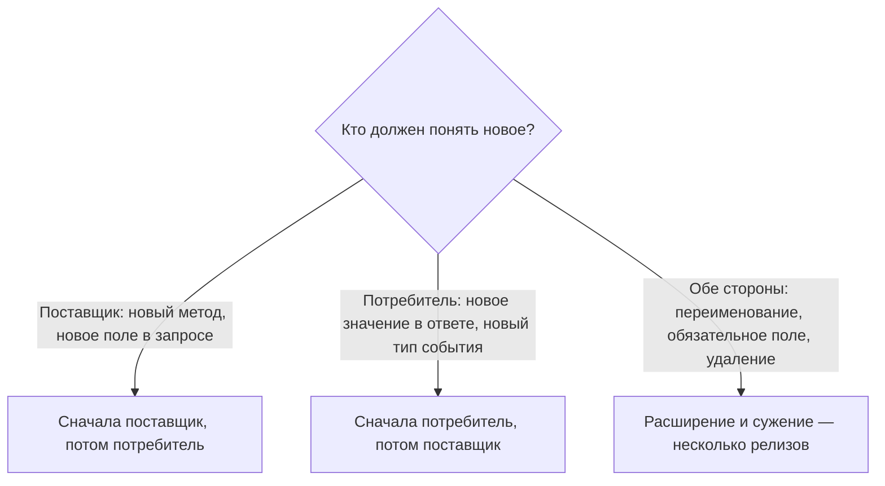

import { Steps } from '@astrojs/starlight/components';
import Brief from '../../../components/Brief.astro';
import CaseRef from '../../../components/CaseRef.astro';
import InterviewQuestions from '../../../components/InterviewQuestions.astro';
import Related from '../../../components/Related.astro';

<Brief>

Системы и сервисы нельзя выложить одновременно: между выкладками всегда есть **окно, когда одна сторона уже новая, а другая ещё старая**. Порядок выкладки выбирают так, чтобы в этом окне всё работало.
Правило: **первым выкладывается тот, кто должен понять новое.** Новый метод или поле в запросе понимает поставщик (provider) — он первый. Новое значение в ответе или новый тип события понимает потребитель (consumer) — тогда первый он.
Если новое должны понять обе стороны (переименование, новое обязательное поле, удаление), изменение делят на несколько совместимых шагов — **расширение и сужение (expand/contract)**. Тот же принцип работает для схемы БД.

</Brief>

## Когда применять

| Применять | Не нужно / проще |
|---|---|
| Изменение затрагивает контракт API или событий между системами или сервисами | Изменение внутри одного сервиса без внешних интерфейсов и без БД |
| В релизе есть скрипты миграции БД | Новая система, у которой ещё нет потребителей и данных |
| Разработчик называет порядок выкладки, и нужно понять, верен ли он | — |
| Проверяете анализ влияния: кого изменение сломает, если выложить не в том порядке | — |

## Как делать

<Steps>

1. **Найти все стороны изменения.** Кто поставщик, кто потребители — в том числе те, о ком команда не помнит: отчёты, выгрузки, SIEM, смежные команды. Источник — карта интеграций и анализ влияния.

2. **Для каждой пары определить, кто должен понять новое.** Новое во входных данных поставщика — первым выкладывается поставщик. Новое в его выходных данных (ответ, событие) — потребитель.

3. **Проверить каждое промежуточное состояние.** «Поставщик новый, потребитель старый» и наоборот: что произойдёт с запросами в этом окне? Окно бывает долгим — у смежной команды свой график релизов.

4. **Проверить откат.** Откат одной стороны снова создаёт смесь версий. Схема после скриптов миграции должна работать и с предыдущей версией приложения.

5. **Если изменение несовместимо для обеих сторон — разбить его.** Сначала добавить новое рядом со старым, перевести всех потребителей, потом удалить старое отдельным релизом.

6. **Записать порядок в план релиза** с причиной каждого шага и договориться о сроках со смежными командами.

</Steps>

## Нотация: кто выкладывается первым

| Изменение | Первым | Что будет при обратном порядке |
|---|---|---|
| Новый метод (endpoint) | Поставщик | Потребитель вызывает метод, которого нет, — 404, повторы, ручные задачи |
| Новое необязательное поле в запросе | Поставщик | Старый поставщик отклонит запрос (400, если схема запрещает лишние поля) или молча проигнорирует поле — данные потеряны |
| Новое поле в ответе | Поставщик | — (совместимо, если потребители пропускают незнакомые поля — tolerant reader) |
| Новое значение enum или новый код ответа | Потребитель | Старый потребитель не знает значения: ошибка разбора или неверная ветка обработки |
| Новый тип события или новое поле в событии | Потребитель (читатель) | Событие уходит в DLQ или обрабатывается неправильно |
| Новое **обязательное** поле в запросе | Обе стороны → расширение и сужение | Старые потребители получают 400 |
| Удаление или переименование поля | Обе стороны → расширение и сужение | Потребитель не находит поле |

### Расширение и сужение (expand/contract)

| Шаг | API | БД: переименовать столбец |
|---|---|---|
| 1. Расширить | Добавить новое поле рядом со старым, поставщик заполняет оба | Добавить новый столбец; приложение пишет в оба |
| 2. Перевести | Потребители переходят на новое поле — каждый в своём релизе | Заполнить новый столбец для старых строк; приложение читает новый |
| 3. Сузить | Убедиться, что старое поле никто не читает, удалить в новой версии контракта | Удалить старый столбец — отдельным релизом, когда откат на старую версию уже не нужен |

### Скрипты миграции БД

- Версионированные, каждый применяется **один раз**; версия схемы хранится в самой БД.
- В одном релизе со сменой приложения — только **аддитивные** изменения: новые таблицы, столбцы, допускающие пустое значение, индексы. Тогда предыдущая версия приложения работает на новой схеме, и откат приложения не требует отката БД.
- Удаления и сужения (NOT NULL, удаление столбца) — последним шагом расширения и сужения.
- Скрипт миграции схемы и миграция данных — разные вещи: первый меняет структуру, вторая переносит данные из старых систем.

### Версии контрактов

По **семантическому версионированию (SemVer)**: MAJOR — несовместимое изменение, MINOR — совместимое новое, PATCH — исправление описания. Номер версии не заменяет порядок выкладки: совместимое по схеме изменение (новый код ответа) всё равно ломает потребителя, который его не ждёт.

## Пример из кейса IDM-JOINER

**Сначала поставщик.** В <CaseRef href="/case/06-rollout/release-plan/" id="Релиз 1.0">плане релиза 1.0</CaseRef> адаптер АБС выкладывается раньше IdM: IdM вызывает адаптер, а не наоборот. Если выложить IdM первой и включить подразделения, задачи по АБС получат ошибку, уйдут в повторы и затем в ручные задачи по FR-16. По той же причине обработчик кадровых событий выкладывается раньше, чем HRMS начинает публиковать события. Скрипты миграции БД в релизе только добавляют таблицы и столбцы, поэтому откат приложений IdM не требует отката схемы.

**Сначала потребитель.** В <CaseRef href="/case/08-operations/change-request/" id="CHG-01">CHG-01</CaseRef> адаптер АБС (поставщик) начинает отвечать **429 с `Retry-After`** вместо 503 при превышении лимита. Новое здесь — значение в ответе, понять его должна IdM (потребитель). Поэтому первой выкладывается IdM с обработкой 429, а адаптер — только после неё. При обратном порядке старая IdM сочла бы 429 технической ошибкой, повторила бы через 1 и 5 минут — и <CaseRef href="/case/08-operations/incident-example/" id="INC-01">инцидент INC-01</CaseRef> повторился бы.

Упражнение: в волне 2 HRMS начнёт публиковать новый тип события TRANSFER (перевод). Каков порядок выкладки?

Новое — тип события, его должен понять потребитель. Сейчас `eventType` в контракте кадровых событий — перечисление HIRE, HIRE_CHANGED, HIRE_CANCELLED, и по FR-02 событие, не прошедшее проверку, уходит в DLQ с инцидентом для HRMS. Значит:

1. Контракт: новое значение TRANSFER, новая версия схемы события.
2. IdM: обработка TRANSFER (или хотя бы осознанный пропуск без DLQ) — релиз IdM.
3. HRMS: публикация TRANSFER — **только после** шага 2.

Если HRMS начнёт раньше, каждое событие перевода попадёт в DLQ, сработает алерт ALR-03, а переводы не будут обработаны до выхода новой IdM.

## Типичные ошибки

| Ошибка | Чем плохо | Как правильно |
|---|---|---|
| «Выложим всё одновременно» | Одновременной выкладки не бывает; окно смешанных версий есть всегда | Проверить каждое промежуточное состояние |
| Всегда «сначала поставщик» | Новое значение в ответе ломает старых потребителей (CHG-01) | Первым — тот, кто должен понять новое |
| Считать изменение совместимым, потому что схема проходит проверку | Новый код ответа или смысл поля ломает потребителя | Совместимость — по поведению потребителей, а не только по схеме |
| Переименовать поле или столбец за один релиз | Падает одна из сторон, откат невозможен | Расширение и сужение в несколько релизов |
| Скрипт миграции удаляет столбец в том же релизе | Откат приложения на старую версию ломается | В релизе — только аддитивные изменения схемы |
| Не учесть потребителей, о которых не помнят | Ломаются отчёты, выгрузки, SIEM | Карта интеграций и анализ влияния до выбора порядка |

## Вопросы на собеседовании

<InterviewQuestions topic="release" ids={['rel-provider-first', 'rel-consumer-first', 'rel-db-migration']} />

## Связанные темы

<Related pages={['requirements/impact-analysis', 'integrations/rest-design', 'integrations/contracts', 'role/change-lifecycle', 'release/feature-flags', 'case/08-operations/change-request', 'interview/tasks/api-change']} />
