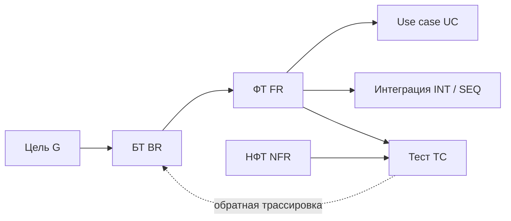

import { Steps } from '@astrojs/starlight/components';
import Brief from '../../../components/Brief.astro';
import CaseRef from '../../../components/CaseRef.astro';
import InterviewQuestions from '../../../components/InterviewQuestions.astro';
import Related from '../../../components/Related.astro';

<Brief>

**Трассировка** (traceability) — связи «цель → БТ → ФТ → use case / интеграция → тест». Она нужна не ради таблицы, а для трёх вещей: **анализ влияния** изменений, **поиск «сирот»** (требований без источника или без теста) и **приёмка**.
**Управление изменениями**: после согласования (базовой линии) требование меняется только через **запрос на изменение** — с анализом влияния и решением владельца.
Трассировка, которую не обновляют, хуже отсутствующей: ей верят, а она врёт.

</Brief>

## Когда применять

| Применять | Не нужно / проще |
|---|---|
| Проекты с формальной приёмкой, регуляторикой, аудитом | Маленький продукт — достаточно связей задач в Jira |
| Много требований, интеграций и команд | Отдельная матрица, которую некому обновлять |
| Требования часто меняются — нужен анализ влияния | — |
| Приёмка по ПМИ: показать покрытие требований тестами | — |

## Как делать

<Steps>

1. **Дайте ID всем артефактам**: G-, BR-, FR-, NFR-, UC-, INT-, TC-.

2. **Ставьте ссылки при создании требования**: каждое ФТ — на БТ, каждое БТ — на цель. Это дешевле, чем восстанавливать связи потом.

3. **Ведите матрицу** (или связи в Jira / Confluence): строка — требование, столбцы — источник, use case, интеграция, тест.

4. **Регулярно делайте обратную проверку:** БТ без ФТ, ФТ без теста, тест без требования.

5. **Зафиксируйте базовую линию** при согласовании: версия документа, дата, кто утвердил.

6. **Изменения — через запрос на изменение (CR):** анализ влияния по трассировке → оценка → решение владельца → новая версия → обновление связей и тестов.

</Steps>

## Нотация: виды трассировки и шаблоны



| Вид | Направление | Вопрос, на который отвечает |
|---|---|---|
| Прямая (forward) | Источник → реализация и тесты | Что реализует это БТ? Чем проверено? |
| Обратная (backward) | Тест, код, ФТ → источник | Зачем это требование? Нет ли лишнего? |
| Горизонтальная | Между артефактами одного уровня | Какие ФТ зависят друг от друга? Какие интеграции участвуют? |

```markdown title="Шаблон матрицы трассировки"
| FR    | БТ    | Цель | UC    | Интеграция / сценарий | Тесты | Статус |
|-------|-------|------|-------|-----------------------|-------|--------|
| FR-01 | BR-01 | G-01 | UC-01 | INT-01, SEQ-01        | TC-01 | Согласовано |
```

```markdown title="Шаблон запроса на изменение (CR)"
## CR-NNN. <Что меняется>

Инициатор: <роль> · Дата: ДД.ММ.ГГГГ · Приоритет: <M/S/C>
Текущее требование: <ID, формулировка, версия>
Предлагаемое изменение: <новая формулировка>
Причина: <зачем>

Анализ влияния (по трассировке):
- Требования: <FR-…, NFR-…>
- Use cases, статусные модели, данные: <…>
- Интеграции и контракты: <INT-…, API>
- Тесты: <TC-…>
- Документы: <…>
Оценка: <трудозатраты, влияние на сроки>

Решение: принято / отложено / отклонено · Кто: <роль> · Дата
```

## Пример из кейса IDM-JOINER

<CaseRef href="/case/02-requirements/traceability-matrix/" id="Матрица">Матрица трассировки кейса</CaseRef> устроена в четыре раздела: прямая трассировка ФТ (БТ, цель, UC, интеграция, тесты), трассировка НФТ, обратная — покрытие БТ, и покрытие целей.

**Анализ влияния на живом примере.** Заказчик хочет активацию не в 07:00, а в 08:30. По трассировке от BR-04 видно, что придётся пересмотреть:

| Затронуто | Что именно |
|---|---|
| <CaseRef href="/case/02-requirements/functional-requirements/#fr-08" id="FR-08">FR-08</CaseRef> | Время активации |
| <CaseRef href="/case/01-business/to-be/#brl-02" id="BRL-02">BRL-02</CaseRef> | Бизнес-правило активации |
| <CaseRef href="/case/02-requirements/use-cases/#uc-02" id="UC-02">UC-02</CaseRef> | Сценарий активации |
| <CaseRef href="/case/04-integrations/scenarios/#seq-01" id="SEQ-01">SEQ-01</CaseRef> | Этап «День D, 07:00» в sequence |
| <CaseRef href="/case/02-requirements/non-functional-requirements/#nfr-02" id="NFR-02">NFR-02</CaseRef> | Готовность к 09:00 — останется ли запас? |
| <CaseRef href="/case/07-testing/test-cases/#tc-06" id="TC-06">TC-06</CaseRef> | Активация в трёх часовых поясах |

Без трассировки такое «маленькое» изменение обнаружилось бы по частям — в тестах и в эксплуатации.

## Типичные ошибки

| Ошибка | Чем плохо | Как правильно |
|---|---|---|
| Заполнить матрицу один раз | Связи устаревают, анализ влияния врёт | Обновлять при каждом изменении требований |
| Только прямая трассировка | Не видно «сирот» и лишней работы | Регулярная обратная проверка |
| Нет ID у требований | Связи держатся на формулировках, ломаются | ID с префиксом |
| Изменения «в переписке» | Неизвестно, какая версия действует | CR, версия документа, журнал изменений |
| Анализ влияния «на глаз» | Затронутые тесты и интеграции забыты | По трассировке, по всем столбцам |
| Аналитик сам принимает изменение | Сроки и бюджет без согласования владельца | Решение — у владельца (A в RACI) |

## Вопросы на собеседовании

<InterviewQuestions topic="requirements" ids={['req-traceability', 'req-change', 'req-baseline']} />

## Связанные темы

<Related pages={['requirements/levels', 'role/artifacts-by-stage', 'requirements/prioritization', 'documentation/templates']} planned={['ПМИ']} />
