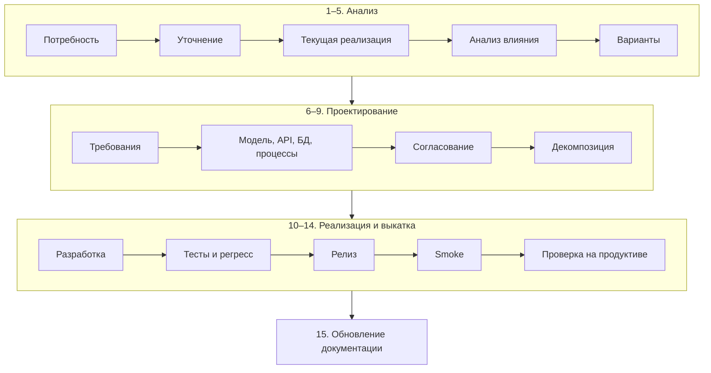

import { Steps } from '@astrojs/starlight/components';
import Brief from '../../../components/Brief.astro';
import CaseRef from '../../../components/CaseRef.astro';
import InterviewQuestions from '../../../components/InterviewQuestions.astro';
import Related from '../../../components/Related.astro';

<Brief>

[Жизненный цикл проекта](/role/lifecycle/) описывает, как создаётся система. Но большая часть работы аналитика — **доработки уже работающей системы**: новый статус, поле, правило, интеграция. У доработки свой цикл — от **потребности** до **проверки на продуктиве и обновления документации**.
Сердце этого цикла — **[анализ влияния](/requirements/impact-analysis/)**: что ещё затронет изменение, кроме того, о чём попросили. Именно его чаще всего пропускают — и именно из-за него доработки ломают соседние функции и смежные системы.
Цикл не заканчивается на релизе: аналитик убеждается, что **в продуктиве работает как задумано**, и обновляет источник истины.

</Brief>

## Когда применять

| Применять | Не нужно / проще |
|---|---|
| Любое изменение поведения работающей системы: статус, поле, правило, интеграция, отчёт | Исправление опечатки в тексте интерфейса |
| Изменение, которое видят пользователи или смежные системы | Чисто техническая задача без изменения поведения — её ведёт разработка |
| Срочное изменение — цикл тот же, просто короче, а не пропущенные шаги | — |

## Как делать

<Steps>

1. **Не брать решение как требование.** «Добавьте статус SUSPENDED» — это решение; выясните проблему: зачем, кому, что сейчас происходит без него.

2. **Сначала понять, как работает сейчас.** Пройдите текущее поведение на стенде, в данных и контрактах — не по памяти и не по старому документу.

3. **Сделать анализ влияния** по всем слоям — до того, как писать требования. От его результата зависят варианты и оценка.

4. **Предложить варианты**, а не единственное решение: часто задача решается без нового статуса или нового поля.

5. **Описать изменение** — требования, критерии приёмки, изменения API, БД и процессов, совместимость и порядок выкатки.

6. **Согласовать** с владельцем продукта, архитектором, владельцами смежных систем и ИБ, если затронуты.

7. **Сопровождать разработку и тесты** — отвечать на вопросы, разбирать спорные дефекты, следить за регрессом.

8. **Проверить на продуктиве и обновить документацию** — только после этого доработка закрыта.

</Steps>

## Нотация: этапы доработки



| № | Этап | Что делает аналитик | Результат | Готово, когда |
|---|---|---|---|---|
| 1 | Потребность / проблема | Принимает запрос, фиксирует источник и срочность | Запрос в трекере | Понятно, кто просит и зачем |
| 2 | Уточнение задачи | Выясняет проблему за просьбой, критерии успеха, границы | Постановка: проблема, цель, что не входит | Заказчик подтвердил постановку |
| 3 | Анализ существующей реализации | Проходит текущее поведение на стенде, в данных, контрактах, логах | Описание «как сейчас» | Подтверждено на системе, а не по памяти |
| 4 | Анализ влияния | Проверяет все слои: модель, API, БД, интерфейс, отчёты, события, потребители, правила, тесты, документацию, совместимость | Таблица влияния с владельцами | По каждому слою — «затронуто / нет / кто скажет» |
| 5 | Варианты решения | Предлагает 2–3 варианта с плюсами, минусами, стоимостью | Сравнение вариантов, при необходимости ADR | Выбран вариант и записано почему |
| 6 | Требования | Пишет ФТ, НФТ, бизнес-правила, критерии приёмки | Описание доработки | Требования проверяемы |
| 7 | Изменения модели / API / БД / процессов | Обновляет статусную модель, контракт, модель данных, процесс | Изменённые артефакты (черновики) | Согласовано с архитектором и разработкой |
| 8 | Согласование | Проводит ревью с владельцем, архитектором, смежными командами, ИБ | Согласованное описание | Все, кого затрагивает, подтвердили |
| 9 | Декомпозиция | Режет на задачи и истории вместе с командой | Задачи в бэклоге со ссылками на описание | Задачи оценены и готовы к спринту (DoR) |
| 10 | Разработка | Отвечает на вопросы, уточняет неясности | Реализация | Код прошёл ревью |
| 11 | Тестирование / регресс | Проверяет полноту тестов, разбирает спорные дефекты | Протокол тестов | Новые тесты и регресс пройдены |
| 12 | Релиз | Проверяет порядок выкатки и готовность потребителей | Релиз | Выкатили в согласованном порядке |
| 13 | Smoke | Проверяет, что ключевые функции работают | Короткий чек-лист пройден | Система работает после выкатки |
| 14 | Проверка на продуктиве | Смотрит реальные данные, метрики, логи, обратную связь | Подтверждение «задача решена» | Метрики и данные в норме, нет всплеска ошибок |
| 15 | Обновление документации | Переносит изменения в источник истины, закрывает вопросы | Актуальные документы и контракты | Документация совпадает с продуктивом |

**Проект и доработка — в чём разница:**

| | Проект | Доработка |
|---|---|---|
| Главный вопрос | Что построить? | Что изменить и что это затронет? |
| Основной риск | Построить не то | Сломать то, что работало (регресс) |
| Ключевой артефакт | ТЗ, требования к системе | Описание доработки и анализ влияния |
| Документация | Создаётся | Обновляется — в конце, в источнике истины |
| Тестирование | Новые тесты | Новые тесты + регресс |

```markdown title="Описание доработки — каркас"
# CHG-NNN. <Короткое название>
Заказчик · приоритет · ссылка на запрос · статус

## 1. Проблема и цель
Что не так сейчас, кому мешает, как поймём, что решено.
## 2. Как работает сейчас
Ссылки на функцию, статусную модель, контракт; что проверено на стенде.
## 3. Анализ влияния
| Слой | Затронуто? | Что меняется | Владелец |
## 4. Варианты и решение
| Вариант | Плюсы | Минусы | Оценка | → выбран, потому что …
## 5. Требования и критерии приёмки
## 6. Изменения: модель · API · БД · процессы · интерфейс
## 7. Совместимость и порядок выкатки
## 8. Проверка на продуктиве
Что смотрим, где, кто, сколько дней.
## 9. Документация к обновлению
```

## Пример из кейса IDM-JOINER

Учебный сценарий на материале кейса: IdM работает год, ИБ просит **приостанавливать заявки на доступ**, пока идёт служебная проверка сотрудника.

<Steps>

1. **Уточнение.** «Нужен статус SUSPENDED» — решение. Проблема: согласующие не должны принимать решение и сроки согласования не должны «гореть», пока ИБ проверяет сотрудника. Может, достаточно ставить заявку на паузу без нового статуса? Это вопрос к вариантам.

2. **Текущая реализация.** <CaseRef href="/case/03-architecture/state-models/" id="Статусы">Статусная модель заявки</CaseRef>: DRAFT → ON_APPROVAL → APPROVED / REJECTED / PROVISIONING → COMPLETED / PARTIALLY_COMPLETED, отзыв → CANCELLED; срок согласования — 1 рабочий день с эскалацией (FR-14).

3. **Анализ влияния** — по всем слоям: статусная модель, enum в <CaseRef href="/case/04-integrations/api-idm/" id="API IdM">API IdM</CaseRef>, БД, портал, отчёт «Доступы сотрудника» (FR-22), события аудита в SIEM (INT-09), эскалации, тесты, документация. Разбор целиком — на странице [«Анализ влияния»](/requirements/impact-analysis/).

4. **Варианты.** А — новый статус SUSPENDED с переходами туда и обратно; Б — флаг «приостановлена» поверх ON_APPROVAL без изменения enum. Б дешевле для потребителей API, А нагляднее в отчётах. Выбор фиксируется в ADR.

5. **Дальше** — требования и критерии приёмки, изменения контракта и БД, согласование с ИБ и владельцами SIEM, декомпозиция, регресс по тестам заявок, выкатка, проверка на продуктиве (появляются ли приостановленные заявки, не сломались ли отчёты и правила SIEM), обновление статусной модели и OpenAPI в документации.

</Steps>

## Типичные ошибки

| Ошибка | Чем плохо | Как правильно |
|---|---|---|
| Сразу описать решение заказчика | Сделали не то или слишком дорого | Проблема → варианты → решение |
| Пропустить анализ влияния | Регресс в отчётах, интеграциях, у потребителей событий | Таблица влияния по всем слоям до требований |
| Описывать «как сейчас» по памяти | Требования к системе, которой нет | Проверить на стенде, в данных, в контрактах |
| Считать релиз концом работы | Проблема в продуктиве не замечена | Проверка на продуктиве по заранее определённым признакам |
| Не обновить документацию | Следующая доработка опирается на устаревшее описание | Обновление источника истины — последний обязательный шаг |

## Вопросы на собеседовании

<InterviewQuestions topic="role" ids={['role-change-lifecycle', 'role-prod-verification']} />
<InterviewQuestions topic="requirements" ids={['req-impact-enum']} />

## Связанные темы

<Related pages={['requirements/impact-analysis', 'release/compatibility', 'release/go-live', 'role/lifecycle', 'onboarding/mature-system', 'requirements/traceability', 'architecture/adr', 'testing/test-types']} />
