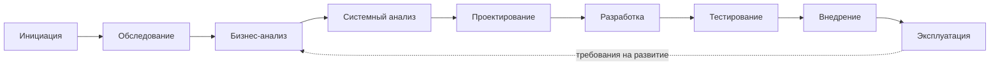

import { Steps, Tabs, TabItem } from '@astrojs/starlight/components';
import Brief from '../../../components/Brief.astro';
import Check from '../../../components/Check.astro';
import CaseRef from '../../../components/CaseRef.astro';
import InterviewQuestions from '../../../components/InterviewQuestions.astro';
import Related from '../../../components/Related.astro';

<Brief>

Проект проходит путь **от «зачем» к «как» и «как проверить»**: инициация → обследование → бизнес-анализ → системный анализ → проектирование → разработка → тестирование → внедрение → эксплуатация.
У каждого этапа есть **главный вопрос** и **критерий выхода**. Основная работа СА — на системном анализе и проектировании, но он нужен на всех этапах.
В Agile этапы 2–7 повторяются в каждом инкременте, однако инициация и «скелет» архитектуры всё равно делаются в начале.

</Brief>

## Когда применять

| Применять | Не нужно |
|---|---|
| Планирование работ аналитика на проекте: что и когда должно быть готово | Расписывать формальные этапы для задачи на 2–3 дня |
| Объяснить заказчику, почему нельзя «сразу программировать» | Навязывать водопадную последовательность продуктовой команде со зрелым Scrum |
| Найти, на каком этапе «застрял» проект: нет критерия выхода — нет перехода | — |
| Собеседование: «расскажите о проекте» — удобный каркас ответа | — |

## Как делать

<Steps>

1. **Определите, где сейчас проект.** Ориентир — какие артефакты уже утверждены (см. таблицу ниже).

2. **Проверьте критерий выхода предыдущего этапа.** Например, на системный анализ нельзя переходить без согласованных БТ — иначе ФТ будут переписываться.

3. **Спланируйте свои артефакты по этапам** и согласуйте с РП: что нужно к какой вехе.

4. **В Agile — разделите «фундамент» и «детали».** Фундамент (устав, контекст, ключевые интеграции, модель данных) делается в начале; ФТ и истории — за 1–2 спринта до реализации.

5. **Не бросайте артефакты после этапа.** Требования, модель данных и трассировка живут до эксплуатации и обновляются при изменениях.

</Steps>

## Нотация: этапы, вопросы, критерии выхода

| Этап | Главный вопрос | Ключевые артефакты | Кто ведёт | Что делает СА | Критерий выхода |
|---|---|---|---|---|---|
| Инициация | Зачем проект и где его границы? | Устав, реестр стейкхолдеров | РП | Помогает уточнить скоуп, называет интеграционные риски, черновой контекст | Устав утверждён |
| Обследование | Как сейчас и что болит? | AS-IS | БА | Интервью, выгрузки и статистика из систем | Проблемы подтверждены данными |
| Бизнес-анализ | Как должно быть? | TO-BE, gap-анализ, БТ | БА | Проверяет реализуемость TO-BE | БТ согласованы заказчиком |
| Системный анализ | Что должна делать система? | Use cases, ФТ, НФТ, справочные данные, бэклог | **СА** | Основной исполнитель | ФТ согласованы, трассировка к БТ есть |
| Проектирование | Как устроено решение? | C4, модель данных, статусы, ADR, интеграции, контракты | Архитектор + **СА** | Данные, статусы, контракты, маппинг, сценарии ошибок | Согласовано архитектурным комитетом и ИБ |
| Разработка | — | Код, технический дизайн | Разработка | Отвечает на вопросы, уточняет требования, ревьюит контракты | Истории соответствуют DoD |
| Тестирование | Работает ли как задумано? | ПМИ, тест-кейсы | QA | Разбирает спорные дефекты: баг или неверное требование | Протокол испытаний подписан |
| Внедрение | Как перейти без потерь? | Миграция, план внедрения, регламенты | РП | Миграция и сверка данных, инструкции | Акт ввода в эксплуатацию |
| Эксплуатация | Достигнуты ли цели? | Отчёт по метрикам целей | Сопровождение | Разбор инцидентов, требования на развитие | Метрики целей достигнуты |

### Те же этапы в разных подходах

<Tabs>
<TabItem label="Waterfall / ГОСТ 34">

Этапы идут последовательно, каждый завершается утверждённым документом. Требования собираются заранее и фиксируются в ТЗ; изменения — через формальный запрос.

ГОСТ 34 задаёт свои названия стадий создания автоматизированной системы: формирование требований, разработка концепции, техническое задание, эскизный и технический проекты, рабочая документация, ввод в действие, сопровождение.

<Check id="role-02">
Перечень стадий приведён по ГОСТ 34.601-90. Проверить, действует ли он ещё или заменён (по имеющимся данным — ГОСТ Р 59793-2021 «Автоматизированные системы. Стадии создания»), и уточнить состав стадий в действующей редакции.
</Check>

</TabItem>
<TabItem label="Scrum">

Этапы «системный анализ → проектирование → разработка → тестирование» сжимаются до спринта и повторяются. Аналитик работает **на 1–2 спринта впереди** команды: на рефайнменте детализирует истории, чтобы они проходили DoR.

Инициация и «скелет» проектирования (контекст, ключевые интеграции, модель данных) всё равно делаются в начале — иначе первые спринты строят то, что потом придётся переделывать.

</TabItem>
<TabItem label="Гибрид">

Самый частый вариант в банках. **Фундамент заранее:** устав, архитектура, интеграции, требования ИБ — согласуются документами (архитектурный комитет, ИБ). **Детали итерациями:** ФТ и истории — перед спринтом.

Так устроен и кейс IDM-JOINER: архитектура и интеграции согласованы до разработки, а разработка идёт спринтами.

</TabItem>
</Tabs>

## Пример из кейса IDM-JOINER

Вехи из <CaseRef href="/case/00-project/project-charter/" id="Устав">устава проекта</CaseRef> (раздел 5) показывают гибридный подход — фундамент согласуется до разработки:

| Веха | Срок | Этап |
|---|---|---|
| Утверждение устава | ноябрь 2026 | Инициация |
| БТ и TO-BE согласованы | декабрь 2026 | Обследование + бизнес-анализ |
| ФТ, архитектура, интеграции согласованы (архитектурный комитет, ИБ) | январь 2027 | Системный анализ + проектирование |
| Разработка и подключение систем | февраль – март 2027 | Разработка |
| Приёмочные испытания по ПМИ | март 2027 | Тестирование |
| Пилот (ДИТ + региональный офис Екатеринбург) | апрель 2027 | Внедрение |
| Промышленная эксплуатация | май 2027 | Эксплуатация |

Эксплуатация замыкает цикл: успех измеряется метриками целей <CaseRef href="/case/00-project/project-charter/#g-01" id="G-01">G-01</CaseRef> … <CaseRef href="/case/00-project/project-charter/#g-03" id="G-03">G-03</CaseRef>, а не фактом запуска.

## Типичные ошибки

| Ошибка | Чем плохо | Как правильно |
|---|---|---|
| Начать с ФТ без согласованных БТ | ФТ переписываются после каждого разговора с заказчиком | Критерий выхода бизнес-анализа: БТ утверждены |
| В Agile «не делать архитектуру, она появится сама» | Первые спринты строят то, что придётся переделать | Фундамент (контекст, интеграции, данные) — в начале |
| Аналитик «уходит» после передачи требований | Вопросы разработки висят, дефекты требований копятся | СА сопровождает разработку, тестирование и внедрение |
| Нет критериев выхода этапов | Этап «почти закончен» месяцами | Явный критерий: что утверждено и кем |
| Миграцию и внедрение вспоминают в конце | Срыв сроков запуска, потеря данных | Стратегия миграции — на проектировании |
| Успех = «система запущена» | Цели проекта не проверяются | Метрики целей из устава в отчёте эксплуатации |

## Вопросы на собеседовании

<InterviewQuestions topic="role" ids={['role-lifecycle', 'role-dor-dod', 'role-defect-or-requirement']} />

## Связанные темы

<Related pages={['role/sa-vs-ba', 'role/artifacts-by-stage', 'role/raci', 'documentation/tz-gost34']} planned={['Waterfall, Scrum, Kanban, гибриды']} />
