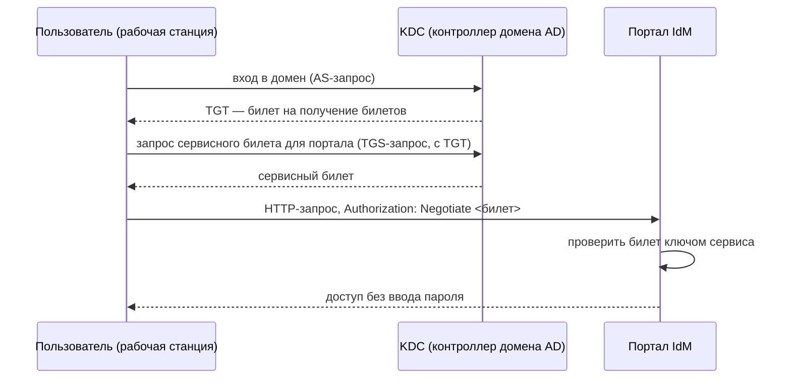

import { Steps, Tabs, TabItem } from '@astrojs/starlight/components';
import Brief from '../../../components/Brief.astro';
import CaseRef from '../../../components/CaseRef.astro';
import InterviewQuestions from '../../../components/InterviewQuestions.astro';
import Related from '../../../components/Related.astro';

<Brief>

**TLS** шифрует канал и подтверждает сервер; **mTLS** (взаимный TLS) подтверждает **и клиента** — сертификатом. Это стандарт для межсистемных интеграций внутри периметра и с партнёрами.
**SSO** (единый вход) — пользователь аутентифицируется один раз и работает с несколькими системами. Технологии: **Kerberos** (домен Windows / AD), **SAML 2.0** и **OpenID Connect** (веб).
Для аналитика главное — записать в требования **кто чем аутентифицируется**, **кто выпускает и меняет сертификаты** и **что происходит, когда они истекают**.

</Brief>

## Когда применять

| Технология | Когда |
|---|---|
| TLS 1.2+ | Всегда, для любого сетевого обмена |
| mTLS | Межсистемные вызовы, где нужно доказать, что клиент — именно эта система |
| Kerberos (SSO) | Внутренние приложения для сотрудников в домене AD |
| SAML 2.0 | Корпоративный веб-SSO, интеграция с внешними SaaS |
| OpenID Connect | Современные веб- и мобильные приложения, внешние пользователи |

## Как делать

<Steps>

1. **Матрица аутентификации:** для каждой интеграции и каждого типа пользователей — механизм (mTLS, OAuth, Kerberos, SAML).

2. **Для mTLS:** удостоверяющий центр, требования к сертификату клиента (что проверяется: субъект, издатель), срок действия, процедура замены без простоя, кто отвечает.

3. **Для SSO:** провайдер идентификации, какие атрибуты пользователя передаются (группы, роли), что при недоступности провайдера.

4. **Сервисные учётные записи** интеграций — минимальные права, секреты в хранилище.

5. **Мониторинг сроков** сертификатов и алерты заранее.

</Steps>

## Нотация

<Tabs>
<TabItem label="TLS и mTLS">

| | TLS (HTTPS) | mTLS |
|---|---|---|
| Сертификат предъявляет | Сервер | Сервер **и** клиент |
| Что доказано | Клиент говорит с настоящим сервером | И сервер знает, какая система к нему обращается |
| Где используется | Любой HTTPS | Межсистемные API, партнёрские интеграции |
| Что добавляется в требования | Версия TLS, наборы шифров | Удостоверяющий центр, проверяемые поля сертификата, ротация |

mTLS часто сочетают с OAuth 2.0: сертификат подтверждает систему на уровне канала, токен — права на операцию. Токен можно и привязать к сертификату клиента (RFC 8705).

</TabItem>
<TabItem label="Kerberos">

| Понятие | Смысл |
|---|---|
| KDC | Центр распределения ключей; в AD — контроллер домена |
| TGT | Билет на получение билетов — выдаётся при входе в домен |
| Сервисный билет | Билет для доступа к конкретному сервису |
| SPN | Имя сервиса, для которого выпускается билет |
| SPNEGO / `Negotiate` | Механизм передачи Kerberos-аутентификации по HTTP |

Пароль по сети не передаётся; работает внутри домена и требует синхронизации времени между участниками.

</TabItem>
<TabItem label="SSO: технологии">

| | Kerberos | SAML 2.0 | OpenID Connect |
|---|---|---|---|
| Среда | Корпоративная сеть, домен | Веб, корпоративные SaaS | Веб, мобильные, API |
| Формат | Билеты | XML-утверждения (assertions) | JWT (ID-токен) |
| Транспорт | Протокол Kerberos, SPNEGO по HTTP | Перенаправления браузера | OAuth 2.0 |
| Типичный провайдер | Active Directory | Корпоративный IdP | Корпоративный или внешний IdP |

</TabItem>
</Tabs>

## Пример из кейса IDM-JOINER

Требования ИБ кейса (<CaseRef href="/case/05-security/security-requirements/" id="ИБ">требования ИБ</CaseRef>, <CaseRef href="/case/02-requirements/non-functional-requirements/#nfr-07" id="NFR-07">NFR-07</CaseRef>):

| Канал | Механизм |
|---|---|
| Все интеграции | TLS 1.2+ (<CaseRef href="/case/05-security/security-requirements/#sec-08" id="SEC-08">SEC-08</CaseRef>) |
| IdM API для систем (ServiceDesk) | mTLS + OAuth 2.0 client credentials |
| Адаптер АБС | mTLS, доступ только с адресов IdM (по контракту адаптера) |
| Портал IdM для сотрудников | SSO через AD (Kerberos), только SSO (<CaseRef href="/case/05-security/security-requirements/#sec-10" id="SEC-10">SEC-10</CaseRef>) |
| Шина Kafka | TLS + SASL/SCRAM (сервер `kafka-secure` в AsyncAPI); запись в топик — только HRMS |
| Коннекторы | Сервисные учётные записи с минимальными правами, секреты в хранилище (<CaseRef href="/case/05-security/security-requirements/#sec-07" id="SEC-07">SEC-07</CaseRef>, NFR-08) |

Модель угроз кейса показывает, зачем это нужно: подмена кадрового события в шине закрывается ограничением записи в топик, TLS + SASL и сверкой с HRMS.

## Типичные ошибки

| Ошибка | Чем плохо | Как правильно |
|---|---|---|
| Не описана ротация сертификатов | Интеграция падает в день истечения | Срок, процедура, ответственный, алерт заранее |
| Проверка «любой сертификат нашего УЦ» | Любая система с сертификатом получает доступ | Проверка субъекта / идентификатора клиента |
| Секреты в конфигурации и репозитории | Утечка доступа | Хранилище секретов |
| Сервисная учётная запись с правами администратора | Компрометация коннектора = компрометация домена | Минимальные права |
| SSO без плана на недоступность провайдера | Никто не может войти | Резервирование, понятный сценарий отказа |
| Путать TLS и mTLS в требованиях | Клиент не аутентифицирован на уровне канала | Явно указать «взаимная аутентификация» |

## Вопросы на собеседовании

<InterviewQuestions topic="security" ids={['int-mtls', 'int-sso-kerberos']} />

## Связанные темы

<Related pages={['security/overview', 'security/data-protection', 'security/oauth', 'integrations/messaging', 'diagrams/dfd', 'case/05-security/security-requirements']} />
