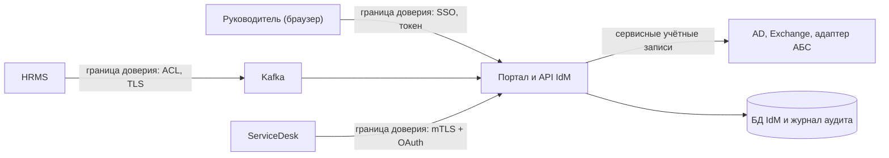

import { Steps } from '@astrojs/starlight/components';
import Brief from '../../../components/Brief.astro';
import CaseRef from '../../../components/CaseRef.astro';
import InterviewQuestions from '../../../components/InterviewQuestions.astro';
import Related from '../../../components/Related.astro';

<Brief>

**Моделирование угроз (threat modeling)** — систематический ответ на четыре вопроса: **что строим, что может пойти не так, что с этим делаем, хорошо ли получилось**. На базовом уровне это схема потоков данных с **границами доверия** и проход по категориям угроз **STRIDE**.
Аналитик знает систему лучше всех: участников, потоки, данные, бизнес-правила. Поэтому он находит угрозы, которые не видны в коде: **злоупотребления бизнес-логикой** вроде самосогласования, перебора чужих номеров или массовых заявок.
Результат — таблица «угроза → мера → статус». Каждая мера становится требованием и тестом, а каждый оставшийся риск — явным решением о его принятии, с владельцем.

</Brief>

## Когда применять

| Применять | Не нужно / проще |
|---|---|
| Новая система или интеграция, новая граница доверия (внешние пользователи, партнёры) | Изменение текста или вёрстки без новых данных и операций |
| Новые операции с правами, деньгами, ПДн | Полный анализ рисков ИБ по методике банка — его ведёт ИБ, аналитик даёт входные данные |
| После инцидента безопасности — проверить, что ещё не учтено | — |

## Как делать

<Steps>

1. **Нарисовать потоки данных:** внешние участники, процессы, хранилища, потоки между ними. Подойдёт контекстная диаграмма или DFD.

2. **Отметить границы доверия** — где данные переходят между зонами: интернет → банк, пользователь → сервер, система → система, сервис → БД.

3. **Для каждой границы и каждого потока пройти по STRIDE** — какие из шести угроз возможны.

4. **Добавить сценарии злоупотреблений:** что сделает недобросовестный, но авторизованный пользователь? Что будет при ошибке скрипта, который шлёт тысячи запросов?

5. **Для каждой угрозы — мера и статус:** есть, предложено, риск принят (кем). Ссылки на требования SEC, FR, NFR.

6. **Превратить меры в требования и тесты,** открытые — в вопросы с владельцем и сроком.

7. **Пересматривать** при новых интеграциях, ролях и после инцидентов.

</Steps>

## Нотация

### STRIDE

| Угроза | Нарушает | Вопрос | Типичная мера |
|---|---|---|---|
| **S**poofing — подмена | Аутентификацию | Можно ли выдать себя за другого? | Аутентификация, mTLS, подпись |
| **T**ampering — изменение | Целостность | Можно ли незаметно изменить данные или сообщение? | TLS, подпись, контроль целостности, журнал только на добавление |
| **R**epudiation — отказ от авторства | Неотказуемость | Можно ли отрицать, что сделал действие? | Журнал аудита с основанием |
| **I**nformation disclosure — раскрытие | Конфиденциальность | Можно ли увидеть чужие данные? | Авторизация на уровне объекта, шифрование, минимизация |
| **D**enial of service — отказ в обслуживании | Доступность | Можно ли перегрузить или остановить систему? | Ограничение частоты, квоты, тайм-ауты |
| **E**levation of privilege — повышение привилегий | Авторизацию | Можно ли получить больше прав, чем положено? | Минимальные привилегии, SoD, проверка на сервере |

### Частые уязвимости API — что проверить в требованиях

| Уязвимость | Пример | Требование |
|---|---|---|
| Нет проверки на уровне объекта | Замена `employeeNumber` в URL открывает чужого сотрудника | Правило доступа к объекту для каждой операции |
| Лишние данные в ответе | API отдаёт все поля, а интерфейс показывает три | Ответ содержит только поля, нужные клиенту |
| Массовое присвоение (mass assignment) | В запрос добавлено поле `status=APPROVED`, сервер его принял | Список полей, которые клиент может задавать; остальные отклоняются |
| Нет ограничения частоты | Перебор паролей, номеров, кодов; перегрузка | Лимиты на клиента и операцию, 429 |
| Злоупотребление бизнес-процессом | Самосогласование, многократное использование одноразового кода | Правила процесса — в ФТ и тестах |

Классический справочник таких уязвимостей — OWASP API Security Top 10.

### Ограничение частоты запросов (rate limiting)

| Что описать | Пример |
|---|---|
| Кого ограничиваем | Клиента (`client_id`), пользователя, IP-адрес, операцию |
| Лимит и окно | 30 запросов в минуту на клиента |
| Что отвечаем при превышении | 429 Too Many Requests, `Retry-After` |
| Где описано | В контракте API: потребитель должен знать лимит заранее |
| Особые операции | Вход, проверка одноразового кода, поиск — строже: после N неудач — блокировка или задержка |
| Мониторинг | Метрика ответов 429 по клиентам, алерт на всплеск |

Ограничение частоты защищает и от злоумышленника, и от собственной ошибки: скрипт или повторы без задержки перегружают систему так же, как атака.

## Пример из кейса IDM-JOINER

<CaseRef href="/case/05-security/threat-model/" id="THR">Модель угроз кейса</CaseRef>: семь границ доверия и 11 угроз по STRIDE. Несколько показательных:

- **THR-01, подмена:** ложное кадровое событие в шине создало бы учётную запись несуществующему сотруднику. Меры — запись в топик только для HRMS и ежедневная сверка с HRMS (FR-05).
- **THR-05, раскрытие:** руководитель перебирает табельные номера. Мера — проверка подчинённости на сервере, а для чужого сотрудника ответ 404, чтобы не раскрыть, существует ли он.
- **THR-08, отказ в обслуживании:** массовые запросы к API портала. Ограничения частоты в требованиях нет, мера предложена. С обратной стороной лимитов кейс уже столкнулся: <CaseRef href="/case/08-operations/incident-example/" id="INC-01">INC-01</CaseRef> произошёл из-за неописанного лимита адаптера АБС.
- **THR-10, повышение привилегий:** руководитель согласует собственную заявку. Этой угрозы не видно в коде, её находит аналитик, знающий процесс. Мера предложена: заявитель не может быть согласующим.

## Типичные ошибки

| Ошибка | Чем плохо | Как правильно |
|---|---|---|
| Моделирование угроз «делает ИБ потом» | Угрозы находятся после реализации, исправлять дорого | На проектировании, вместе с архитектурой и контрактами |
| Только внешний злоумышленник | Не видны злоупотребления авторизованных пользователей и ошибки систем | Сценарии злоупотреблений и «что, если ошибся скрипт» |
| Угроза без меры и статуса | Список страхов, а не решения | Мера, статус, ссылка на требование или принятый риск |
| Лимиты не описаны в контракте | Потребитель узнаёт о них в продуктиве — инцидент | Лимиты и 429 в контракте |
| Модель угроз не обновляется | Новая интеграция или роль открывает путь в обход мер | Пересмотр при изменениях — строка в анализе влияния |

## Вопросы на собеседовании

<InterviewQuestions topic="security" ids={['sec-stride', 'sec-rate-limit', 'sec-abuse']} />

## Связанные темы

<Related pages={['security/overview', 'security/access-control', 'case/05-security/threat-model', 'diagrams/dfd', 'integrations/reliability', 'tools/api-lab']} />
