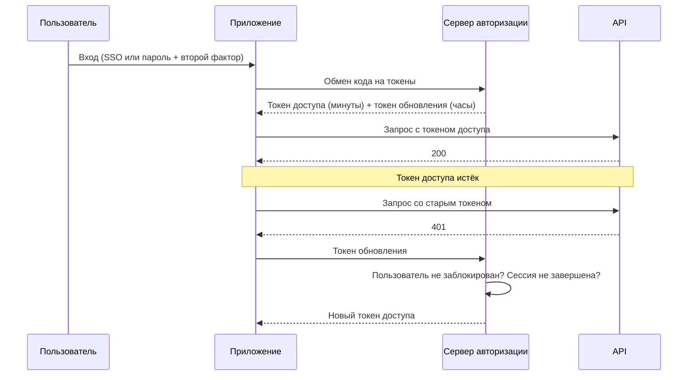

import { Steps } from '@astrojs/starlight/components';
import Brief from '../../../components/Brief.astro';
import CaseRef from '../../../components/CaseRef.astro';
import InterviewQuestions from '../../../components/InterviewQuestions.astro';
import Related from '../../../components/Related.astro';

<Brief>

Вход — только начало. Дальше у пользователя есть **сессия** или **токен**, и аналитику нужно описать их жизнь: **сколько живут**, **как продлеваются**, **что происходит при бездействии, выходе, блокировке и увольнении**.
Короткий **токен доступа (access token)** живёт минуты, **токен обновления (refresh token)** или сессия — часы. JWT проверяется без обращения к серверу, поэтому **его нельзя отозвать до истечения срока**: отзыв делается через короткий срок жизни и отказ в обновлении.
То же для систем: **секреты и сертификаты** имеют срок, и их **замена (rotation)** должна проходить без простоя.

</Brief>

## Когда применять

| Применять | Не нужно / проще |
|---|---|
| Описываете вход в приложение или портал | Устройство протоколов (как подписывается токен) — подробно на странице про OAuth и JWT |
| Требования «пользователь заблокирован — доступ прекращается сразу» | — |
| Интеграция по OAuth 2.0 или mTLS: сроки токенов и сертификатов | — |
| Разбираете инцидент «уволенный сотрудник ещё час работал в системе» | — |

## Как делать

<Steps>

1. **Описать способ входа и что выдаётся после него:** серверная сессия (cookie) или токены.

2. **Задать сроки:** жизнь токена доступа, абсолютный срок сессии, тайм-аут бездействия. Срок — компромисс между безопасностью и удобством; решение согласовать с ИБ.

3. **Описать продление:** когда и как выдаётся новый токен доступа, нужно ли повторно вводить пароль.

4. **Описать завершение:** выход пользователя, блокировка учётной записи, смена пароля, увольнение. За какое время доступ прекращается в каждом случае?

5. **Описать отзыв:** что можно отозвать немедленно, а что истечёт само. Остаточный риск записать и согласовать с ИБ.

6. **Для систем — сроки секретов и сертификатов,** кто отвечает за замену, за сколько до истечения, как заменить без простоя.

7. **Тесты:** истёкший токен → 401; обновление после блокировки → отказ; бездействие → повторный вход; запрос со старым секретом после замены → отказ.

</Steps>

## Нотация

### Сессия и токены

| | Серверная сессия | Токены (OAuth 2.0, JWT) |
|---|---|---|
| Что у клиента | Идентификатор сессии (обычно в cookie) | Токен доступа и, возможно, токен обновления |
| Где состояние | На сервере | В самом токене (JWT) или на сервере авторизации |
| Отзыв | Удалить сессию на сервере — сразу | JWT действует до `exp`; отзывают обновление и держат срок коротким |
| Типично для | Веб-приложения с одним сервером | API, микросервисы, мобильные приложения, интеграции |

### Жизненный цикл токенов пользователя

| Событие | Что должно произойти | Когда доступ прекращается |
|---|---|---|
| Истёк токен доступа | Приложение обновляет токен незаметно для пользователя | — |
| Бездействие дольше тайм-аута | Повторный вход | Сразу после тайм-аута |
| Выход | Сессия и токен обновления отозваны | Сразу; токен доступа — до истечения |
| Блокировка или увольнение | Сервер авторизации не выдаёт новых токенов | Не позже срока жизни токена доступа |
| Смена пароля | Отзыв других сессий пользователя — по требованиям ИБ | Зависит от требования |

### Секреты и сертификаты систем

| Что | Почему меняют | Как без простоя |
|---|---|---|
| `client_secret` | Срок по политике, увольнение администратора, подозрение на утечку | Сервер на время принимает старый и новый, клиент переходит, старый отзывается |
| Сертификат mTLS | Истекает срок действия | Новый выпускают заранее, доверие к нему настраивают до переключения |
| Пароль сервисной учётной записи | Политика паролей | Замена через хранилище секретов, приложение перечитывает секрет |

Истёкший сертификат — частая причина «внезапной» аварии интеграции. Срок действия и ответственный за замену — часть требований к интеграции.

## Пример из кейса IDM-JOINER

<CaseRef href="/case/05-security/threat-model/" id="THR">Модель угроз кейса</CaseRef>, раздел «Сроки жизни учётных данных»:

- **Портал:** токен доступа — 15 минут. Сессия — 8 часов с тайм-аутом бездействия 30 минут. Повторный вход через SSO в домене проходит без ввода пароля.
- **Блокировка в AD:** портал перестаёт выдавать новые токены, действующий истекает не позже чем через 15 минут. ИБ приняла это как остаточный риск.
- **Системные клиенты** (client credentials): токен — 5 минут, `client_secret` и сертификаты mTLS — на год, замена за месяц до истечения без простоя.
- **Одноразовый пароль** (FR-20) действует до первого входа и меняется при нём. Что делать, если сотрудник не вышел в первый день, — открытый вопрос к ИБ и HRD.

## Типичные ошибки

| Ошибка | Чем плохо | Как правильно |
|---|---|---|
| Срок токена не указан в требованиях | Разработчик выбирает сам: от «бессрочно» до «5 секунд» | Сроки — в НФТ, согласованы с ИБ |
| Токен доступа живёт сутки | Уволенный или заблокированный пользователь сутки работает в системе | Короткий токен доступа, отзыв через обновление |
| «Выход» только удаляет токен в браузере | Скопированный токен продолжает работать | Отозвать сессию и токен обновления на сервере |
| Нет тайм-аута бездействия | Оставленный открытым компьютер — открытый доступ | Тайм-аут по требованиям ИБ |
| Срок сертификата никто не отслеживает | Интеграция падает в день истечения | Ответственный, алерт за месяц, порядок замены |
| Секрет меняют одномоментно на обеих сторонах | Простой интеграции | Период, когда принимаются старый и новый |

## Вопросы на собеседовании

<InterviewQuestions topic="security" ids={['sec-token-lifecycle', 'sec-jwt-revoke']} />

## Связанные темы

<Related pages={['security/oauth', 'security/mtls-sso', 'security/access-control', 'security/data-protection', 'release/environments']} />
