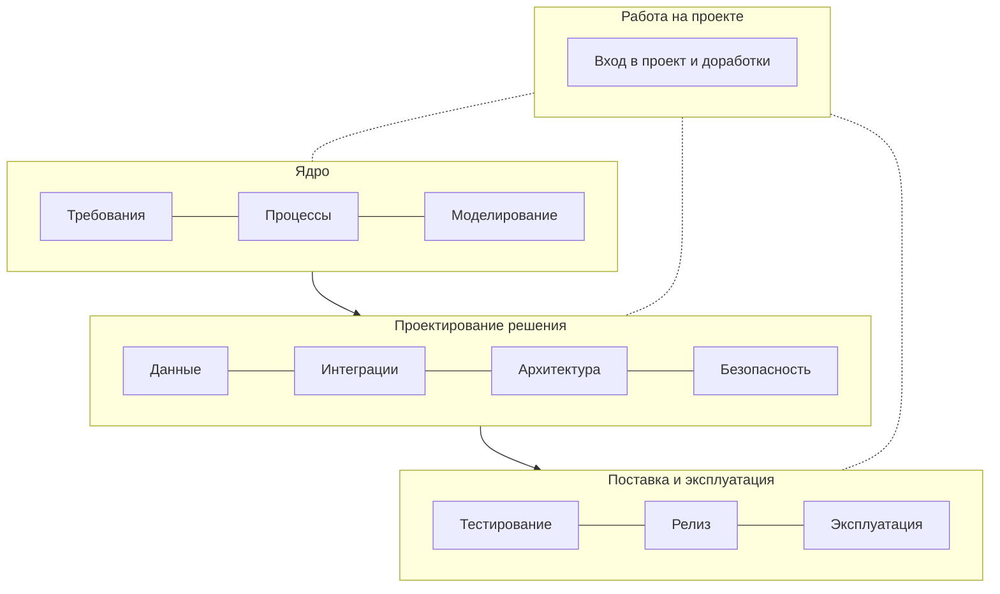

Профессию удобно представить как 11 областей в четырёх группах: **ядро** (без него аналитика нет), **техническое проектирование решения**, **работа на проекте** и **поставка и эксплуатация**. Последние две группы отличают аналитика, который пишет документы, от аналитика, который доводит изменение до продуктива и отвечает за него после.

«Работа на проекте» связана со всеми группами: вход в проект, анализ влияния и доработка существующей системы используют и требования, и данные, и релиз.

| Область | Что входит | Разделы справочника |
|---|---|---|
| **Требования** | Выявление, уровни и свойства, user stories и use cases, критерии приёмки, приоритизация, трассировка | [Выявление](/elicitation/sources/), [требования](/requirements/levels/) |
| **Процессы** | BPMN, AS-IS и TO-BE, gap-анализ | [Процессы](/processes/bpmn/) |
| **Моделирование** | UML, C4, DFD, выбор диаграммы, синтаксис Mermaid и PlantUML | [Диаграммы](/diagrams/choose/), [практикум](/diagram-howto/) |
| **Данные** | Модели и ER, нормализация, SQL, транзакции, индексы, НСИ | [Данные](/data/models-er/) |
| **Интеграции** | HTTP и REST, контракты OpenAPI и AsyncAPI, форматы и схемы, SOAP, gRPC, GraphQL, брокеры, надёжность | [Интеграции](/integrations/styles/) |
| **Архитектура** | НФТ, ADR, монолит и микросервисы, кэширование, CAP | [Архитектура](/architecture/nfr-iso25010/) |
| **Безопасность** | Аутентификация и авторизация, RBAC и ABAC, OAuth и JWT, mTLS и SSO, секреты и ПДн, аудит, угрозы | [Безопасность](/security/overview/) |
| **Работа на проекте** | Вход в проект в шести сценариях, жизненный цикл доработки, анализ влияния, роль и RACI, методологии, документирование | [Вход в проект](/onboarding/), [роль](/role/sa-vs-ba/), [методологии](/methodologies/comparison/), [документирование](/documentation/tz-gost34/) |
| **Тестирование** | Виды, тест-дизайн, ПМИ, UAT | [Тестирование](/testing/test-types/) |
| **Релиз** | Среды, совместимость и порядок выкладки, миграции, фича-флаги, откат, go/no-go, smoke | [Релиз и продуктив](/release/environments/) |
| **Эксплуатация** | Сопровождение, инциденты, анализ корневых причин, мониторинг, логи, runbook | [Эксплуатация](/operations/support/) |

## Что ожидают на каждом уровне

Ориентир, а не стандарт: в разных компаниях планка отличается. Вопросы на собеседованиях обычно идут примерно по этой шкале.

| Область | Junior | Middle | Senior |
|---|---|---|---|
| **Требования** | Пишет ФТ и истории по образцу, знает свойства хорошего требования | Самостоятельно выявляет, разрешает конфликты, ведёт трассировку | Выстраивает работу с требованиями в команде |
| **Процессы** | Читает BPMN, рисует простой процесс | AS-IS и TO-BE с пулами, событиями, исключениями | Процессы нескольких подразделений, gap-анализ |
| **Моделирование** | Use case, activity, sequence по образцу | Выбирает диаграмму под задачу, статусные модели, C4 L1–L2 | Модели сложных распределённых сценариев |
| **Данные** | SELECT, JOIN, GROUP BY; читает ER | Логическая модель, нормализация, подзапросы, оконные функции | Модели для интеграций и отчётности, миграция данных |
| **Интеграции** | Знает HTTP и REST, читает OpenAPI | Проектирует REST API и асинхронный обмен, ошибки, идемпотентность | Выбор стиля интеграции, паттерны надёжности |
| **Архитектура** | Знает, что такое НФТ | Формулирует измеримые НФТ, участвует в ADR | Обсуждает компромиссы с архитектором на равных |
| **Безопасность** | Отличает аутентификацию от авторизации, знает про ПДн | Описывает доступ на уровне объектов, аудит, сроки токенов | Моделирует угрозы вместе с ИБ |
| **Работа на проекте** | Работает по задачам в Scrum или Kanban, пишет по шаблону | Входит в зрелую систему, проводит анализ влияния, ведёт рефайнмент | Организует аналитику и документацию проекта |
| **Тестирование** | Пишет критерии приёмки | Тест-дизайн, полнота тестов по трассировке | ПМИ, приёмка, спорные дефекты с заказчиком |
| **Релиз** | Знает среды и зачем smoke | Порядок выкладки, совместимость, откат | Планирует выпуск со смежными командами |
| **Эксплуатация** | Читает логи по `traceId` | Разбирает инцидент, требования к мониторингу | Ведёт разбор проблем и изменения по итогам |

## Как этим пользоваться

- Пройти области по порядку можно по [маршруту изучения](/start/learning-path/): модули идут от ядра к эксплуатации.
- Те же 11 областей — компетенции в разделе «Аттестация»: после экзамена видно, какие области слабее.
- Технологии и инструменты по уровням, с обязательным минимумом, — на странице [«Технологический стек для аналитика»](/software/stack/).
- Всё на одном сквозном примере — [кейс IDM-JOINER](/case/).
