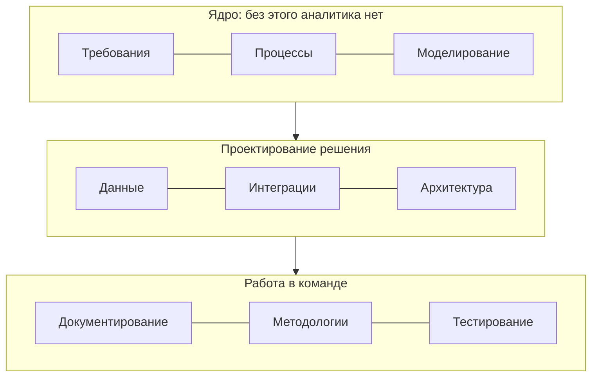

Профессию удобно представить как девять областей. Первые три — «ядро»: без них аналитика нет. Остальные определяют, насколько глубоко вы проектируете решение.

| Область | Что входит |
|---|---|
| Требования | Выявление, уровни и свойства, user stories и use cases, критерии приёмки, приоритизация, трассировка |
| Процессы | BPMN, AS-IS и TO-BE, gap-анализ |
| Моделирование | UML (use case, activity, sequence, state, class, component, deployment), C4, DFD |
| Данные | Модели и ER, ключи и нормализация, SQL, транзакции, индексы, НСИ |
| Интеграции | REST, SOAP, gRPC, GraphQL, брокеры сообщений, паттерны надёжности, контракты, безопасность |
| Архитектура | Монолит и микросервисы, кэширование, НФТ и ISO/IEC 25010, CAP, ADR |
| Документирование | ТЗ по ГОСТ 34, шаблоны, docs-as-code, Confluence |
| Методологии | Waterfall, Scrum, Kanban, гибриды; роль аналитика в каждой |
| Тестирование | Виды тестирования, тест-дизайн, ПМИ, UAT |

## Что ожидают на каждом уровне

Ориентир, а не стандарт: в разных компаниях планка отличается. Но вопросы на собеседованиях обычно идут примерно по этой шкале.

| Область | Junior | Middle | Senior |
|---|---|---|---|
| **Требования** | Пишет ФТ и истории по образцу, знает свойства хорошего требования | Самостоятельно выявляет, разрешает конфликты, ведёт трассировку | Выстраивает процесс работы с требованиями в команде |
| **Процессы** | Читает BPMN, рисует простой процесс | AS-IS / TO-BE с пулами, событиями, исключениями | Gap-анализ, процессы на уровне нескольких подразделений |
| **Моделирование** | Use case, activity, sequence по образцу | Выбирает нужную диаграмму, статусные модели, C4 L1–L2 | Модели для сложных распределённых сценариев |
| **Данные** | SELECT, JOIN, GROUP BY; читает ER | Проектирует логическую модель, нормализация, подзапросы, оконные функции | Модели для интеграций и отчётности, миграция данных |
| **Интеграции** | Знает REST, коды и методы HTTP, читает OpenAPI | Проектирует REST API и асинхронный обмен, ошибки, идемпотентность | Паттерны надёжности, выбор стиля интеграции, безопасность |
| **Архитектура** | Знает, что такое НФТ | Формулирует измеримые НФТ, участвует в ADR | Обсуждает компромиссы с архитектором на равных |
| **Документирование** | Пишет по шаблону | Выбирает формат под аудиторию, ТЗ по ГОСТ 34 | Организует документацию проекта (docs-as-code, Confluence) |
| **Процесс** | Работает в Scrum/Kanban | Ведёт рефайнмент, DoR, работает с PO | Встраивает аналитику в гибридный процесс, оценивает работы |
| **Тестирование** | Пишет критерии приёмки | Тест-дизайн, проверяет полноту тестов по трассировке | ПМИ, приёмка, разбор спорных дефектов с заказчиком |

## Где это в справочнике

| Область | Раздел |
|---|---|
| Роль на проекте | [Роль и процесс](/role/sa-vs-ba/) |
| Процессы | [BPMN 2.0](/processes/bpmn/) |
| Всё на одном примере | [Кейс IDM-JOINER](/case/) |

Остальные разделы (выявление и требования, диаграммы, данные, интеграции, архитектура, документирование, методологии, тестирование) добавляются по мере готовности — их список и статус на [главной](/).
