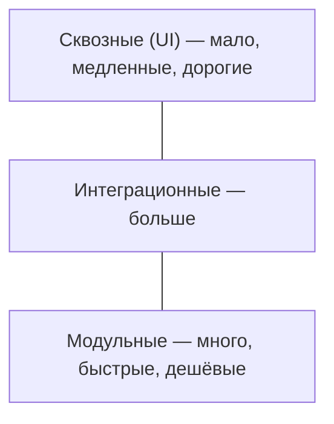

import { Steps } from '@astrojs/starlight/components';
import Brief from '../../../components/Brief.astro';
import CaseRef from '../../../components/CaseRef.astro';
import InterviewQuestions from '../../../components/InterviewQuestions.astro';
import Related from '../../../components/Related.astro';

<Brief>

Тестирование проверяет систему на нескольких **уровнях**: модульное → интеграционное → системное → приёмочное, и разными **видами**: функциональное, нагрузочное, безопасности, регрессионное и другие.
Аналитик не обязан писать тест-кейсы, но отвечает за то, чтобы требования были **проверяемыми**, модели давали тесты, а **трассировка** показывала, что каждое требование проверено.
Главный вклад аналитика — тесты на **альтернативы и ошибки**: их находят в use cases, статусных моделях и sequence-диаграммах.

</Brief>

## Когда применять

| Аналитику важно | Не нужно |
|---|---|
| Понимать, на каком уровне проверяется каждое требование | Писать автотесты и модульные тесты |
| Проверить полноту тестов по трассировке | Подменять QA в выполнении тестов |
| Разбирать спорные дефекты | — |
| Участвовать в приёмке | — |

## Как делать

<Steps>

1. **Пишите требования проверяемыми:** у каждого — критерий приёмки или способ проверки (для НФТ).

2. **Передайте QA модели:** use cases, статусные модели, sequence, бизнес-правила — из них выводятся тесты.

3. **Ревьюйте список тестов** по трассировке: есть ли тест на каждое требование, на каждую альтернативу и ошибку.

4. **Подготовьте тестовые данные** для краевых случаев вместе с QA.

5. **Разбирайте спорные дефекты:** «так в требованиях» или нет; если требование неоднозначно — это дефект требования, его исправляют и сообщают всем.

</Steps>

## Нотация: уровни и виды

| Уровень | Что проверяет | Кто делает | Вход от аналитика |
|---|---|---|---|
| Модульное | Функции и классы | Разработка | Бизнес-правила, граничные значения |
| Интеграционное | Обмен между компонентами и системами | Разработка, QA | Контракты, sequence-диаграммы, маппинг, сценарии ошибок |
| Системное | Система целиком против требований | QA | ФТ, НФТ, критерии приёмки, статусные модели |
| Приёмочное | Решает ли система задачу заказчика | Заказчик, пользователи, QA | ПМИ, сценарии UAT, бизнес-процесс TO-BE |

| Вид | Что проверяет |
|---|---|
| Функциональное | Что делает система — по ФТ |
| Нагрузочное / производительности | Время ответа и пропускная способность под нагрузкой |
| Стресс-тестирование | Поведение за пределами нормальной нагрузки, восстановление |
| Безопасности | Права, защита данных, уязвимости |
| Отказоустойчивости и восстановления | Поведение при отказе компонентов, RTO / RPO |
| Удобства использования | Могут ли пользователи выполнить задачу |
| Совместимости | Браузеры, версии, окружения |
| Регрессионное | Не сломалось ли работавшее |
| Дымовое (smoke) | Работают ли ключевые функции после сборки |
| Позитивное / негативное | Корректные сценарии / ошибки и неверные данные |

## Пример из кейса IDM-JOINER

<CaseRef href="/case/07-testing/test-cases/" id="TC">Тест-кейсы кейса</CaseRef> выведены из требований и моделей — «каждый альтернативный поток use case, каждый переход статусной модели и каждая ветка `alt` на sequence-диаграмме дают как минимум один тест»:

| Вид | Тесты кейса |
|---|---|
| Позитивный сквозной | TC-01 приём: учётные записи созданы заблокированными |
| Негативный | TC-02 повторное событие, TC-03 событие без поля, TC-11 SoD-конфликт, TC-12 АБС недоступна |
| Граничный | TC-05 логины, TC-06 активация в трёх часовых поясах, TC-07 событие за 1 день до выхода |
| Альтернативный | TC-04 повторный приём, TC-08 перенос даты, TC-09 отмена, TC-20 совместительство |
| Безопасности | TC-17 журнал аудита и SIEM |
| Нагрузочный | TC-19 300 событий за час |

Роль аналитика записана в <CaseRef href="/case/07-testing/test-program/" id="ПМИ">ПМИ</CaseRef>: «СА — разбор спорных результатов: дефект или неверное требование».

## Типичные ошибки

| Ошибка | Чем плохо | Как правильно |
|---|---|---|
| Только позитивные тесты | Ошибки и исключения не проверены | Тесты на альтернативы, ошибки, границы |
| Тесты пишутся после разработки «по факту» | Тестируют реализацию, а не требования | Критерии и тесты — вместе с требованиями |
| Нет трассировки требований к тестам | Непокрытые требования всплывают в эксплуатации | Матрица или связи в Jira |
| НФТ «проверим на проде» | Падение под нагрузкой после запуска | Нагрузочные тесты до запуска |
| Спорный дефект решается разработчиком и тестировщиком без аналитика | Требование «молча» меняется | Разбор с аналитиком, фиксация решения |

## Вопросы на собеседовании

<InterviewQuestions topic="testing" ids={['test-levels', 'test-types', 'test-analyst-role', 'test-defect-severity']} />

## Связанные темы

<Related pages={['testing/test-design', 'testing/pmi', 'testing/uat', 'requirements/traceability']} />
